# Tutorial 1: Block Diagram Algebra and Modelling, worked solutions

Method for Q1 to Q3: reduce step by step with named operations (series, parallel, feedback collapse, pickoff/summer moves), then cross-check the result with Mason's gain formula. Signs read off the PDF figures, so verify against the memo if it disagrees.

Reduction rules used:
- Series: blocks in cascade multiply, $G_1 G_2$
- Parallel: paths into a plus summer add, $G_1 + G_2$
- Feedback collapse: forward $G$, feedback $H$, negative feedback gives $\dfrac{G}{1+GH}$, positive feedback gives $\dfrac{G}{1-GH}$
- Mason: $T = \dfrac{\sum_k P_k \Delta_k}{\Delta}$ with $\Delta = 1 - \sum L_i + \sum L_i L_j(\text{non-touching}) - \dots$

## Question 1
Signal flow: x enters summer 1 (plus), summer 1 output enters summer 2 (plus), then A(s). A's output splits three ways: to B(s), to C(s), and back to summer 2 (minus). B and C both enter the output summer with plus. y feeds back to summer 1 with minus.

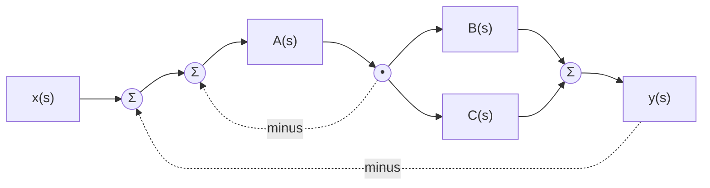

**Step 1, inner unity feedback around A.** The branch from A's output to summer 2 is a unity negative feedback loop around A alone:
$$G_1 = \frac{A}{1+A}$$

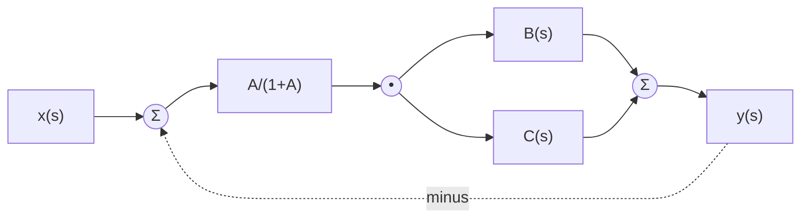

**Step 2, parallel B and C.** The pickoff after A feeds B and C; both outputs add at the output summer, so they combine in parallel:
$$G_2 = \frac{A}{1+A}\,(B+C)$$

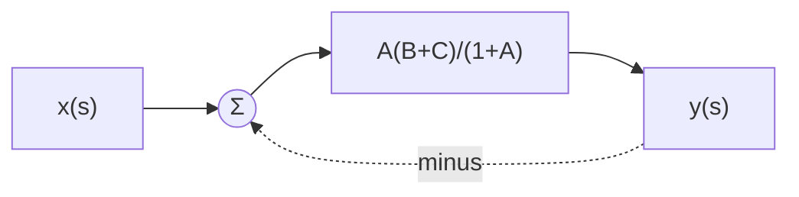

**Step 3, outer unity feedback.** y returns to summer 1 with minus, unity feedback around $G_2$:
$$\frac{Y}{X} = \frac{G_2}{1+G_2} = \frac{\dfrac{A(B+C)}{1+A}}{1+\dfrac{A(B+C)}{1+A}}$$

$$\boxed{\frac{Y}{X} = \frac{A(B+C)}{1+A+A(B+C)}}$$

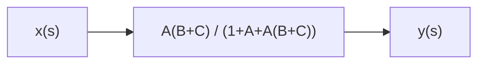

**Mason check.** Forward paths: $P_1 = AB$, $P_2 = AC$. Loops: $L_1=-A$, $L_2=-AB$, $L_3=-AC$, all touch (share A), so $\Delta = 1+A+AB+AC$ and both paths touch every loop ($\Delta_k=1$). $T = \dfrac{AB+AC}{1+A+AB+AC}$. Same result.

## Question 2
Name the internal signals: e = summer 1 output, m = A output, u = summer 2 output (input to B), w = summer 3 output (input to C).

Read the four equations off the diagram:
- Summer 3: $w = Bu + u + Ey$ (B path plus the feedforward branch that bypasses B, plus E from y, all with plus signs)
- Output: $y = Cw$
- Summer 2: $u = m - Dw$ (D is picked off from w)
- Summer 1: $e = x - Fw$, and $m = Ae$ (F is picked off from w)

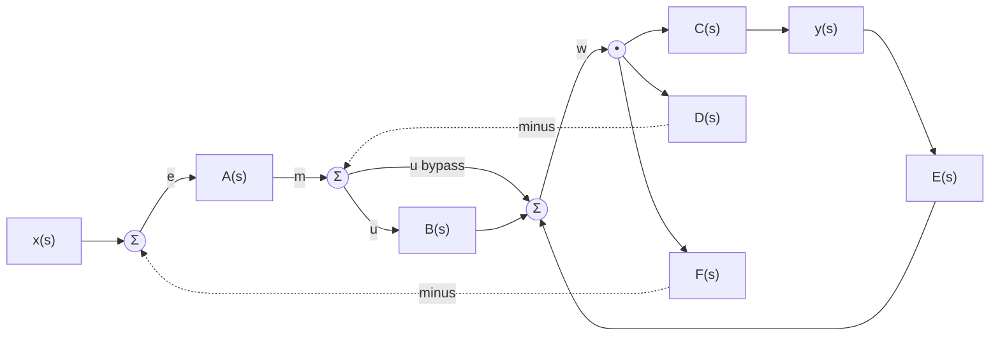

**Step 1, collapse the feedforward around B.** The unity branch parallel to B gives $w = (1+B)u + Ey$.

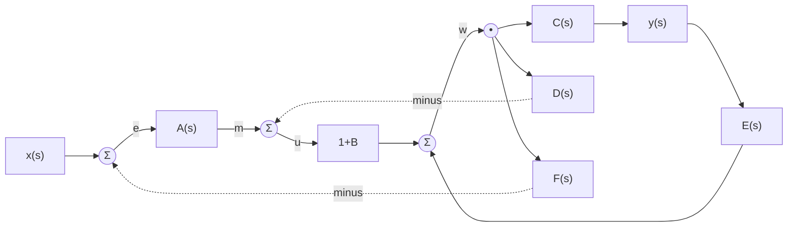

**Step 2b, drawn as blocks.** Absorbing the positive E loop turns everything between u and w into one block $\dfrac{1+B}{1-CE}$; then the D loop collapses around it, then the outer A and F loop, with $C$ hanging off w to make y:

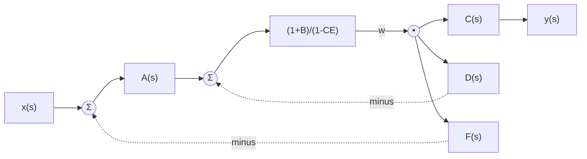

**Step 2, absorb the E loop.** Substitute $y = Cw$:
$$w(1 - CE) = (1+B)u$$
E enters with a plus sign, so this is positive feedback, hence the minus in $(1-CE)$.

**Step 3, absorb the D loop and the outer F loop.** With $u = A(x - Fw) - Dw$:
$$w\big[1 - CE + (1+B)(D + AF)\big] = (1+B)A\,x$$

**Step 4, output.** $y = Cw$:

$$\boxed{\frac{Y}{X} = \frac{AC(1+B)}{1 + D(1+B) + AF(1+B) - CE}}$$

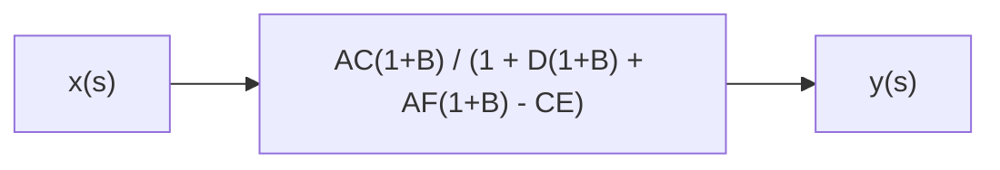

**Mason check.** Forward paths: $P_1 = ABC$, $P_2 = AC$ (via the bypass branch). Loops: $-BD$, $-D$, $+CE$, $-ABF$, $-AF$; every loop passes through w or u and all pairs touch, so $\Delta = 1 + D(1+B) + AF(1+B) - CE$, $\Delta_k = 1$. Numerator $AC(1+B)$. Same result.

## Question 3

Name the signals: e = main summer output, $b = Be$ (pickoff between B and C), $c = Cb$ (pickoff between C and D), $y = DEc$.

Feedback paths:
- A(s) fed from c, into the main summer with minus
- G(s) fed from b, then F(s), into the lower summer with plus
- H(s) fed from y, into the lower summer with minus
- Lower summer output into the main summer with minus

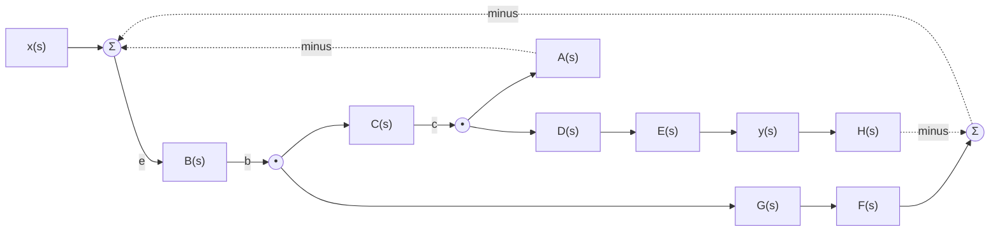

**Step 1, main summer equation.**
$$e = x - Ac - (FGb - Hy)$$

**Step 2, express everything in e.** $b = Be$, $c = BCe$, $y = BCDE\,e$:
$$e = x - ABC\,e - BFG\,e + BCDEH\,e$$

**Step 3, solve.**
$$e\big[1 + ABC + BFG - BCDEH\big] = x, \qquad y = BCDE\,e$$

$$\boxed{\frac{Y}{X} = \frac{BCDE}{1 + ABC + BFG - BCDEH}}$$

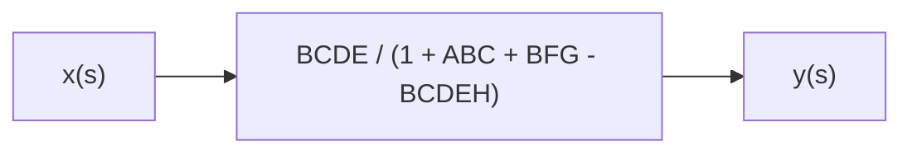

**Mason check.** Single forward path $P_1 = BCDE$. Loops: $L_1 = -ABC$, $L_2 = -BFG$, $L_3 = +BCDEH$ (minus into the lower summer, minus again into the main summer, net plus). All loops pass through B, all touch: $\Delta = 1 + ABC + BFG - BCDEH$, $\Delta_1 = 1$. Same result.

Note the H path is net positive feedback. If the memo shows $+BCDEH$ in the denominator, one of the two minus signs on that path was read differently from the figure.

## Question 4: automated anesthesia (Meier, 1992)

Functional block diagram, so the marks are for identifying roles and signals correctly, not for transfer functions.

Design intent from the text: the controller automates only the isoflurane concentration loop. Depth of anesthesia is not directly measurable; blood pressure is the measured surrogate. Ventilation, fluid balance and other drugs stay with the anesthesiologist and act on the patient as disturbances to this loop.

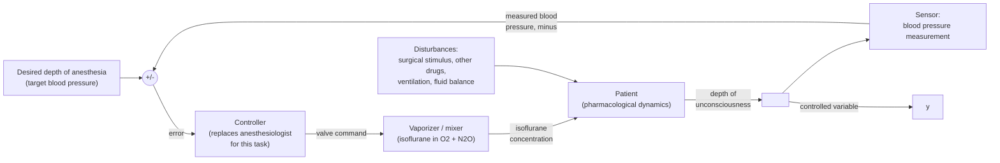

Pertinent signals, named explicitly:

| Role | Signal or subsystem |
|---|---|
| Reference input | target blood pressure corresponding to desired depth |
| Controller | automatic controller (the automated part of the anesthesiologist's task) |
| Actuator | vaporizer, sets isoflurane concentration in the O2 and N2O mixture |
| Plant | patient |
| Controlled variable | depth of unconsciousness |
| Measured variable | blood pressure (surrogate measurement) |
| Feedback element | blood pressure sensor |
| Disturbances | surgical stimulus, other drugs, ventilation, fluid balance |

## Question 5: cheetah on the bakkie

Every bullet in the brief maps to one structural feature:

| Requirement | Diagram feature |
|---|---|
| Subsystems N, L, T, B, E, V, P | one block each |
| Controls body angle theta(s) | theta is the plant (body) output |
| Sensed angle = average of eyes, vestibular, proprioception | E, V, P in parallel from theta, summed, times 1/3 |
| N acts on difference between r(s) and sensed angle | error summer feeding N(s) |
| Impulse i(s) commands legs and tail | N output branches to L and T |
| Combined torque tau(s) corrects the angle | L and T outputs summed to tau |
| Vehicle motion c(s) also affects the body | disturbance added before B(s) |

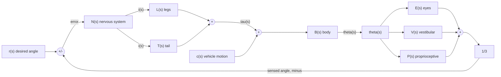

Modelling choices worth stating in the tut (these are the A-grade justifications):
- The average is implemented structurally: parallel sensors, summed, then an explicit 1/3 gain block. Writing feedback = (E+V+P)/3 without the gain block loses the "average" requirement.
- c(s) enters at a summer before B(s), the same point as tau(s): both are physical effects (torques/accelerations) acting on the body, and the brief says the correcting torque and the vehicle motion both act on the angle through the body. Adding c(s) directly to theta after B would instead model a measurement offset, which the text does not describe.
- Legs and tail share one input i(s) and their torques add, so they are in parallel between N(s) and the torque summer.

Closed loop for reference (not required, but one line): with sensor average $S = \tfrac{1}{3}(E+V+P)$ and actuator $M = L+T$,
$$\theta = \frac{NMB}{1 + NMBS}\,r + \frac{B}{1 + NMBS}\,c$$
which shows the loop attenuates the vehicle disturbance by the loop gain, exactly the balancing behaviour observed in the field footage.
