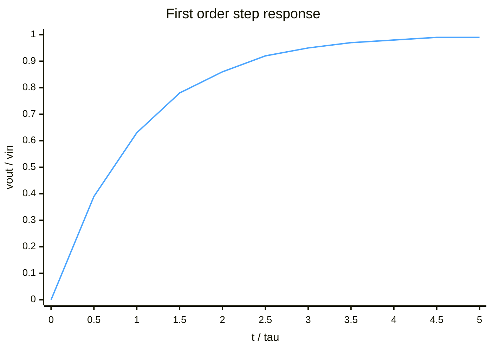
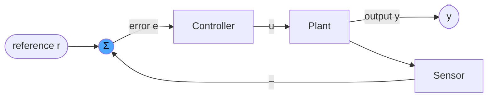
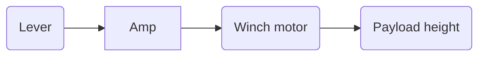
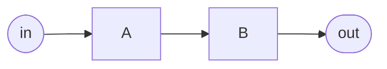
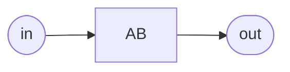
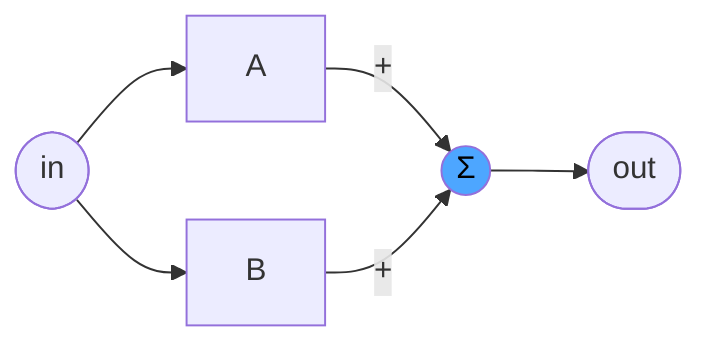
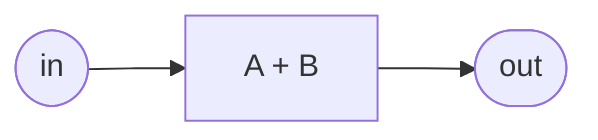
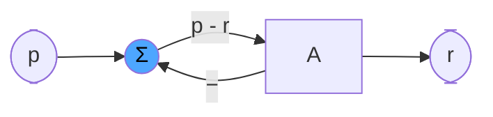
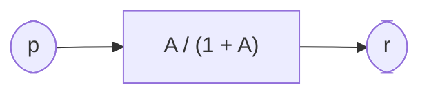

## System modelling
A system is a box that takes an input signal and produces an output signal. A model is a mathematical description of that box, precise enough that we can predict the output for any input. Once we have a model, we can design a controller around it.

> [!info] What is a signal?
> Just a function of time: $x(t)$. Voltage over time, payload height over time, temperature over time. Think of it as a continuous version of an array of samples: instead of `x[i]` you have $x(t)$ for every real $t$.

### Example: RC circuit
A resistor and capacitor in series. Input is the voltage $v_{in}$ we apply, output is the voltage $v_{out}$ measured across the capacitor.
```tikz
\usepackage{circuitikz}
\begin{document}
\begin{circuitikz}
\draw (0,0) to[V, l=$v_{in}$] (0,2.5)
	to[R, l=$R$] (3,2.5)
	to[C, l=$C$] (3,0) -- (0,0);
\draw (3,2.5) to[short, -o] (4.5,2.5) node[right]{$v_{out}$};
\draw (3,0) to[short, -o] (4.5,0);
\end{circuitikz}
\end{document}
```

> [!tip] How to write circuitikz by hand
> It looks scary but it is one repeating pattern: `\draw (x1,y1) to[part, l=$label$] (x2,y2);` means "draw a wire from point (x1,y1) to (x2,y2) with a part on it". Parts: `R` resistor, `C` capacitor, `V` voltage source, `short` plain wire, `-o` puts an open terminal dot at the end. Coordinates are just grid positions you pick yourself. Chain segments by continuing with `to[...] (next point)`.

**Deriving the model, step by step:**
1. Kirchhoff's voltage law (KVL): going around a closed loop, the source voltage equals the sum of voltage drops. Here: $v_{in} = v_R + v_{out}$.
2. Component laws: resistor $v_R = R \, i$, capacitor $i = C\frac{dv_{out}}{dt}$ (current into a capacitor is proportional to how fast its voltage changes).
3. Substitute 2 into 1: $$RC\frac{dv_{out}}{dt} + v_{out} = v_{in}$$
That is the model: a differential equation linking input and output.

> [!info] Laplace transform, and why $s$ keeps showing up
> The Laplace transform converts a function of time $x(t)$ into a function $X(s)$ of a new variable $s$ (a complex number). Its killer feature: taking a derivative in time becomes multiplying by $s$. So a differential equation turns into ordinary algebra. Same trick as logarithms turning multiplication into addition: transform, solve the easy version, transform back if needed.

4. Laplace transform the equation ($\frac{d}{dt} \to s$, assuming everything starts at zero): $$RCs \, V_{out} + V_{out} = V_{in}$$
5. Solve for output over input: $$H(s) = \frac{V_{out}}{V_{in}} = \frac{1}{RCs + 1} = \frac{\frac{1}{RC}}{s + \frac{1}{RC}}$$
$H(s)$ is called the transfer function: one expression that fully describes what the system does to any input.

> [!info] Pole
> A pole is a value of $s$ where the denominator of $H(s)$ becomes zero. Here: $s = -\frac{1}{RC}$. Poles determine behaviour: a negative real pole means the output settles exponentially, and the further left it is, the faster. A pole with positive real part means the output blows up (unstable).

**Ways to poke this system and see what it does:**
- Impulse response $h(t)$: response to an infinitely short kick. Here $h(t) = \frac{1}{RC}e^{-t/RC}$ for $t \ge 0$. A spike that dies out exponentially.
- Step response: response to flipping the input from 0 to $v_{in}$ at $t=0$. Here $v_{out}(t) = v_{in}(1 - e^{-t/\tau})$ with time constant $\tau = RC$. At $t = \tau$ the output has covered 63 % of the distance; after $5\tau$ it is effectively done.

- Frequency response: feed in a sine wave of frequency $\omega$ and look at what comes out (substitute $s = j\omega$ in $H(s)$). This circuit passes slow sines through and dampens fast ones: a low-pass filter. The boundary is the cutoff frequency $\omega_c = \frac{1}{RC}$.
## Classes of systems
Classified by how many inputs and outputs they have:
- SISO: single input, single output (the RC circuit)
- SIMO: single input, multiple outputs
- MISO: multiple inputs, single output
- MIMO: multiple inputs, multiple outputs (drone: 4 motor inputs; position and attitude out)
This course is mostly SISO.
## Time invariance
A system is time invariant if it behaves the same today as tomorrow: shifting the input in time just shifts the output by the same amount. $$x(t) \to y(t) \implies x(t - T) \to y(t - T)$$
Counterexample: a rocket burning fuel. Its mass drops over time, so the same thrust input gives more acceleration later. That system is time varying.
## Linearity
Suppose input $x_1$ gives output $y_1$, and $x_2$ gives $y_2$. The system is linear if any weighted mix of inputs gives the same weighted mix of outputs ($\alpha, \beta$ are just constants): $$H(\alpha x_1 + \beta x_2) = \alpha y_1 + \beta y_2$$
This packs two properties into one:
- Homogeneity: double the input, the output doubles.
- Superposition: response to a sum of inputs = sum of the individual responses.

> [!important] Why LTI matters
> Linear + Time Invariant = LTI. For LTI systems the impulse response $h(t)$ tells you everything: the output for any input is the convolution of input with $h(t)$. Convolution is a messy integral in time, but in the Laplace domain it becomes plain multiplication: $Y(s) = H(s)X(s)$. That is the entire reason transfer functions work, and why we keep jumping to the $s$ domain.

## Disturbances
Anything that affects the system but that we did not model and cannot control: wind pushing on a crane payload, load changes, sensor noise. We do not try to model every disturbance. Instead we use feedback control, which pushes their effect on the output down automatically.
## Open loop vs closed loop
- Open loop: command goes straight through controller and plant, nobody checks the result. Simple and cheap, but disturbances and model errors go uncorrected. Like a microwave: runs 60 s regardless of how hot the food actually got.
- Closed loop: measure the output, compare with what you wanted (the reference), act on the difference (the error). Like a thermostat. Suppresses disturbances and tolerates an imperfect model.

The plant is just the thing being controlled (motor, heater, crane). The $\Sigma$ circle is a summing junction: it adds its incoming signals, here reference minus measurement, producing the error.
## Example: modelling a crane
Standard procedure for modelling anything:
1. Find the inputs: which knobs can we actuate? Here: lever position feeding an amplifier.
2. Find the outputs: what do we care about? Here: payload height.
3. Model each block on the path from input to output.

- Analogue amplifier: a pure gain, lever voltage in, bigger motor voltage out.
- Motor equation: voltage in, shaft speed out (first order dynamics, like the RC circuit but electromechanical).
- Winch: shaft speed becomes rope speed becomes payload height. Height is the integral of speed, so this block is an integrator.
Disturbances here: payload weight, wind.
## Laplace domain vs time domain
Two representations of the same system, used for different jobs:
- Time domain: differential equations and convolution. Natural for simulation, painful for composing systems.
- Laplace ($s$) domain: derivative becomes multiply by $s$, convolution becomes multiplication. Two blocks in series just multiply: $H(s) = H_1(s)H_2(s)$.
- Workflow: model physics in time domain, transform to $s$, do all analysis and design there, transform back only if you need the actual time response.
## Signals
A signal lives in both the time domain (value at each instant) and the frequency domain (which frequencies it is built from). Same information, two views, like viewing a struct as bytes or as fields.
### Basis signals

> [!info] Basis, same idea as linear algebra
> In linear algebra any vector is a weighted sum of basis vectors. Same here: any signal can be built as a weighted sum of a few standard building-block signals. Analyze how the system responds to the building blocks and you know how it responds to everything (thanks to linearity).

The building blocks and their Laplace transforms:
- Dirac delta $\delta(t)$, the impulse: infinitely short, infinitely tall spike with area 1. An idealized hammer tap. Laplace: $1$. Feeding it to a system yields the impulse response $h(t)$.
- Unit step $u(t)$: 0 until $t=0$, then 1 forever. Flipping a switch. Laplace: $\frac{1}{s}$. Yields the step response.
- Complex exponential $e^{j\omega t}$: a point rotating around the unit circle at angular frequency $\omega$ rad/s. Yields the sinusoidal (steady state) response: sine in, sine out, same frequency, only amplitude and phase change.

> [!info] Complex numbers refresher
> $j = \sqrt{-1}$ (engineers write $j$ because $i$ is taken by current). Euler's formula: $e^{j\omega t} = \cos\omega t + j\sin\omega t$, so this one expression carries both a cosine and a sine. The reason exponentials are the favourite basis: differentiating $e^{st}$ gives $s\,e^{st}$, the same function scaled. LTI systems cannot change the frequency of an exponential input, only scale and shift it, which is what makes frequency-domain analysis possible.

Side note, DAC (digital to analog converter): a computer outputs a staircase of discrete values; the physical world needs continuous signals. Relevant later when a digital controller drives an analog plant.
### Block diagram algebra
Goal: reduce any block diagram to one single block. Three rules cover everything.
**Series** blocks multiply:

is equivalent to

**Parallel** blocks add (outputs meet in a summing junction):

is equivalent to

**Feedback** loop: input $p$, the output $r$ is fed back and subtracted, the block $A$ acts on the difference:

Derive the equivalent single block by writing down what the picture says and solving for $\frac{r}{p}$ (output over input):
1. The block sees $p - r$ and multiplies by $A$: $r = A(p - r)$
2. Expand: $r = Ap - Ar$
3. Collect $r$: $r(1 + A) = Ap$
4. Divide: $$\frac{r}{p} = \frac{A}{1 + A}$$

This little formula is the heart of the whole course: it is how a feedback loop collapses into one transfer function.

## Block diagrams
Draw a functional block diagram for a closed-loop system that...

## Risky Algebraic Method
1. Label helpful points (mostly post-junction)
2. Define TF (using points)
3. Define points
4. Substitute and resolve
or

