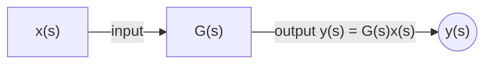
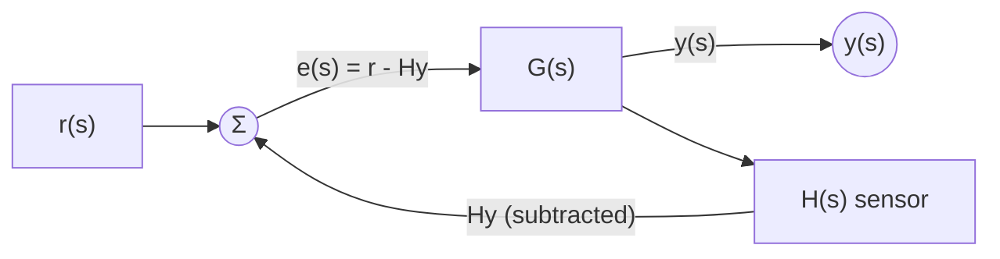

## 1.1 Impulse response
### Signals
**Signal:** quantity that varies with time
- Discrete and continuous
### Systems
**System:** object or process that transforms signals
- Anything can be a system if you can think of suitable inputs and outputs to describe it that way
In control engineering the system could be:
- The thing we are trying to control
- Combination of the thing and the controller
- Part of the thing

*Input-output relationship* between signals
- SISO, MIMO, SIMO, MISO
- Can think of a signal as a mathematical function, but we do not always know the function
### System ID
**System identification:** finding a model that can calculate the *response* to any input
**White box modelling:** we know something about the system (like the value of a constant), so we can use knowledge of the dynamics to work out the model
**Black box modelling:** we know nothing about the contents of the system, so we identify the model through experiments by applying known inputs
Often system modelling is both black and white
### LTI systems
**Linear and time-invariant (LTI)** systems: only need to know the response to one signal (input) to fully define the system, i.e. to calculate the response to any input
#### LTI properties
**Homogeneity:** response to scaled input = response scaled by same factor
**Additivity:** response to sum = sum of responses
Linear systems preserve **weighted sums**
**Time invariance:** time-shifting the input causes the same shift in the response

**Pulse:** signal with some constant height over a narrow interval of width $\Delta$, zero everywhere else

We can approximate any input using a sum of shifted, scaled pulses.
So if we know the response to the pulse, we can approximate the response using the LTI properties
### Impulse
**Dirac delta** $\delta$ or **impulse** function: a narrow pulse with area = 1 and width $\frac{1}{\infty}$ (near zero)

If we know the **impulse response $h(t)$** (output when the input is a single impulse), we can calculate any output.
The impulse response therefore completely defines the model of an LTI system

**Convolution:** operation to calculate the output from the input and impulse response $$y(t)=\int x(\lambda)h(t-\lambda)d\lambda$$It is the running weighted sum of the input's history, with $h$ weighting each past value by how long ago it happened
## 1.2 Frequency domain
### Frequency domain
**Time** and **frequency** domains are like different "coordinate systems" for representing signal information.
Might use both time- and frequency-domain objectives, such as decreasing settling time
### Basis
Changing domains = a basis change
**Basis:** set of vectors that can be linearly combined to create all vectors in a space

A signal is an infinitely long vector, so:
- Basis: set of signals that can be linearly combined to create all signals in a domain
- Any signal can be constructed as a weighted sum of shifted impulses
- So the basis of the time domain is the set of shifted impulses

Basis of the frequency domain is the set of sinusoids with frequencies that are integer multiples of the signal's frequency
### Harmonics
**Harmonics:** frequencies that are integer multiples of the signal's frequency

$0^{th}$ harmonic = DC component
Changing the DC component shifts the signal up or down without changing its shape.
Frequencies must be integer multiples for the combination to be periodic

The parameters of each harmonic component are **magnitude** $A$ and **phase** $\theta$ $$A\cos(k\omega t+\theta)$$
### Complex exponential basis
Q: Impulses only have magnitude, so how can *one* coefficient represent both magnitude and phase?
A: The coefficients are 2-dimensional numbers (complex numbers)

So the basis of the frequency domain is the set of complex exponentials with frequencies that are positive and negative integer multiples of the signal's frequency.
For a signal to be real-valued, the positive and negative frequency components must form conjugate pairs (same magnitude, opposite phase)
### Fourier series
**Fourier series:** representation of a periodic signal as a weighted sum of harmonic components (sinusoids)

For a real-valued signal, the frequency-domain plot has even magnitude and odd phase.
Moving the pulses closer (increasing $\omega_0$) moves the components further apart; moving the pulses further apart (decreasing $\omega_0$) brings them closer
### Fourier transform
Fourier synthesis equation
Fourier analysis in frequency and time domain
Use table of transforms

S plane: $s = \sigma + j\omega$
Region of convergence (ROC): where the transform converges
### Laplace transform
**Laplace transform:** takes us from the time domain to the s domain
- Bilateral
- Unilateral

Sinusoids and exponentials are the only types of signal that pass through all linear systems without changing their shape (still sinusoids/exponentials after the system). They are eigenfunctions of linear systems (only transformation = scaling)
### Convolution
Convolution in the time domain becomes multiplication in the frequency (or s) domain.
So instead of finding the output by convolving the input and impulse response, we can multiply their Laplace transforms

**Transfer function:** Laplace transform of the impulse response

$G(s) = \frac{y(s)}{x(s)}$: ratio of output to input in the s domain (zero initial conditions). Multiply input by $G(s)$ to get output, instead of convolving with $h(t)$
## 1.3 Block diagrams
### Connections
**Cascade connection:** blocks in series; multiply their transfer functions into one effective transfer function
**Take-off point:** same signal split to multiple paths
**Summing junction:** adds/subtracts signals; sums with > 2 signals drawn as chained junctions
**Parallel connection:** same input to multiple blocks, outputs summed
### Feedback loop

Error compares setpoint with *measured* output: $e = r - Hy$. Perfect sensor: $H = 1$, so $e = r - y$
**Setpoint:** desired value for the output $r(s)$
**Negative feedback:** output is subtracted from setpoint
**Positive feedback:** output is added to setpoint
**Plant:** the thing we are trying to control
- Consists of two subsystems: actuator and process
- Process: part of plant that produces the output
- Actuator: drives the process in response to input $u(s)$
"Input" = input to the plant, which is the actuator input
**Sensor:** system that measures the output
- No sensor block = perfect sensing, i.e. sensor output is exactly the true output
**Error:** difference between setpoint and output
**Controller:** system that adjusts the plant input in response to the error

Control engineering: "the science and art of choosing inputs to get the outputs that we want"

Once the system reliably reaches the setpoint, the next objective is to improve how it gets there
### Simplifying block diagrams
**Closed loop transfer function:** effective transfer function from setpoint to output
**Forward path:** path from setpoint to output without the loop
**Open loop transfer function:** transfer function of the forward path
Effective transfer function for the basic loop; interlocking loops

Cascaded loops: multiply their effective transfer functions

Move take of point