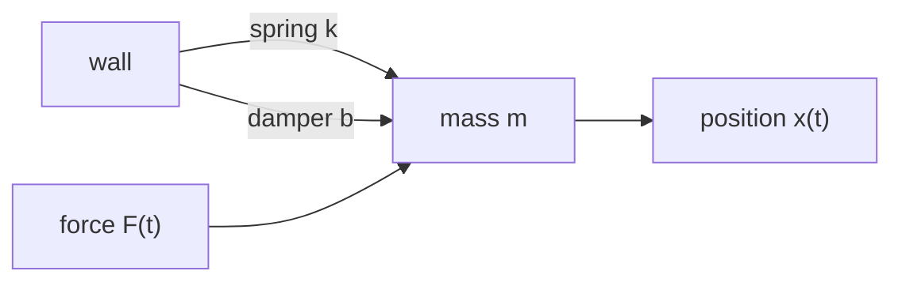
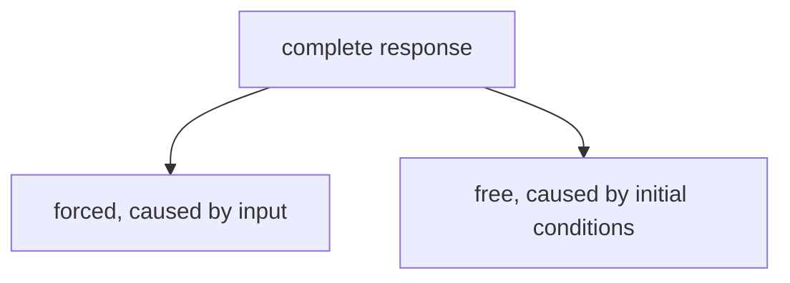
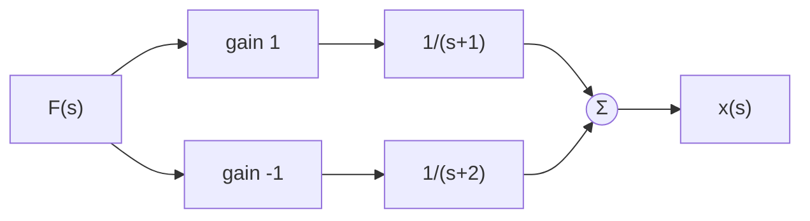
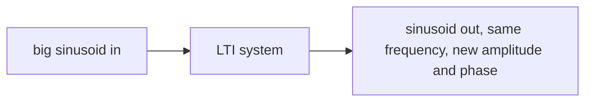
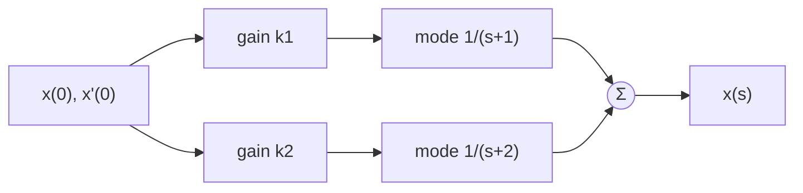
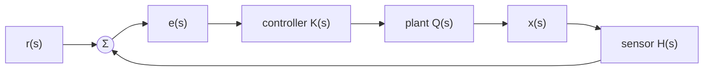
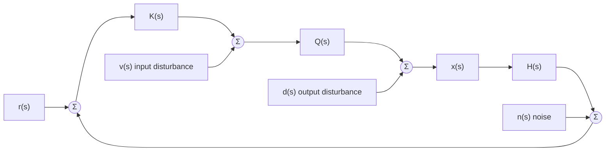

Skeleton mirroring deck sections, page numbers = PDF pages in [[../lecture-notes/02 time response|02 time response]] decks. Fill bullets while watching.
## 2.1 Dynamic responses of LTI systems
### Dynamic systems (p2-7)
**Dynamic system:** system modelled by differential equations in time. Output depends not only on the current input but on history (state), like a function with memory
- Example 1: motion described by position, velocity, acceleration
- Example 2: resistor-capacitor circuit, $\dot{V}(t) = -\frac{1}{RC}V(t)$
**LTI dynamic system:** modelled by a linear, constant-coefficient differential equation (LCCDE)
- Example: spring-mass-damper $m\ddot{x} = -b\dot{x} - kx + F(t)$, all coefficients constant
- Counter-example: pendulum, the $\sin(\theta(t))$ term means a coefficient depends on the variable itself, not LTI
**Order:** highest derivative present in the equation. RC circuit is first-order, spring-mass-damper is second-order
### Solving LCCDEs (p8-13)
Differential equations in the time domain become algebraic equations in the s domain, so "solving" turns into rearranging

The running example, spring-mass-damper. Mass on a spring with friction, push it with force $F(t)$, watch position $x(t)$:

**Laplace transform of a derivative** brings the initial conditions in as extra terms
- $\mathcal{L}\{\dot{x}(t)\} = sx(s) - x(0)$
- $\mathcal{L}\{\ddot{x}(t)\} = s^2x(s) - sx(0) - \dot{x}(0)$
- Do not forget the initial conditions
**Example: spring-mass-damper**
- Time domain: $m\ddot{x}(t) = -b\dot{x}(t) - kx(t) + F(t)$
- Transform each term: $m(s^2x(s) - sx(0) - \dot{x}(0)) = -b(sx(s) - x(0)) - kx(s) + F(s)$
- Collect all $x(s)$ terms on the left: $(ms^2 + bs + k)x(s) = F(s) + (b + ms)x(0) + m\dot{x}(0)$
- Left side: system dynamics acting on $x(s)$. Right side: input $F(s)$ plus initial-condition terms
- From here just algebra: solve for $x(s)$, no calculus needed
### Dynamic response (p14-34)
Divide the solved equation through by the dynamics and the response splits into two parts:
$$x(s) = \underbrace{\frac{1}{ms^2+bs+k}F(s)}_{\text{forced}} + \underbrace{\frac{(b+ms)x(0) + m\dot{x}(0)}{ms^2+bs+k}}_{\text{free}}$$
- **Forced response:** part caused by the input (particular solution)
- **Free response:** part caused by the initial conditions (homogeneous solution)
- Complete response = forced + free
Both parts share the same denominator $(ms^2 + bs + k)$, because both pass through the same dynamics
**Characteristic equation:** denominator set to zero, e.g. $ms^2 + bs + k = 0$
**Poles:** roots of the characteristic equation. Number of poles = order of the system
**Rest:** zero initial conditions. At rest the free part vanishes and only the transfer function is left. The course mostly assumes initial rest from here on
**Modal decomposition:** representing a system as a combination of elementary first-order mode subsystems. Like factoring a big problem into independent subproblems, each mode is one exponential $e^{pt}$ with its own pole $p$
- Lecturer's picture (p22-26): rather fight 100 duck-sized horses one at a time than one horse-sized duck. A seventh-order system is scary, seven first-order systems are manageable

**Running example** (used through the whole deck): pick $m=1$, $b=3$, $k=2$, so $ms^2+bs+k = (s+1)(s+2)$
Partial fraction working (p20): set $\frac{A}{s+1} + \frac{B}{s+2} = \frac{1}{(s+1)(s+2)}$, so $A(s+2) + B(s+1) = 1$
- Let $s=-1$: $A(1) + B(0) = 1$, so $A = 1$
- Let $s=-2$: $A(0) + B(-1) = 1$, so $B = -1$
$$x(s) = \frac{1}{(s+1)(s+2)}F(s) = \frac{1}{s+1}F(s) - \frac{1}{s+2}F(s)$$
Instead of one complicated monolithic response, we now have a sum of simple first-order parts (p21). As a block diagram (p28), the modes sit in parallel with gains $1$ and $-1$, impulse responses $e^{-t}u(t)$ and $e^{-2t}u(t)$:

Feed it a step $F(s) = \frac{1}{s}$. Multiplying by $\frac{1}{s}$ = integrating in the time domain, so the step response is the integral of the impulse response (p30). Integrate each mode:
$$x(t) = \tfrac{1}{2} - e^{-t} + \tfrac{1}{2}e^{-2t}$$
Starts at 0, settles at $\frac{1}{2}$. Same picture as slide p34, overall response = sum of the two mode responses:
```functionplot
---
title: Overall response f = mode g + mode h (slide p34)
xLabel: t
yLabel: x
bounds: [0, 6, -0.8, 1.2]
grid: true
---
f(x) = 0.5 - exp(-x) + 0.5*exp(-2*x)
g(x) = 1 - exp(-x)
h(x) = -0.5 + 0.5*exp(-2*x)
```
### Steady-state response (p35-39)
**Steady state:** part of the response that remains as $t \to \infty$
Its form follows the input: step input gives constant steady state, sinusoid in gives sinusoid out (slide p39)

Example: turn shower tap to fixed position (step input). Wild temperature swings at first = transient, settled final temperature = steady state
```functionplot
---
title: Step response = transient wiggle + steady state at 1
xLabel: t
yLabel: x(t)
bounds: [0, 6, 0, 1.6]
grid: true
---
f(x) = 1 - exp(-x) * cos(4*x)
g(x) = 1
```
### Transient response (p40-54)
**Transient:** part of the response that decays away over time
Transient has the same modes as the impulse response, i.e. the system's own exponentials, regardless of what input kicked them off
Transient dies away only if all exponential modes decay. One growing mode = response blows up = **unstable system**
**BIBO stability** (p43): Bounded Input, Bounded Output. Stable = every bounded (non-infinite) input is guaranteed a bounded output. A growing mode breaks this, the bounded impulse produces an infinite response
The sign of the exponent in each $e^{pt}$ decides it (p44-45): $e^{-t}$ decays, $e^{+t}$ grows. So pole locations determine stability
Stability from pole positions in the s plane (pole $p = \sigma + j\omega$, mode $e^{pt}$):
- Left-half plane, real part negative: decaying mode, stable
- Right-half plane, real part positive: growing mode, unstable
- On the imaginary axis, real part zero: sinusoid that never decays, marginally stable
```tikz
\begin{document}
\begin{tikzpicture}[scale=1.1]
\draw[->, thick] (-3.4,0) -- (3.4,0) node[below right] {$\sigma$};
\draw[->, thick] (0,-3.2) -- (0,3.2) node[above left] {$j\omega$};
\node at (-1.7,2.7) {\textbf{stable}};
\node at (1.7,2.7) {\textbf{unstable}};
\draw[dotted] (-3.2,-3) rectangle (0,3);
\node at (-2,0) {$\times$};
\node[below] at (-2,-0.1) {$-2$};
\node at (1,0) {$\times$};
\node[below] at (1,-0.1) {$+1$};
\node at (-1,2) {$\times$};
\node[left] at (-1.15,2) {$-1+3j$};
\node at (-1,-2) {$\times$};
\node[left] at (-1.15,-2) {$-1-3j$};
\node at (0,1.2) {$\times$};
\node[right] at (0.15,1.2) {$+3j$ marginal};
\draw[dashed] (-1,2) -- (-1,-2);
\end{tikzpicture}
\end{document}
```

| Pole location | Mode | Behaviour |
|---|---|---|
| $p = -2$ | $e^{-2t}$ | dies out fast |
| $p = -0.1$ | $e^{-0.1t}$ | dies out slowly |
| $p = +1$ | $e^{t}$ | blows up, unstable |
| $p = \pm 3j$ | $\cos(3t)$ | oscillates forever, never decays |
| $p = -1 \pm 3j$ | $e^{-t}\cos(3t)$ | oscillates while dying out |

```functionplot
---
title: The three fates of a mode
xLabel: t
yLabel: mode
bounds: [0, 4, -1.5, 3]
grid: true
---
f(x) = exp(-2*x)
g(x) = exp(0.6*x)
h(x) = exp(-x) * cos(6*x)
```
Top curve grows (unstable pole), bottom two die out, the wiggly one is a complex pair
**Initial value theorem (IVT):** $x(0) = \lim_{s \to \infty} s\,x(s)$
**Final value theorem (FVT):** $x(\infty) = \lim_{s \to 0} s\,x(s)$ (only valid if the limit exists, i.e. stable)
Mnemonic: the s limit runs opposite to the time limit. $t \to 0$ pairs with $s \to \infty$, $t \to \infty$ pairs with $s \to 0$
Running example (step input, slide p54): $x(s) = \frac{1}{(s+1)(s+2)}\cdot\frac{1}{s}$
- FVT: $\lim_{s \to 0} s\,x(s) = \frac{1}{1 \cdot 2} = \frac{1}{2}$, exactly where the plot above flattens out
- IVT: $\lim_{s \to \infty} s\,x(s) = 0$, starts at rest
### Free response (p55-58)
Course usually assumes initial rest so the free response rarely appears, but worth knowing (p55)
Set the input to zero, keep only the initial-condition terms
Running example (slide p58): $x(s) = \frac{(3+s)x(0) + \dot{x}(0)}{(s+1)(s+2)}$
Even though there is an $s$ in the numerator, partial fractions still give two terms with constant numerators:
$$x(s) = \frac{2x(0)+\dot{x}(0)}{s+1} - \frac{x(0)+\dot{x}(0)}{s+2}$$
Same two modes $e^{-t}$ and $e^{-2t}$ as always, but now the numerators are set by where you started, not by the input. The system rings down from its initial state
### Dynamic response: putting it together (p59-68)
Slide p65 picture, initial conditions feed both modes through gains $k_1 = 2x(0)+\dot{x}(0)$ and $k_2 = -x(0)-\dot{x}(0)$, modes sum to the output:

- IVT on each mode: $s \cdot \frac{k}{s+p} \to k$ as $s \to \infty$, so initial value $= k_1 + k_2$, set purely by the initial conditions. They decide where you start
- FVT on the free response: it decays to zero regardless of initial conditions (for a stable system). Initial conditions never affect where you end up
- Complete response = forced response + free response
- Punchline (p66-68): initial conditions shape the transient, never the steady state. No matter where the system starts or how fast it is going, it ends up in the same place
## 2.2 Steady state
### Last time (p2-6)
Steady state: part of the response that remains as $t \to \infty$. Its form follows the input, this lecture uses step and ramp setpoints
### Reference tracking (p7-96)
**Reference tracking:** ability of the system to follow a given setpoint exactly
This deck's example (p8): same spring-mass car but $m=1$, $b=10$, $k=24$, so plant $Q(s) = \frac{1}{(s+4)(s+6)}$. Goal: unit step reference moves the car exactly 1 m
**Why feedback?** Open loop cannot track reliably (p11-13): the force profile that reached the target on day 1 gives a different result under day 2 conditions. Close the loop so the system can check whether it has actually arrived

Closed-loop transfer function: $G_{CL} = \frac{KQ}{1+KQ}$
No controller at all (p18-21): $G_{CL} = \frac{1}{s^2+10s+25}$. FVT on a unit step: $x(\infty) = \frac{1}{25} = 0.04$. Car barely moves
Why it stalls (p22-24): initial error 1 gives initial force 1, but force shrinks as the error shrinks, until the spring and damper balance it and the car stops short
**Proportional controller:** scales the error by a constant $k$. Bigger $k$ gets closer (deck: $k=5$ closer, $k=150$ closer still but overshoots and has to backtrack). Never reaches zero error
**Integral controller:** scales and integrates the error. Force keeps growing while the car sits away from the setpoint, so the error gets driven all the way to zero. Too big $k$ = overshoot. Constant error in gives constant velocity out
**Setpoint to error transfer function.** Around the loop: error times controller times plant gives the output, times the sensor gives what the summer subtracts
**Loop transfer function** $L(s)$: product of every block in the loop path, so
$$e(s) = \frac{1}{1+L(s)}\,r(s)$$
Apply the FVT to $e(s)$ to get the final error
**Error constant:** final value of the error for some setpoint. Shrinks as loop gain grows
**Gain:** value of a transfer function at $s=0$
- Proportional control raises the loop gain, which scales the error down to something manageable, but never to zero
- Zero error needs infinite gain at $s=0$. An integrator $\frac{k}{s}$ delivers exactly that, its gain blows up as $s \to 0$. That is why the integral controller succeeds: its denominator $s$ lands in the numerator of $\frac{1}{1+L}$ and kills the error
**Integrator:** block with transfer function $\frac{1}{s}$, output is the running integral of the input
**Why the denominator lands on top** (p59-70). Write each block as numerator over denominator, $K = \frac{N_K}{D_K}$ and so on. Then
$$G_e = \frac{1}{1+L} = \frac{D_K D_Q D_H}{N_K N_Q N_H + D_K D_Q D_H}$$
All the loop denominators end up in the numerator of $G_e$. An integrator makes $D_K = s$, so an $s$ sits on top. Race it against the setpoint's $s$'s in the FVT:
- Step $\frac{1}{s}$: the $s$'s cancel, error $\to 0$
- Ramp $\frac{1}{s^2}$: one $s$ short, error finite, car trails at a constant offset (deck example: $\frac{10}{11} = 0.91$)
- Parabola $\frac{1}{s^3}$: two short, error $\to \infty$, setpoint runs away over time
**Type number:** number of integrators in the loop path
- Type must match the setpoint order for perfect tracking: at least one integrator for a step, two for a ramp, three for a parabola. Matches the setpoint transforms $\frac{1}{s}$, $\frac{1}{s^2}$, $\frac{1}{s^3}$
- **Type correction:** add integrators in the loop path, anywhere in the loop counts, usually put in the controller before the plant
- Intuition: you are adding the form of the setpoint you want to track into the loop
**Internal model principle:** to track a reference without error, the form of that reference must be included in the loop path
- Works for other setpoint shapes too (p91): tracking a sinusoid $\sin(bt)$ needs $\frac{b}{s^2+b^2}$ in the loop
- Do not mash every setpoint form into one giant controller (p92-96): you will likely introduce unstable poles, every extra layer adds cost and failure points, and the loop becomes more sensitive to signals you do not want. Design the simplest system that solves the problem
### Disturbance rejection (p97-121)
Real loops have unwanted inputs besides the setpoint:
- **Input disturbance** $v(s)$: enters at the plant input, plant receives something different from what the controller sent
- **Output disturbance** $d(s)$: plant model inaccurate or plant misbehaving, modelled as an extra signal added to the output
- **Noise** $n(s)$: error added at the sensor measurement

Loop becomes MISO. Superposition applies: consider each input individually with all others set to zero
Transfer function from each unwanted input to the output (good exercise to derive, p104-116):
$$G_v = \frac{Q}{1+L} \qquad G_d = \frac{1}{1+L} \qquad G_n = \frac{-L}{1+L}$$
$G_d$ is the same as the setpoint-to-error transfer function
High loop gain: $G_v \to 0$ and $G_d \to 0$, disturbances rejected. But $|G_n| \to 1$, noise passes straight through to the output. Loop gain cannot fix noise, frequency response methods handle it later
## 2.3 Transient response
### Last time: modal decomposition (p2-12)
Transient response: part of the response that decays away over time, what the system does in transition from one steady state to another
Dies away because all exponential modes are decaying. If any mode grows, the transient grows to infinity, unstable
Stability depends on pole locations. Poles = roots of the characteristic equation (denominator of transfer function set to zero). Left-half plane stable, right-half plane unstable (deck p7-8 has the labels swapped, trust the pictures)
A pole $p$ with residual $r$ is one mode: $\frac{r}{s-p} \to re^{pt}u(t)$
High-order systems are hard, so break them into simple first-order modes and sum the mode responses
### First-order system (p13-28)
General form:
$$\frac{A}{\tau s + 1}$$
**Gain** $A$: value as $s \to 0$. For an unknown system, gain = height of output over height of input in a step test
**Time constant** $\tau$: sets the decay rate
Rearrange to match the Laplace table: $\frac{r}{s + 1/\tau}$ with **residual** $r = \frac{A}{\tau}$, so the impulse response is $re^{-t/\tau}u(t)$
Step response:
$$A(1 - e^{-t/\tau})u(t)$$
At $t = \tau$ the response has reached $1 - e^{-1} \approx 63\%$ of its final value. So for an unknown system, read $\tau$ off the plot at the 63% level
```functionplot
---
title: First-order step response, 63% of final value at t = tau
xLabel: t/tau
yLabel: x(t)/A
bounds: [0, 5, 0, 1.1]
grid: true
---
f(x) = 1 - exp(-x)
g(x) = 0.63
```
**Settling time:** time to get within some % of the final value. $\tau_{5\%} \geq 3\tau$, $\tau_{2\%} \geq 4\tau$
Pole sits at $-\frac{1}{\tau}$: distance from the origin sets the speed, further left = smaller $\tau$ = faster
### Second-order system (p29-42)
General form:
$$\frac{A\omega_n^2}{s^2 + 2\zeta\omega_n s + \omega_n^2}$$
**Gain** $A$, same idea as before
Match against spring-mass-damper $\frac{1/m}{s^2 + \frac{b}{m}s + \frac{k}{m}}$ to interpret the parameters:
**Natural frequency** $\omega_n = \sqrt{k/m}$: frequency the system would oscillate at with no damping. Undamped form matches the Laplace transform of a sinusoid
**Damping ratio** $\zeta = \frac{b}{2m\omega_n}$: ratio of actual damping to the critical damping value. Makes sense only after seeing how $b$ moves the poles, next section
### Second-order derivation: damping cases (p43-89)
Quadratic formula on the characteristic equation gives the poles:
$$p = \frac{-b \pm \sqrt{b^2 - 4mk}}{2m}$$
**Stability aside** (p46-53): a positive pole needs $m$ or $k$ negative (no physical sense) or $b$ negative. Dampers dissipate energy, so a negative damper adds energy. Stable systems lose energy, unstable systems gain energy. A damped system is stable
Three forms of response depending on the value under the square root (examples use $m=1$, $k=1$):
**Case 1, $b^2 - 4mk > 0$: two real poles, overdamped**
- Example $b=5$: poles $-0.21$ and $-4.79$, transient $-e^{-0.21t}u(t) + e^{-4.79t}u(t)$, sum of two first-order modes
- Increasing $b$: one pole crawls to $0$, the other flies to $-\infty$. Settling is only as fast as the slowest pole, so more damping = slower response
- Fastest response when the two poles coincide
**Case 2, $b^2 - 4mk = 0$: repeated real pole at $-\frac{b}{2m}$, critically damped**
- Example $b=2$: $x(s) = \frac{1}{(s+1)^2}$, both poles at $-1$
- Repeated pole multiplies the exponential by $t$ (or a power of $t$ for more repeats): transient $te^{-t}u(t)$
- Condition rewritten: $b = 2\sqrt{mk} = 2m\omega_n$, and then $\tau = \frac{1}{\omega_n}$
**Case 3, $b^2 - 4mk < 0$: complex conjugate pole pair, underdamped**
- Example $b=0.25$: poles $-\frac{1}{8} \pm j\frac{3\sqrt{7}}{8}$
- Always a conjugate pair, so the two complex exponentials combine into a real decaying sinusoid: $e^{\sigma t}(e^{j\omega t} + e^{-j\omega t}) = 2e^{\sigma t}\cos(\omega t)$
- In parameters: poles $p = -\zeta\omega_n \pm j\omega_n\sqrt{1-\zeta^2}$, response $e^{-\zeta\omega_n t}\cos(\omega_n\sqrt{1-\zeta^2}\,t)u(t)$
- Imaginary part = oscillation frequency: **damped frequency** $\omega_d = \omega_n\sqrt{1-\zeta^2}$
- Real part = decay rate: **time constant** $\tau = \frac{1}{\zeta\omega_n}$
```functionplot
---
title: Step responses, three damping cases (sketch)
xLabel: t
yLabel: x(t)
bounds: [0, 12, 0, 1.7]
grid: true
---
f(x) = 1 - exp(-0.21*x)
g(x) = 1 - (1 + x) * exp(-x)
h(x) = 1 - exp(-0.25*x) * cos(0.97*x)
```
Slow creeper = overdamped, clean fast rise = critically damped, ringing = underdamped
### Second-order wrap-up (p90-92)
Damping ratio tells you how close the actual damping is to critical:
- $\zeta = 1$: critically damped, fastest possible response without oscillation
- $\zeta < 1$: underdamped, oscillates
- $\zeta > 1$: overdamped, sluggish
Any complicated system can be understood through three elementary mode types:

| Mode | Transfer function | Time response |
|---|---|---|
| real pole | $\frac{r}{s-p}$ | $re^{pt}u(t)$ |
| repeated real pole | $\frac{r}{(s-p)^n}$ | $t^{n-1}e^{pt}$ shape |
| complex pole pair | $\frac{r}{(s-\sigma-j\omega)(s-\sigma+j\omega)}$ | decaying sinusoid |

## 2.4 Pole dominance
### Main question: which modes dominate (p2-4)
Any system = combination of the three elementary modes (real pole, repeated real pole, complex pair)
This lecture: if a system has many modes, which ones actually matter? Which is the most important?
### Dominant mode (p5-8)
**Dominant mode:** mode with the most influence on the overall response
Candidates: smallest time constant? Largest gain? Answer: the **longest time constant** wins, slow modes stick around contributing to the response long after the fast ones have decayed into insignificance
### Residual (p9-128)
**Residual** $r = \frac{A}{\tau}$: combines gain and time constant, scales the impulse response $re^{-t/\tau}u(t)$
Key idea: a pole's residual is a function of its proximity to the other poles
Worked example $\frac{1}{(s+4)(s+6)}$: let $s=-4$ gives $r_1 = \frac{1}{2}$, let $s=-6$ gives $r_2 = -\frac{1}{2}$. Same magnitude, opposite signs
General $n$th-order system, substitute $s = p_1$ and every other term dies:
$$r = \frac{1}{[\text{product of distances from every other pole}]}$$
So poles close to other poles have larger residuals. With only two poles the distances are equal, hence the matching magnitudes
**Complex poles** (p38-48): distances become 2D vectors, but conjugate pairs contribute $\sqrt{(p-\sigma)^2 + \omega^2}$ per pole, the straight-line distance. Complex poles get complex residuals, but those also come in conjugate pairs $|r|e^{\pm j\phi}$, combining into the real sinusoid $2|r|\cos(\omega t + \phi)$
**Repeated poles** (p49-113): a triple pole is a combination of three modes, $\frac{r_{11}}{s-p} + \frac{r_{12}}{(s-p)^2} + \frac{r_{13}}{(s-p)^3}$, giving $(r_{11} + r_{12}t + r_{13}t^2)e^{pt}u(t)$, exponential times polynomial in $t$. Finding the lower-repeat residuals needs derivatives of the expansion equation. No need to memorise the algebra, the takeaway: all residuals are still functions of proximity to the other poles
**Residual formula** (p114-128), use this from now on:
$$r_i = \lim_{s \to p_i}(s - p_i)H(s)$$
Repeated pole version, $k$ derivatives peel off the lower repeats:
$$r_{i\,m-k} = \frac{1}{k!}\lim_{s \to p_i}\frac{d^k}{ds^k}\left[(s-p_i)^m H(s)\right]$$
### Zeros and proper transfer functions (p129-190)
**Zero:** root of the numerator of the transfer function. In general a transfer function is $m$ zero terms over $n$ pole terms
- **Proper (biproper):** $m = n$
- **Strictly proper:** $m < n$
- **Improper:** $m > n$, real-world systems never fall here
Why no improper systems (p135-147), two schools:
- Not causal: simplest improper system is $y(s) = sx(s)$, a differentiator. Computing a derivative at $t=0$ forward needs a future input value
- Not physically realisable: differentiate any decent approximation of a step and the output spike needs a near-infinite energy source
Effect of a zero on a first-order system (p148-157): write $\frac{A(-\frac{1}{z}s + 1)}{\tau s + 1}$ so the gain is unchanged, then split it into the standard first-order path plus a $-\frac{s}{z}$ derivative path in parallel
- Zeros do not change the form or duration of the transient (the poles own that)
- They do change the initial value. IVT: $x(0) = -\frac{A}{z\tau}$
- The free response had exactly this shape, a transfer function with a zero: $\frac{sx(0) + (3x(0)+\dot{x}(0))}{(s+1)(s+2)}$
Zeros change residuals (p160-188):
$$r = \frac{[\text{product of distances from every zero}]}{[\text{product of distances from every other pole}]}$$
- Poles close to other poles and far from zeros have bigger residuals
- Zero moves close to a pole: that pole's residual shrinks, on top of it = cancelled completely
- Zero off to $-\infty$: response resembles the no-zero system
- Zero near the origin: derivative path scaled huge, big spike near $t=0$, large initial "velocity"
- Zero crosses into the right-half plane: residuals swap signs, response starts off negative
**Non-minimum phase system:** system with a positive (right-half plane) zero. Real-life example: a lift that dips upward before going down
**Warning** (p179-182): never use right-half plane zeros to cancel unstable poles. Theory says $\frac{K(s-1)}{s(s-1)(s+3)}$ cancels, reality gives $\frac{K(s-1.013)}{s(s-0.998)(s+3.012)}$, and the tiny mismatch leaves an unstable pole live
### Order reduction (p191-226)
**Reduced-order model:** representation of the same system with fewer poles and/or zeros
Method 1: remove the mode with the smallest residual. Two catches:
- The remaining residuals change, recompute them with one fewer pole
- The gain changes too. Removing a $(s+7)$ bracket multiplied the gain by 7, so the reduced model settled at the wrong steady state. Fix: replace the removed pole term with its gain, evaluate the bracket at $s=0$
Example 2 (p210-223): smallest-residual rule picks badly when some poles are much faster. The fast poles have big residuals but die almost instantly, so the time constant is the better dominance indicator there. Removing both fast poles gave a better first-order approximation
Rule of thumb (p224-226):
- A pole 5 times faster than the others can be removed (replace with its gain)
- Otherwise, remove the poles with the smallest residuals 
