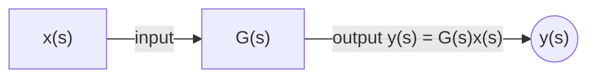

# 1.2 Frequency domain
*Amathuba: Module 1, Chapter 1: Introduction and Revision > Notes > `notes 1_2 signals revision - frequency domain.pdf`*  
*Local deck: `02 Modules/Module 1, Chapter 1 - Introduction and Revision/1.2 Signals revision - frequency domain.pdf`*
### Overview
**Time and frequency domains:** like different "coordinate systems" for representing signal information. Same signal, two views: value at each instant (time) vs. which frequencies it is built from (frequency).

**Domain-specific objectives:** we might need to satisfy both time- and frequency-domain objectives, such as:
- Decreasing settling time (time domain)
- Attenuating high-$\omega$ noise (frequency domain)
### Basis and Coordinate Systems
**Basis:** set of signals that can be linearly combined to create all signals in a domain.

**Time domain basis:** set of shifted impulses $\delta(t-\lambda)$ for all $\lambda \in \mathbb{R}$
- Any signal can be constructed as weighted sum of shifted impulses
- Basis functions: $\delta(t-\lambda) \, \forall \lambda \in \mathbb{R}$

**Frequency domain basis:** set of sinusoids with frequencies that are integer multiples of the signal's fundamental frequency
- Basis functions: $\cos(k\omega t) \, \forall k \in \mathbb{Z}$
- Allows representation of periodic signals

**Changing domains = basis change:** transforming between domains is mathematically a change of basis, like transforming between rectangular and polar coordinates.
### Harmonics
**Harmonics:** frequencies that are integer multiples of the signal's fundamental frequency
- Basis: $\cos(k\omega t)$ where $k \in \mathbb{Z}$ and $\omega = \frac{2\pi}{T}$
- First through fourth harmonics shown as constituent frequencies

**DC component:** 0th harmonic
- Changing DC component shifts entire signal up or down without changing shape

**Periodicity requirement:** frequencies must be integer multiples for combination to be periodic

**Parameters of each harmonic:**
- Magnitude: $A$
- Phase: $\theta$
- General form: $A\cos(k\omega t + \theta)$
### Complex Exponentials and Conjugate Pairs
**Question:** impulses only have magnitude, so how can one coefficient represent both magnitude and phase?

**Answer:** coefficients are 2-dimensional numbers (complex numbers)

**Basis expansion:** frequency domain basis is set of complex exponentials with positive and negative integer multiples of signal frequency
- Basis: $e^{jk\omega t}$ for $k \in \mathbb{Z}$ (positive and negative frequencies)

**Real-valued signals:** positive and negative frequency components must form conjugate pairs to produce real-valued output
- Conjugate pair: $Ae^{j\theta}e^{jk\omega t} + Ae^{-j\theta}e^{-jk\omega t}$
- Same magnitude, opposite phase

**Euler's formula:** $$\frac{1}{2}e^{jk\omega t} + \frac{1}{2}e^{-jk\omega t} = \cos(k\omega t)$$
### Fourier Series
**Fourier series:** representation of periodic signal as weighted sum of harmonic components (sinusoids with integer multiple frequencies)

**Example:** $$6\cos\left(\pi t + \frac{\pi}{4}\right) = 3e^{j\pi/4}e^{j\pi t} + 3e^{-j\pi/4}e^{-j\pi t}$$

**General form:** $$x(t) = \sum_{k=-\infty}^{\infty} a_k e^{jk\omega_0 t}$$

**Frequency domain plot properties:**
- Magnitude: even function
- Phase: odd function
- For real-valued signals

**Pulse spacing and frequency components:**
- Moving pulses closer (increasing $\omega_0$): moves frequency components further apart
- Moving pulses further apart (decreasing $\omega_0$): brings frequency components closer together
- Pulses infinitely far apart (non-periodic): frequency components become continuous
### Fourier Transform
**Fourier transform:** frequency domain representation of non-periodic signal.

**Fourier synthesis equation (reconstruction):** reconstructs signal as integral of frequency components
$$x(t) = \frac{1}{2\pi}\int_{-\infty}^{\infty} X(\omega)e^{j\omega t}d\omega$$

**Fourier analysis equation:** calculates transform of signal
$$X(\omega) = \int_{-\infty}^{\infty} x(t)e^{-j\omega t}dt$$

**Practical use:** seldom use analysis equation directly. Instead evaluate Fourier transform using:
- Transform properties (scaling, time shift, differentiation, etc.)
- Table of common transform pairs

**Example 1:** $x(t) = 5e^{-2(t-1)}u(t-1)$
- Form: $e^{-bt}u(t) \to \frac{1}{j\omega+b}$ with $b=2$
- Scaling: $ax(t) \to aX(\omega)$ with $a=5$
- Time shift: $x(t-c) \to X(\omega)e^{-j\omega c}$ with $c=1$
- Result: $$X(\omega) = \frac{5e^{-j\omega}}{j\omega+2}$$

**Example 2:** $x(t) = \frac{1}{2}e^{2t}u(t)$ - non-convergent case
- Direct integration diverges (integral does not converge)
- Solution: multiply by "helper" exponential $e^{-\sigma t}$
### Laplace Transform and s-Domain
**Problem with Fourier transform:** convergence issues with non-decaying signals

**Solution:** introduce "helper" exponential $e^{-\sigma t}$

**Example 2 continued:** $x(t) = \frac{1}{2}e^{-\sigma t}e^{2t}u(t)$ with $\sigma > 2$
- Product becomes decreasing exponential
- Analysis equation converges when $\sigma = 5$:
$$X(\omega) = \int_0^{\infty} \frac{1}{2}e^{-(3+j\omega)t}dt = \frac{1}{2(3+j\omega)}$$

**Basis change to s-plane:** integrating product with complex exponential $e^{-st}$ where $s = \sigma + j\omega$
$$X(s) = \int_0^{\infty} x(t)e^{-st}dt$$

**s-plane representation:** complex plane with $\sigma$ on real axis, $\omega$ on imaginary axis ($s = \sigma + j\omega$)

**Laplace transform:** $X(s)$, the s-domain version of signal
- Bilateral Laplace transform: spans all time from $-\infty$ to $\infty$
- Unilateral Laplace transform: runs from 0 to $\infty$ (used in control for right-sided signals)

**Region of convergence (ROC):** region in s-plane where integral converges
- For right-sided signal (0 for $t < 0$): unilateral Laplace sufficient

**Laplace basis functions:** complex exponentials with exponential envelope
- Form: $e^{\sigma}e^{j\omega t}$ or combined: $e^{\sigma}2\cos(\omega t)$
- Sinusoids multiplied by exponential envelopes

**Eigenfunctions of linear systems:** sinusoids and exponentials are only types of signals that pass through linear systems without changing shape
- Pass through derivative unchanged (only scaled and phase-shifted)
- Example: triangle wave becomes square wave (changes shape)
- Property: only transformation is scaling, hence "eigenfunctions"
### Convolution Property
**Key insight:** convolution in time domain becomes multiplication in frequency/s-domain

**Time domain:** $$y(t) = x(t) * h(t) = \int_{-\infty}^{\infty} x(\lambda)h(t-\lambda)d\lambda$$

**Frequency domain:** $$Y(\omega) = X(\omega)H(\omega)$$

**s-domain:** $$Y(s) = X(s)H(s)$$

**System computation:**
- Instead of convolving input and impulse response in time domain (computationally intensive)
- Multiply Laplace transforms in s-domain
- Transform back if needed

**Transfer function:** Laplace transform of impulse response
$$H(s) = \mathcal{L}\{h(t)\}$$

**Transfer function as system model:** completely defines model of LTI system, just as impulse response does

**Working with transfer functions:** gives intuitive way to visually represent and manipulate interconnected systems (block diagram algebra)

## Alternate pass
A second, more compressed write-up of the same deck. Useful for a quick skim or self-test.

### Frequency domain
**Time** and **frequency** domains are like different "coordinate systems" for representing signal information.
Might use both time- and frequency-domain objectives, such as decreasing settling time
### Basis
Changing domains = a basis change
**Basis:** set of vectors that can be linearly combined to create all vectors in a space

A signal is an infinitely long vector, so:
- Basis: set of signals that can be linearly combined to create all signals in a domain
- Any signal can be constructed as a weighted sum of shifted impulses
- So the basis of the time domain is the set of shifted impulses

Basis of the frequency domain is the set of sinusoids with frequencies that are integer multiples of the signal's frequency
### Harmonics
**Harmonics:** frequencies that are integer multiples of the signal's frequency

$0^{th}$ harmonic = DC component
Changing the DC component shifts the signal up or down without changing its shape.
Frequencies must be integer multiples for the combination to be periodic

The parameters of each harmonic component are **magnitude** $A$ and **phase** $\theta$ $$A\cos(k\omega t+\theta)$$
### Complex exponential basis
Q: Impulses only have magnitude, so how can *one* coefficient represent both magnitude and phase?
A: The coefficients are 2-dimensional numbers (complex numbers)

So the basis of the frequency domain is the set of complex exponentials with frequencies that are positive and negative integer multiples of the signal's frequency.
For a signal to be real-valued, the positive and negative frequency components must form conjugate pairs (same magnitude, opposite phase)
### Fourier series
**Fourier series:** representation of a periodic signal as a weighted sum of harmonic components (sinusoids)

For a real-valued signal, the frequency-domain plot has even magnitude and odd phase.
Moving the pulses closer (increasing $\omega_0$) moves the components further apart; moving the pulses further apart (decreasing $\omega_0$) brings them closer
### Fourier transform
Fourier synthesis equation
Fourier analysis in frequency and time domain
Use table of transforms

S plane: $s = \sigma + j\omega$
Region of convergence (ROC): where the transform converges
### Laplace transform
**Laplace transform:** takes us from the time domain to the s domain
- Bilateral
- Unilateral

Sinusoids and exponentials are the only types of signal that pass through all linear systems without changing their shape (still sinusoids/exponentials after the system). They are eigenfunctions of linear systems (only transformation = scaling)
### Convolution
Convolution in the time domain becomes multiplication in the frequency (or s) domain.
So instead of finding the output by convolving the input and impulse response, we can multiply their Laplace transforms

**Transfer function:** Laplace transform of the impulse response

$G(s) = \frac{y(s)}{x(s)}$: ratio of output to input in the s domain (zero initial conditions). Multiply input by $G(s)$ to get output, instead of convolving with $h(t)$
