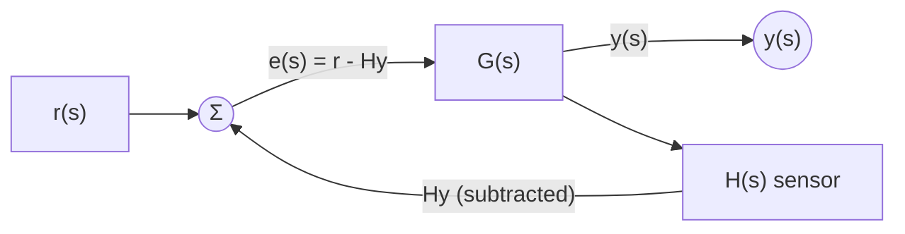

# 1.3 Block diagrams
*Amathuba: Module 1, Chapter 1: Introduction and Revision > Notes > `notes 1_3 block diagrams.pdf`*  
*Local deck: `02 Modules/Module 1, Chapter 1 - Introduction and Revision/1.3 Block diagrams.pdf`*
### System Blocks
**System block:** basic unit of block diagram
- Input: $x(s)$ (in Laplace domain) or $x(t)$ (in time domain)
- Transfer function: $H(s)$
- Output: $y(s) = H(s)x(s)$ (frequency domain) or $y(t) = h(t) * x(t)$ (time domain)

**Output calculation:**
- Frequency domain: output = input multiplied by transfer function
- Time domain: output = convolution of input and impulse response (rarely used due to computational intensity)
### Cascade Connection
**Cascade connection:** one system connected after another, so output of first becomes input to next

**Signal flow:** $x(s) \to H_1(s) \to H_2(s) \to y(s)$
- Output of $H_1$: $H_1(s)x(s)$
- Final output: $y(s) = H_2(s)H_1(s)x(s)$

**Effective transfer function:** $$H(s) = H_2(s)H_1(s)$$
- Cascade blocks are multiplied
- Transfer function of single equivalent system with same effect as combination
### Take-off Points
**Take-off point:** point where signal splits into different paths
- Signal remains same anywhere along either path
- Allows signal to feed multiple subsystems
### Summing Junctions
**Summing junction:** combines signals using addition/subtraction
- Represented by circle with +/- signs
- Inputs are added (+ sign) or subtracted (- sign)
- Single output

**Multiple summands:** representing sums with > 2 signals
- Can use multiple + or - symbols around junction circle
- Alternative representations exist, lecture uses simple circle with +/- marking
### Parallel Connection
**Parallel connection:** two systems along separate paths that join at summing junction

**Effective transfer function:** $$H(s) = H_1(s) + H_2(s)$$
- Parallel blocks are added
- Outputs from each path combine at sum

**Alternative notation:** various ways to draw summing junctions and paths, all equivalent
### Feedback and Loops
**Loop:** connecting output of system to its input, creating feedback path

**Feedback:** ability of system to monitor its own output
- Putting system in feedback gives ability to regulate itself by responding to present output
- Can be negative (stabilizing) or positive (destabilizing)

**Shower example - open loop control:**
- Turn tap to position, no feedback
- No way to know if water is right temperature before getting in
- Disturbances (roommate using water) cause temperature changes we cannot correct

**Shower example - closed loop control:**
- Feel water temperature (sensor)
- Compare to desired value (setpoint)
- Adjust tap (actuator) based on error
- Negative feedback: if too hot, turn toward cold; if too cold, turn toward hot
- Oscillates between states but eventually reaches setpoint

**Negative feedback:** output is subtracted from setpoint
- Corrections opposite to direction of error
- Stabilizing, used in control engineering

**Positive feedback:** output is added to setpoint
- Reinforces deviations from ideal
- Destabilizing, rarely used in control
- Example: outbreak of mass hysteria
### Control Systems
**Plant:** the thing we are trying to control (motor, heater, shower, crane)

**Process:** part of plant that produces the output
- Example: shower (produces water temperature)

**Actuator:** drives process in response to input
- Example: person turning tap (you are the actuator)

**Actuator input:** control signal $u(s)$ sent to actuator

**Process input:** what actuator actually drives (tap position $x(s)$)

**Setpoint:** desired value for output, $r(s)$

**Error:** difference between setpoint and output, $e(s) = r(s) - y(s)$

**Sensor:** system that measures output
- Block shown explicitly if not perfect
- No sensor block means perfect sensing (output of sensor is exactly true output)

**Controller:** system that adjusts plant input in response to error
- Takes error signal and produces actuator input
- Transfer function: $K(s)$

**Control system diagram:**
```
r(s) --[+]--[e(s)]--[K(s)]--[u(s)]--[P(s)]--[y(s)]
       [- ]          plant              [H(s)]
              [sensor]
```

**Control engineering definition:** "the science and art of choosing inputs to get the outputs that we want"

**Control objectives:**
1. System reliably reaches setpoint value
2. Once at setpoint, improve how it gets there:
   - Make it get there in less time (settling time)
   - Make it get there with less oscillation (damping)
### Closed-Loop Transfer Function
**Closed-loop transfer function:** effective transfer function that maps setpoint to output

**Notation:**
- Controller: $K(s)$
- Plant: $P(s)$
- Sensor: $H(s)$

**Open-loop transfer function:** transfer function of forward path (from setpoint to output without loop)
$$G(s) = K(s)P(s)$$

**Derivation of closed-loop transfer function:**
1. Feedback signal: $v = H(s)y(s)$
2. Error: $e(s) = r(s) - H(s)y(s)$
3. Control input: $u(s) = K(s)e(s)$
4. Plant output: $y(s) = P(s)u(s)$
5. Combining: $y(s) = P(s)K(s)[r(s) - H(s)y(s)]$
6. Expanding: $y(s) = P(s)K(s)r(s) - P(s)K(s)H(s)y(s)$
7. Rearranging: $y(s)[1 + P(s)K(s)H(s)] = P(s)K(s)r(s)$
8. Solving: $$G_{CL} = \frac{y(s)}{r(s)} = \frac{K(s)P(s)}{1 + K(s)P(s)H(s)} = \frac{G(s)}{1 + G(s)H(s)}$$

**Basic feedback loop (unity feedback):**
$$G_{CL} = \frac{G}{1 + GH}$$
where the denominator $1 + GH$ is called the "loop gain"
### Feedback Loop Configurations
**Nested loops:** one feedback loop inside another
- Inner loop $A$ with feedback $B$: $\frac{A}{1+AB}$
- Outer loop $C$ around the result: overall transfer function $\frac{A}{1+AB+AC}$

**Cascaded loops:** feedback loops in series
- Each loop reduced independently: $\frac{A}{1+AB}$ and $\frac{C}{1+CD}$
- Combined as cascade: $$\frac{AC}{(1+AB)(1+CD)}$$

**Interlocking loops:** loops that share signals, require block diagram manipulation
- Use moving take-off points: multiply by $\frac{1}{G(s)}$ to extract signal before a block
- Use moving summing junctions: multiply by $\frac{1}{G(s)}$ to move sum before block
- Technique allows reduction to simpler nested or cascaded form
### Block Diagram Reduction
**Moving a take-off point:**
- Moving from output of $G(s)$ to input requires adding $\frac{1}{G(s)}$ block in the signal path
- Ensures output remains unchanged

**Moving a summing junction:**
- Moving sum from output of $G(s)$ to input requires adding $\frac{1}{G(s)}$ block for the affected signal
- Preserves output relationships

**Interlocking loop example - reduction steps:**
1. Identify take-off points to move
2. Add inverse transfer functions where needed
3. Reduce inner loops
4. Reduce parallel sections
5. Apply basic feedback formula to final loop

**Result:** reduces complex interconnected loops to standard form allowing formula application

**Example interlocking reduction:** From complex multi-branch configuration:
$$G_{CL} = \frac{ABC}{1 + BEA + BDC}$$

> **Correction announced 5 Aug.** From slide 92 the deck simplifies the interlocking loops wrongly. The simplified inner term is $(DA - EC)$, not $-(EC + DA)$. Mark this in the PDF, the fix has not been made in the file on Amathuba.
### Three Core Block Diagram Rules
**Series (cascade):** blocks in sequence multiply
- Equivalent single block: $H_{total}(s) = H_2(s)H_1(s)$

**Parallel:** blocks with outputs combined at summing junction add
- Equivalent single block: $H_{total}(s) = H_1(s) + H_2(s)$

**Feedback:** output fed back to input through loop
- General form: $$G_{CL} = \frac{G(s)}{1 + G(s)H(s)}$$
- Negative feedback (standard): output subtracted from reference
- Positive feedback: output added to reference

## Alternate pass
A second, more compressed write-up of the same deck. Useful for a quick skim or self-test.

### Connections
**Cascade connection:** blocks in series; multiply their transfer functions into one effective transfer function
**Take-off point:** same signal split to multiple paths
**Summing junction:** adds/subtracts signals; sums with > 2 signals drawn as chained junctions
**Parallel connection:** same input to multiple blocks, outputs summed
### Feedback loop

Error compares setpoint with *measured* output: $e = r - Hy$. Perfect sensor: $H = 1$, so $e = r - y$
**Setpoint:** desired value for the output $r(s)$
**Negative feedback:** output is subtracted from setpoint
**Positive feedback:** output is added to setpoint
**Plant:** the thing we are trying to control
- Consists of two subsystems: actuator and process
- Process: part of plant that produces the output
- Actuator: drives the process in response to input $u(s)$
"Input" = input to the plant, which is the actuator input
**Sensor:** system that measures the output
- No sensor block = perfect sensing, i.e. sensor output is exactly the true output
**Error:** difference between setpoint and output
**Controller:** system that adjusts the plant input in response to the error

Control engineering: "the science and art of choosing inputs to get the outputs that we want"

Once the system reliably reaches the setpoint, the next objective is to improve how it gets there
### Simplifying block diagrams
**Closed loop transfer function:** effective transfer function from setpoint to output
**Forward path:** path from setpoint to output without the loop
**Open loop transfer function:** transfer function of the forward path
Effective transfer function for the basic loop; interlocking loops

Cascaded loops: multiply their effective transfer functions

Move take of point
