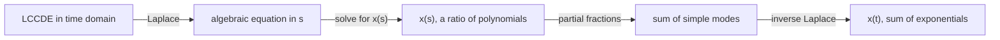
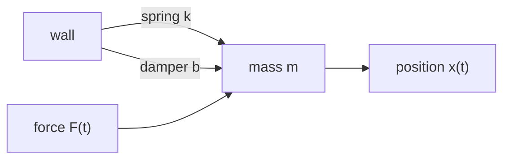
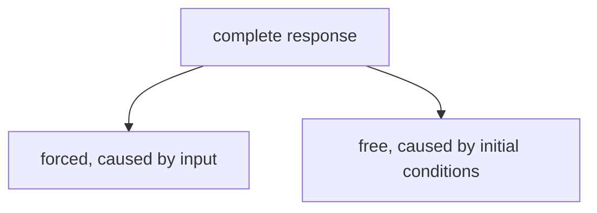
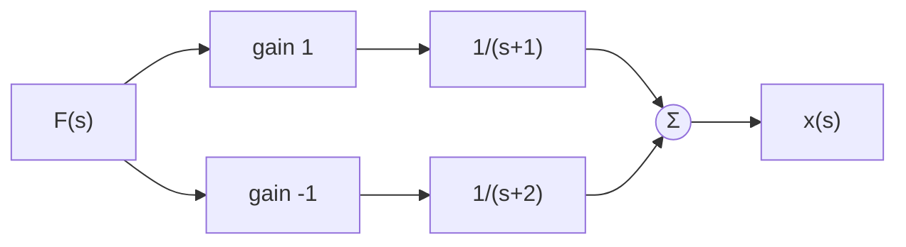
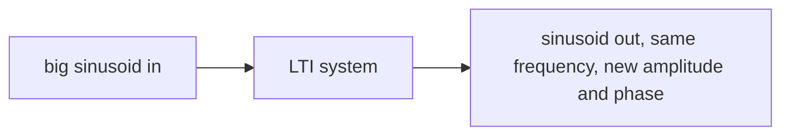
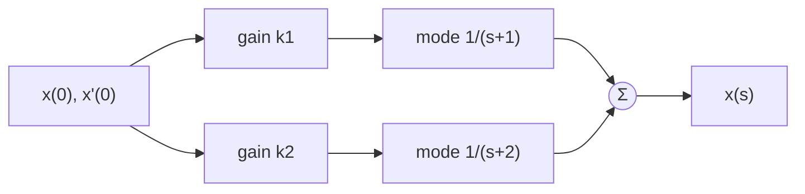

# 2.1 Dynamic responses of LTI systems
*Amathuba: Module 1, Chapter 2: Behaviour of LTI Systems in the Time Domain > Notes > `notes 2_1 dynamic reponses of LTI systems.pdf`*  
*Local deck: `02 Modules/Module 1, Chapter 2 - Behaviour of LTI Systems in the Time Domain/2.1 Dynamic responses of LTI systems.pdf`*

### Dynamic systems (p2-7)
**Dynamic system:** system modelled by differential equations in time. Output depends not only on the current input but on history (state), like a function with memory
- Example 1: motion described by position, velocity, acceleration
- Example 2: resistor-capacitor circuit, $\dot{V}(t) = -\frac{1}{RC}V(t)$
**LTI dynamic system:** modelled by a linear, constant-coefficient differential equation (LCCDE)
- Example: spring-mass-damper $m\ddot{x} = -b\dot{x} - kx + F(t)$, all coefficients constant
- Counter-example: pendulum, the $\sin(\theta(t))$ term means a coefficient depends on the variable itself, not LTI
**Order:** highest derivative present in the equation. RC circuit is first-order, spring-mass-damper is second-order
### Solving LCCDEs (p8-13)
Differential equations in the time domain become algebraic equations in the s domain, so "solving" turns into rearranging

The running example, spring-mass-damper. Mass on a spring with friction, push it with force $F(t)$, watch position $x(t)$:

**Laplace transform of a derivative** brings the initial conditions in as extra terms
- $\mathcal{L}\{\dot{x}(t)\} = sx(s) - x(0)$
- $\mathcal{L}\{\ddot{x}(t)\} = s^2x(s) - sx(0) - \dot{x}(0)$
- Do not forget the initial conditions
**Example: spring-mass-damper**
- Time domain: $m\ddot{x}(t) = -b\dot{x}(t) - kx(t) + F(t)$
- Transform each term: $m(s^2x(s) - sx(0) - \dot{x}(0)) = -b(sx(s) - x(0)) - kx(s) + F(s)$
- Collect all $x(s)$ terms on the left: $(ms^2 + bs + k)x(s) = F(s) + (b + ms)x(0) + m\dot{x}(0)$
- Left side: system dynamics acting on $x(s)$. Right side: input $F(s)$ plus initial-condition terms
- From here just algebra: solve for $x(s)$, no calculus needed
### Dynamic response (p14-34)
Divide the solved equation through by the dynamics and the response splits into two parts:
$$x(s) = \underbrace{\frac{1}{ms^2+bs+k}F(s)}_{\text{forced}} + \underbrace{\frac{(b+ms)x(0) + m\dot{x}(0)}{ms^2+bs+k}}_{\text{free}}$$
- **Forced response:** part caused by the input (particular solution)
- **Free response:** part caused by the initial conditions (homogeneous solution)
- Complete response = forced + free
Both parts share the same denominator $(ms^2 + bs + k)$, because both pass through the same dynamics
**Characteristic equation:** denominator set to zero, e.g. $ms^2 + bs + k = 0$
**Poles:** roots of the characteristic equation. Number of poles = order of the system
**Rest:** zero initial conditions. At rest the free part vanishes and only the transfer function is left. The course mostly assumes initial rest from here on
**Modal decomposition:** representing a system as a combination of elementary first-order mode subsystems. Like factoring a big problem into independent subproblems, each mode is one exponential $e^{pt}$ with its own pole $p$
- Lecturer's picture (p22-26): rather fight 100 duck-sized horses one at a time than one horse-sized duck. A seventh-order system is scary, seven first-order systems are manageable

**Running example** (used through the whole deck): pick $m=1$, $b=3$, $k=2$, so $ms^2+bs+k = (s+1)(s+2)$
Partial fraction working (p20): set $\frac{A}{s+1} + \frac{B}{s+2} = \frac{1}{(s+1)(s+2)}$, so $A(s+2) + B(s+1) = 1$
- Let $s=-1$: $A(1) + B(0) = 1$, so $A = 1$
- Let $s=-2$: $A(0) + B(-1) = 1$, so $B = -1$
$$x(s) = \frac{1}{(s+1)(s+2)}F(s) = \frac{1}{s+1}F(s) - \frac{1}{s+2}F(s)$$
Instead of one complicated monolithic response, we now have a sum of simple first-order parts (p21). As a block diagram (p28), the modes sit in parallel with gains $1$ and $-1$, impulse responses $e^{-t}u(t)$ and $e^{-2t}u(t)$:

Feed it a step $F(s) = \frac{1}{s}$. Multiplying by $\frac{1}{s}$ = integrating in the time domain, so the step response is the integral of the impulse response (p30). Integrate each mode:
$$x(t) = \tfrac{1}{2} - e^{-t} + \tfrac{1}{2}e^{-2t}$$
Starts at 0, settles at $\frac{1}{2}$. Same picture as slide p34, overall response = sum of the two mode responses:
```functionplot
---
title: Overall response f = mode g + mode h (slide p34)
xLabel: t
yLabel: x
bounds: [0, 6, -0.8, 1.2]
grid: true
---
f(x) = 0.5 - exp(-x) + 0.5*exp(-2*x)
g(x) = 1 - exp(-x)
h(x) = -0.5 + 0.5*exp(-2*x)
```
### Steady-state response (p35-39)
**Steady state:** part of the response that remains as $t \to \infty$
Its form follows the input: step input gives constant steady state, sinusoid in gives sinusoid out (slide p39)

Example: turn shower tap to fixed position (step input). Wild temperature swings at first = transient, settled final temperature = steady state
```functionplot
---
title: Step response = transient wiggle + steady state at 1
xLabel: t
yLabel: x(t)
bounds: [0, 6, 0, 1.6]
grid: true
---
f(x) = 1 - exp(-x) * cos(4*x)
g(x) = 1
```
### Transient response (p40-54)
**Transient:** part of the response that decays away over time
Transient has the same modes as the impulse response, i.e. the system's own exponentials, regardless of what input kicked them off
Transient dies away only if all exponential modes decay. One growing mode = response blows up = **unstable system**
**BIBO stability** (p43): Bounded Input, Bounded Output. Stable = every bounded (non-infinite) input is guaranteed a bounded output. A growing mode breaks this, the bounded impulse produces an infinite response
The sign of the exponent in each $e^{pt}$ decides it (p44-45): $e^{-t}$ decays, $e^{+t}$ grows. So pole locations determine stability
Stability from pole positions in the s plane (pole $p = \sigma + j\omega$, mode $e^{pt}$):
- Left-half plane, real part negative: decaying mode, stable
- Right-half plane, real part positive: growing mode, unstable
- On the imaginary axis, real part zero: sinusoid that never decays, marginally stable
```tikz
\begin{document}
\begin{tikzpicture}[scale=1.1]
\draw[->, thick] (-3.4,0) -- (3.4,0) node[below right] {$\sigma$};
\draw[->, thick] (0,-3.2) -- (0,3.2) node[above left] {$j\omega$};
\node at (-1.7,2.7) {\textbf{stable}};
\node at (1.7,2.7) {\textbf{unstable}};
\draw[dotted] (-3.2,-3) rectangle (0,3);
\node at (-2,0) {$\times$};
\node[below] at (-2,-0.1) {$-2$};
\node at (1,0) {$\times$};
\node[below] at (1,-0.1) {$+1$};
\node at (-1,2) {$\times$};
\node[left] at (-1.15,2) {$-1+3j$};
\node at (-1,-2) {$\times$};
\node[left] at (-1.15,-2) {$-1-3j$};
\node at (0,1.2) {$\times$};
\node[right] at (0.15,1.2) {$+3j$ marginal};
\draw[dashed] (-1,2) -- (-1,-2);
\end{tikzpicture}
\end{document}
```

| Pole location | Mode | Behaviour |
|---|---|---|
| $p = -2$ | $e^{-2t}$ | dies out fast |
| $p = -0.1$ | $e^{-0.1t}$ | dies out slowly |
| $p = +1$ | $e^{t}$ | blows up, unstable |
| $p = \pm 3j$ | $\cos(3t)$ | oscillates forever, never decays |
| $p = -1 \pm 3j$ | $e^{-t}\cos(3t)$ | oscillates while dying out |

```functionplot
---
title: The three fates of a mode
xLabel: t
yLabel: mode
bounds: [0, 4, -1.5, 3]
grid: true
---
f(x) = exp(-2*x)
g(x) = exp(0.6*x)
h(x) = exp(-x) * cos(6*x)
```
Top curve grows (unstable pole), bottom two die out, the wiggly one is a complex pair
**Initial value theorem (IVT):** $x(0) = \lim_{s \to \infty} s\,x(s)$
**Final value theorem (FVT):** $x(\infty) = \lim_{s \to 0} s\,x(s)$ (only valid if the limit exists, i.e. stable)
Mnemonic: the s limit runs opposite to the time limit. $t \to 0$ pairs with $s \to \infty$, $t \to \infty$ pairs with $s \to 0$
Running example (step input, slide p54): $x(s) = \frac{1}{(s+1)(s+2)}\cdot\frac{1}{s}$
- FVT: $\lim_{s \to 0} s\,x(s) = \frac{1}{1 \cdot 2} = \frac{1}{2}$, exactly where the plot above flattens out
- IVT: $\lim_{s \to \infty} s\,x(s) = 0$, starts at rest
### Free response (p55-58)
Course usually assumes initial rest so the free response rarely appears, but worth knowing (p55)
Set the input to zero, keep only the initial-condition terms
Running example (slide p58): $x(s) = \frac{(3+s)x(0) + \dot{x}(0)}{(s+1)(s+2)}$
Even though there is an $s$ in the numerator, partial fractions still give two terms with constant numerators:
$$x(s) = \frac{2x(0)+\dot{x}(0)}{s+1} - \frac{x(0)+\dot{x}(0)}{s+2}$$
Same two modes $e^{-t}$ and $e^{-2t}$ as always, but now the numerators are set by where you started, not by the input. The system rings down from its initial state
### Dynamic response: putting it together (p59-68)
Slide p65 picture, initial conditions feed both modes through gains $k_1 = 2x(0)+\dot{x}(0)$ and $k_2 = -x(0)-\dot{x}(0)$, modes sum to the output:

- IVT on each mode: $s \cdot \frac{k}{s+p} \to k$ as $s \to \infty$, so initial value $= k_1 + k_2$, set purely by the initial conditions. They decide where you start
- FVT on the free response: it decays to zero regardless of initial conditions (for a stable system). Initial conditions never affect where you end up
- Complete response = forced response + free response
- Punchline (p66-68): initial conditions shape the transient, never the steady state. No matter where the system starts or how fast it is going, it ends up in the same place

## Outline recap
Condensed bullet pass over the same deck. Use it to skim before a lecture or to self-test after.

### Introduction to Dynamic Systems
**Dynamic systems and differential equations**
- Dynamic system: a system that can be modeled using differential equations in time
- Examples: motion (position, velocity, acceleration), RC circuits, spring-mass-damper systems
- LTI dynamic system: linear, constant-coefficient differential equation in time (LCCDE)
- Order of differential equation: the highest derivative present
- Counter-example of LTI: pendulum (coefficients are functions of variables)

**From time domain to s-domain**
- Laplace transform converts differential equations to algebraic equations
- For second-order example: $m\ddot{x}(t) = -b\dot{x}(t) - kx(t) + F(t)$ becomes $ms^2x(s) + bsx(s) + kx(s) = F(s) + \text{initial conditions}$
- Characteristic equation: denominator set equal to zero
- Poles: roots of characteristic equation; number of poles equals system order
### Dynamic Response Decomposition
**Forced and free response**
- Forced response (particular solution): part related to input
- Free response (homogeneous solution): part related to initial conditions
- Complete response: sum of both components

**Modal decomposition and partial fraction expansion**
- Any transfer function can be decomposed into simpler first-order components
- Partial fraction expansion: high-order system represented as sum of elementary modes
- Example: $\frac{1}{(s+1)(s+2)} = \frac{1}{s+1} - \frac{1}{s+2}$
- Working with simple modes is far easier than complex high-order systems

**Block diagram representation of modes**
- Each mode represented as its own subsystem
- Modes connected in parallel
- For step response to impulse response: multiplying by $1/s$ in s-domain equals integration in time domain
- Overall response is sum of individual mode responses

**From s-domain to time domain**
- Example: $x(t) = e^{-t}u(t) - e^{-2t}u(t) + \frac{1}{2}$
- Each mode contributes exponential decay term
- Faster poles contribute higher frequency decay
### Poles and Stability
**Pole location and time-domain response**
- Real pole at $-p$ gives response: $e^{-pt}u(t)$ (decaying if $p > 0$)
- Poles in left-half plane (negative real part): stable, exponential decay
- Poles in right-half plane (positive real part): unstable, exponential growth
- Poles on imaginary axis (real part = 0): marginally stable, bounded sinusoid

**BIBO stability**
- Bounded input, bounded output stability
- System is stable if bounded input produces bounded output
- Requires all poles in left-half plane
### Initial and Final Value Theorems
**Initial value theorem (IVT)**
- $x(0) = \lim_{s \to \infty} sx(s)$
- Finds value at $t = 0$ using only transfer function

**Final value theorem (FVT)**
- $x(\infty) = \lim_{s \to 0} sx(s)$
- Finds steady-state value as $t \to \infty$
- Note: limits in $s$ go opposite direction to desired time value
### Free Response with Initial Conditions
**Free response structure**
- Transfer function with initial conditions: $x(s) = \frac{(b + ms)x(0) + m\dot{x}(0)}{ms^2 + bs + k}$
- Partial fraction expansion still yields constant-denominator terms
- Residuals depend on initial conditions

**Complete response behavior**
- No matter initial conditions, system converges to same steady state (if stable)
- Initial conditions only affect transient response, not steady state
- Free response decays to zero regardless of initial state (for stable systems)
