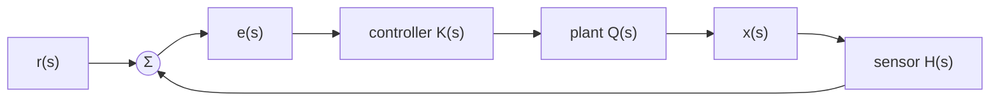
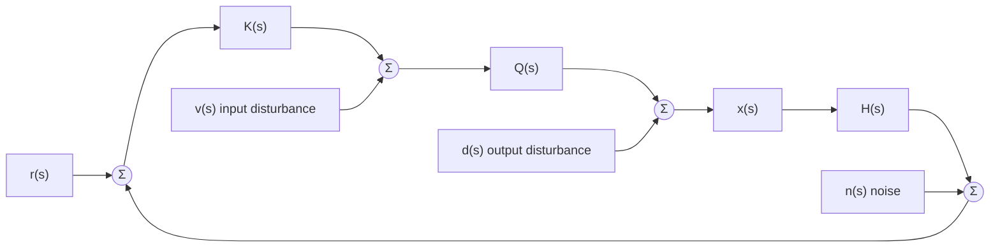

# 2.2 Steady state
*Amathuba: Module 1, Chapter 2: Behaviour of LTI Systems in the Time Domain > Notes > `notes 2_2 steady state.pdf`*  
*Local deck: `02 Modules/Module 1, Chapter 2 - Behaviour of LTI Systems in the Time Domain/2.2 Steady state.pdf`*

### Last time (p2-6)
Steady state: part of the response that remains as $t \to \infty$. Its form follows the input, this lecture uses step and ramp setpoints
### Reference tracking (p7-96)
**Reference tracking:** ability of the system to follow a given setpoint exactly
This deck's example (p8): same spring-mass car but $m=1$, $b=10$, $k=24$, so plant $Q(s) = \frac{1}{(s+4)(s+6)}$. Goal: unit step reference moves the car exactly 1 m
**Why feedback?** Open loop cannot track reliably (p11-13): the force profile that reached the target on day 1 gives a different result under day 2 conditions. Close the loop so the system can check whether it has actually arrived

Closed-loop transfer function: $G_{CL} = \frac{KQ}{1+KQH}$. The deck writes the denominator as $1+KQH$ throughout, and $L = KQH$. Dropping $H$ is only valid when the sensor is unity
No controller at all (p18-21): $G_{CL} = \frac{1}{s^2+10s+25}$. FVT on a unit step: $x(\infty) = \frac{1}{25} = 0.04$. Car barely moves
Why it stalls (p22-24): initial error 1 gives initial force 1, but force shrinks as the error shrinks, until the spring and damper balance it and the car stops short
**Proportional controller:** scales the error by a constant $k$. Bigger $k$ gets closer (deck: $k=5$ closer, $k=150$ closer still but overshoots and has to backtrack). Never reaches zero error
**Integral controller:** scales and integrates the error. Force keeps growing while the car sits away from the setpoint, so the error gets driven all the way to zero. Too big $k$ = overshoot. Constant error in gives constant velocity out
**Setpoint to error transfer function.** Around the loop: error times controller times plant gives the output, times the sensor gives what the summer subtracts
**Loop transfer function** $L(s)$: product of every block in the loop path, so
$$e(s) = \frac{1}{1+L(s)}\,r(s)$$
Apply the FVT to $e(s)$ to get the final error
**Error constant:** final value of the error for some setpoint. Shrinks as loop gain grows
**Gain:** value of a transfer function at $s=0$
- Proportional control raises the loop gain, which scales the error down to something manageable, but never to zero
- Zero error needs infinite gain at $s=0$. An integrator $\frac{k}{s}$ delivers exactly that, its gain blows up as $s \to 0$. That is why the integral controller succeeds: its denominator $s$ lands in the numerator of $\frac{1}{1+L}$ and kills the error
**Integrator:** block with transfer function $\frac{1}{s}$, output is the running integral of the input
**Why the denominator lands on top** (p59-70). Write each block as numerator over denominator, $K = \frac{N_K}{D_K}$ and so on. Then
$$G_e = \frac{1}{1+L} = \frac{D_K D_Q D_H}{N_K N_Q N_H + D_K D_Q D_H}$$
All the loop denominators end up in the numerator of $G_e$. An integrator makes $D_K = s$, so an $s$ sits on top. Race it against the setpoint's $s$'s in the FVT:
- Step $\frac{1}{s}$: the $s$'s cancel, error $\to 0$
- Ramp $\frac{1}{s^2}$: one $s$ short, error finite, car trails at a constant offset (deck example: $\frac{10}{11} = 0.91$)
- Parabola $\frac{1}{s^3}$: two short, error $\to \infty$, setpoint runs away over time
**Type number:** number of integrators in the loop path
- Type must match the setpoint order for perfect tracking: at least one integrator for a step, two for a ramp, three for a parabola. Matches the setpoint transforms $\frac{1}{s}$, $\frac{1}{s^2}$, $\frac{1}{s^3}$
- **Type correction:** add integrators in the loop path, anywhere in the loop counts, usually put in the controller before the plant
- Intuition: you are adding the form of the setpoint you want to track into the loop
**Internal model principle:** to track a reference without error, the form of that reference must be included in the loop path
- Works for other setpoint shapes too (p91): tracking a sinusoid $\sin(bt)$ needs $\frac{b}{s^2+b^2}$ in the loop
- Do not mash every setpoint form into one giant controller (p92-96): you will likely introduce unstable poles, every extra layer adds cost and failure points, and the loop becomes more sensitive to signals you do not want. Design the simplest system that solves the problem
### Disturbance rejection (p97-121)
Real loops have unwanted inputs besides the setpoint:
- **Input disturbance** $v(s)$: enters at the plant input, plant receives something different from what the controller sent
- **Output disturbance** $d(s)$: plant model inaccurate or plant misbehaving, modelled as an extra signal added to the output
- **Noise** $n(s)$: error added at the sensor measurement

Loop becomes MISO. Superposition applies: consider each input individually with all others set to zero
Transfer function from each unwanted input to the output (good exercise to derive, p104-116):
$$G_v = \frac{Q}{1+L} \qquad G_d = \frac{1}{1+L} \qquad G_n = \frac{-L}{1+L}$$
$G_d$ is the same as the setpoint-to-error transfer function
High loop gain: $G_v \to 0$ and $G_d \to 0$, disturbances rejected. But $|G_n| \to 1$, noise passes straight through to the output. Loop gain cannot fix noise, frequency response methods handle it later

## Outline recap
Condensed bullet pass over the same deck. Use it to skim before a lecture or to self-test after.

### Reference Tracking Fundamentals
**Steady-state definition**
- Part of response that remains as time tends to infinity
- Form depends on the input type (step, ramp, parabola)

**Open-loop limitations**
- Open-loop control cannot track references reliably
- Same input produces different results under varying conditions
- Solution: feedback loop with controller
### Feedback Control Architecture
**Basic feedback loop**
- Setpoint $r(s)$ compared to measured output through sensor
- Error signal: $e(s) = r(s) - Hx(s)$
- Controller outputs force proportional to error
- Closed-loop transfer function: $G_{CL} = \frac{KQ}{1 + KQH}$

**Proportional control**
- Controller scales error by constant: $K$
- Reduces error but cannot eliminate it completely
- Too much gain causes overshoot; too little is slow

**Integral control**
- Controller integrates error: $K_i/s$
- Force increases if error persists
- Achieves zero steady-state error for step inputs
- Can be tuned with scalar to speed up or slow down response
### Error Transfer Function and Type Number
**Setpoint to error transfer function**
- General form: $G_e = \frac{1}{1 + L}$ where $L(s) = K(s)Q(s)H(s)$ is loop transfer function
- For stable system: $e(\infty) = \lim_{s \to 0} s \cdot \frac{1}{1 + L} \cdot r(s)$

**Type number concept**
- Type number: number of integrators in loop path
- System must match input order for zero steady-state error
  - Type 0: can track constants (step bounded error)
  - Type 1: can track steps perfectly, ramps with finite error
  - Type 2: can track ramps perfectly, parabolas with finite error
  - Type 3: can track parabolas perfectly

**Error constants for reference signals**
- For step input ($r(s) = 1/s$): error depends on loop gain at $s = 0$
- For ramp input ($r(s) = 1/s^2$): system needs integrator in loop to achieve zero error
- Increasing loop gain reduces error for fixed type number

**Residual numerator and denominator analysis**
- Transfer function in terms of components: $G_e = \frac{D_K D_Q D_H}{N_K N_Q N_H + D_K D_Q D_H}$
- Integrators contribute $s$ terms to numerator
- Matches input order to the $s$ in denominator

**Internal model principle**
- System must include model of reference to track it without error
- Adding integrator is equivalent to adding pole at origin
- Applies to step, ramp, and other periodic signals (e.g., sinusoid requires $\frac{b}{s^2 + b^2}$)
- Can add desired reference model into loop path
### Disturbance Rejection
**Multiple inputs (MISO systems)**
- Reference input $r(s)$
- Input disturbance $v(s)$ (affects plant input)
- Output disturbance $d(s)$ (affects plant output)
- Measurement noise $n(s)$ (corrupts sensor)

**Transfer functions for disturbances**
- Input disturbance: $G_v = \frac{Q}{1+L}$ (reduced by increasing loop gain)
- Output disturbance: $G_d = \frac{1}{1+L}$ (reduced by increasing loop gain)
- Measurement noise: $G_n = \frac{-L}{1+L}$, magnitude approaches 1 for high loop gain, so noise is not attenuated. The minus sign is on the slide

**Trade-off at high frequencies**
- Increasing loop gain helps with input/output disturbances
- High loop gain amplifies high-frequency noise
- Must balance disturbance rejection with noise robustness
