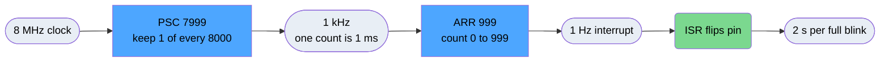
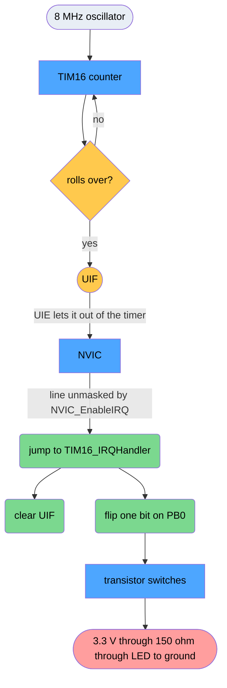
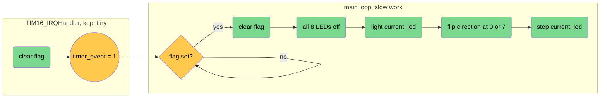
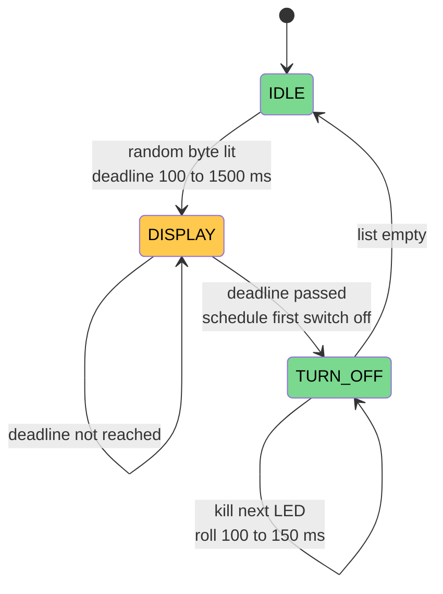
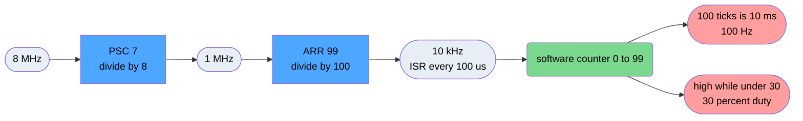

## Task 1 timer config
**Task.** Blink LED0 on PB0 at an exact 0.5 Hz using a timer interrupt, then prove the rate on the scope.
**Solution.** Divide 8 MHz in two stages, PSC 7999 to get 1 kHz and ARR 999 to get a 1 Hz update. The rollover raises UIF, UIE and the NVIC carry it to `TIM16_IRQHandler`, which toggles the pin. Two toggles make one cycle, so 2 s. Had to add `NVIC_EnableIRQ` myself, CubeMX never generated it.
**Code.** `main.c1`. Three places, and the third is the one CubeMX left out.
```c
htim16.Init.Prescaler = 7999;   // 8 MHz / 8000 = 1 kHz, one count is 1 ms
htim16.Init.Period    = 999;    // 1 kHz / 1000 = 1 Hz update
NVIC_EnableIRQ(TIM16_IRQn);     // I added this, without it nothing reaches the CPU

HAL_TIM_Base_Start_IT(&htim16); // in main, sets UIE and CEN together

void TIM16_IRQHandler(void) {
  HAL_TIM_IRQHandler(&htim16);  // clears UIF, else it refires forever
  HAL_GPIO_TogglePin(GPIOB, GPIO_PIN_0);
}
```
**Result.** 2.0038 s measured against 2.000 s expected, 0.19 percent fast, inside the HSI's 1 percent tolerance.
Tests two things: working the division backwards, and understanding the chain from hardware event to my code.
### Maths
$$f_{update}=\frac{f_{sysclk}}{(PSC+1)(ARR+1)}$$
Need to divide 8 MHz down to 1 Hz. One counter cannot, so two steps.

- **PSC** the prescaler, throws away ticks. 7999 lets 1 through per 8000.
- **ARR** the counter's finish line. 999 means it counts 0 to 999 then rolls over.
- Both one less than the round number because counting starts at 0.
- The ISR only flips, so a full blink takes two interrupts. 2 s on the scope.
### Vocabulary
- **peripheral** anything on the chip that is not the processor. Own settings at fixed addresses. Runs while the processor does nothing.
- **TIM16** one of the timers. Counts clock ticks by itself.
- **GPIOB** port B, owns pins PB0 to PB15. In code an address pointing at its settings.
- **PB0** wired to LED D1 through 150 ohm. The pin I probe.
- **UIF** the flag the timer raises when it rolls over. Stays up until cleared, so forgetting to clear it means the ISR repeats forever.
- **NVIC** watches the flags, holds the list of which function to run, interrupts the processor.
- **ISR** the function hardware jumps to. Never called from my code. Mine is `TIM16_IRQHandler`.
- **ARPE** stops the finish line moving mid race. ARR changes wait for the next rollover. Dead here, matters in Task 3.
- **HAL, LL, direct registers** friendly wrapper, thin wrapper, raw. All write the same addresses.
### The chain

Blue is hardware doing it on its own, amber is the flag, green is my code, red is the physical output.
Break one link and the LED sits dead with no error message.
Code never supplies power. It flips one bit, that bit picks which transistor conducts.
### Code map
| What | Where |
|---|---|
| chip to 8 MHz | `SystemClock_Config`, generated |
| timer power on | `HAL_TIM_Base_MspInit`, `stm32f0xx_hal_msp.c:95` |
| load 7999 and 999, unmask NVIC | `MX_TIM16_Init` |
| port B on, PB0 output | `MX_GPIO_Init` |
| **starts the counter** | `HAL_TIM_Base_Start_IT` in main |
| **flips the LED** | `TIM16_IRQHandler` |
| setup failed | `Error_Handler`, stops and spins |
Order matters. Clock first, everything is timed against it. Peripheral power before writing its settings, else writes vanish silently. Start last.
`main` starts the timer, does not run it. Breakpoint main and the LED keeps blinking. On this chip `main` never finishes, no OS to return to.
### Points to say out loud
1. **Bus divider is 1**, the only reason the timer sees the full 8 MHz. At 2 both numbers would be wrong.
2. **I added the NVIC line.** CubeMX never generated it. Without it the timer runs fine, raises its flag, and nothing listens. Almost certainly the deliberate fault in the template.
3. **PB1 driven low on purpose.** It sits beside PB0 and the two act like a tiny capacitor. Left floating it drifted up on every PB0 edge and lit LED1 faintly. Real fault, found on the bench.
4. **Push pull** two transistors, one up to 3.3 V, one down to ground, one on at a time. Open drain only pulls down, needs an external resistor, fine for I2C, no good for an LED.
5. **The handler is found by name only.** Startup file reserves the slot, my spelling replaces the placeholder. One wrong letter compiles, links, never blinks.
6. **HAL "Period" is not a time**, it is the raw ARR count.
### Measurement
2.0038 s against 2.000 s, 0.19 percent fast. The 8 MHz source is an RC circuit inside the chip, trimmed to about 1 percent at the factory. Inside spec. A crystal would be roughly 200 times tighter. Taken with the scope's automatic readout, not cursors.
## Task 2 running light
**Task.** One LED lit at a time walking 0 to 7 and back, one step per second, with the ISR setting a flag rather than driving pins.
**Solution.** Same timer as Task 1. The handler clears UIF, sets `timer_event`, and returns. The main loop polls the flag, clears it, and does the eight GPIO writes. Direction flips at 0 and 7 after lighting but before stepping, which is what stops the end LEDs repeating.
**Code.** `main.c2`. The whole task is the split between these two blocks.
```c
void TIM16_IRQHandler(void) {     // two writes and out
  HAL_TIM_IRQHandler(&htim16);
  timer_event = 1;
}

while (1) {                       // slow GPIO work lives here, not in the ISR
  if (timer_event) { timer_event = 0; update_led_pattern(); }
}

if (current_led == 7) direction = -1;   // flip AFTER lighting, BEFORE stepping
else if (current_led == 0) direction = 1;
current_led += direction;
```
**Result.** Sequence 0,1,2,3,4,5,6,7,6,5,4,3,2,1,0,1,2 as the brief requires. 14 steps per round trip. Recorded on video.
Timer untouched from Task 1. What changes is where the work happens.

Three things the brief demands, and they are the marks:
1. Handler sets a flag, never touches pins.
2. Sequence 0 to 7 to 0 with no repeated end LED.
3. Use the provided port and pin arrays.
- **Why the short handler.** Inside an interrupt, other interrupts are blocked. Eight writes in there delays everything. From Task 4 on, buttons depend on this.
- **Why volatile.** The ISR writes `timer_event`, the loop reads it. The compiler sees nothing in `while(1)` changing it, so it caches the value and spins forever on a stale copy. Leave it out and the code looks right and hangs. Most likely question here.
- **Why the flip comes before the step.** LED is lit, then direction is checked, then the index moves. Flip after stepping and LED7 lights twice in a row.
## Task 3 button and debounce
**Task.** Measure switch bounce on the scope, then debounce PA0 in software and use it to toggle the step speed between 1 s and 0.5 s.
**Solution.** Two filters must both agree before a press counts: the pin has just gone high to low, and 50 ms have passed since the last accepted press. Timestamps come from `HAL_GetTick`, so nothing blocks. Speed changes write `TIM16->ARR` directly and zero `TIM16->CNT`, prescaler untouched at 7999.
**Code.** `main.c3`. Two filters in one `if`, and a three line speed change.
```c
static GPIO_PinState prev_state = GPIO_PIN_SET;       // survives between calls
if (state == GPIO_PIN_RESET && prev_state == GPIO_PIN_SET &&   // filter 1, edge
    (now - last_button_press_time) >= DEBOUNCE_MS) {           // filter 2, deadline
  last_button_press_time = now;
  speed_state ^= 1;
  change_timer_period(speed_state ? 500 : 1000);
}
prev_state = state;               // always, or the edge is never seen

TIM16->ARR = new_period_ms - 1;   // PSC untouched, so ARR is just ms minus one
TIM16->CNT = 0;                   // else CNT past ARR wraps through 65535
```
**Result.** Debounce set to 50 ms, single shot capture on PA0 read 1.27 us. Speed toggles cleanly with no double stepping and the pattern never stutters.
- **Bounce** is two bits of metal springing together. They chatter for a few ms, so one press looks like several. Read naively and one press toggles the speed repeatedly.
- **The fix.** Accept a press only when the pin has just gone high to low, and at least 50 ms have passed since the last accepted press. First rule ignores holding. Second eats the chatter. 50 ms sits above bounce and below any deliberate double press.
- **Active low.** Pressing connects the pin to ground, so pressed reads 0. Nothing holds it high, hence `GPIO_PULLUP` on the button and `GPIO_NOPULL` on the LEDs.
- **Speed change.** Brief is specific: prescaler stays 7999, write `TIM16->ARR` directly, reset `TIM16->CNT`, do not re-init. One count is 1 ms so ARR is period minus one. 1000 gives 999, 500 gives 499.
- **Where ARPE earns its keep.** With it on, the new finish line waits for the next rollover, so the cycle in progress finishes cleanly. With it off, if the counter is already past the new ARR it runs to 65535 first. One absurdly long blink. This is Question 4 in the report.
- **On the scope.** Probe PA0, single shot trigger. Bounce happens once and never repeats identically, so a repeating trigger has nothing to lock onto.
## Task 4 four buttons, three modes
**Task.** Combine everything. Four debounced buttons selecting three display modes plus a speed toggle that works in all of them.
**Solution.** Every button gets its own timestamp and its own previous state, held in arrays, so one press cannot lock the others out. Changing mode clears the LEDs and resets every mode variable. Mode 3 is a three state machine driven by tick comparisons instead of delays, so the buttons stay live through waits of up to 1.5 s.
**Code.** `main.c4`. Same debounce as Task 3 but indexed, plus a state machine that never waits.
```c
uint32_t last_button_time[4];                  // one per button, not shared
static GPIO_PinState prev_state[4] = {GPIO_PIN_SET, ...};
for (uint8_t b = 0; b < 4; b++) { /* same two filters, indexed by b */ }

case SPARKLE_DISPLAY:                          // no delay anywhere
  if (now >= sparkle_display_until) {          // just asks "is it time yet"
    sparkle_next_off_time = now + 100 + (rand() % 51);
    sparkle_state = SPARKLE_TURN_OFF;
  }
  break;
```
**Result.** All three modes run and switch cleanly with no residue from the previous mode. Mode 3 LED on time measured 500 ms minimum and 1420 ms maximum, against a theoretical 200 ms and 2700 ms.
PA1 mode 1, PA2 mode 2, PA3 mode 3, PA0 speed in every mode. Starts blank.
- **Mode 1** running light from Task 2
- **Mode 2** inverse, all on except a moving gap
- **Mode 3** sparkle, random pattern held then switched off one at a time
Each button gets its own timestamp and its own previous state, in arrays. One shared timestamp would let a press on one button lock the other three out for 50 ms.
Mode switch clears all LEDs and resets every mode variable, so no pattern survives into the next mode.

Green states do something, amber just watches the clock.
Every transition is a clock comparison, never a wait. A delay would freeze the loop and the buttons would die. That is the whole reason for the state machine.
**Measurements.** Theoretical minimum is shortest hold plus shortest delay, 100 + 100 = 200 ms. Maximum is 1500 + 8 x 150 = 2700 ms. We measured 500 ms and 1420 ms. Hitting the maximum needs all eight bits set, about one round in 256.
## Task 5 ADC bar graph
**Task.** Read a DC voltage on PA5 with the ADC in continuous mode, take an interrupt on every conversion, and show the level as a bar of LEDs.
**Solution.** Register level setup: calibrate while disabled, wait for ADRDY, select channel 5 with the slowest sampling time, enable CONT and the EOC interrupt, then start once from main. The ISR reads DR, which also clears the flag, maps 12 bits onto 0 to 8 LEDs with `(value * 8 + 2048) / 4096` for round to nearest, and builds the bar with `(1 << k) - 1`.
**Result.** LED 5 predicted to switch at 1.857 V, measured 1.83 V, 1.5 percent low. Bar tracks the potentiometer smoothly with no flicker at the thresholds.
The ADC compares the input against 3.3 V and reports the fraction as 12 bits. 0 V gives 0, 3.3 V gives 4095.
Three ordering rules that break it silently:
1. Calibrate before enabling. Calibration only runs while the ADC is off.
2. Wait for the ready flag after enabling.
3. Reading the result register clears the done flag. No separate clear.
Continuous mode converts, interrupts, then starts the next conversion by itself.
- **Predicted count** for 2.0 V is 2.0 / 3.3 x 4095 = 2482.
- **Mapping** uses `(value * 8 + 2048) / 4096`. The +2048 is half the divisor, turning round down into round to nearest. LED 5 comes on at 2304, which is 1.857 V. Measured 1.83 V, 1.5 percent low.
- **Bar pattern** is `(1 << k) - 1`, which leaves the lowest k bits set. Five LEDs is `00011111`.
- **The 5 V question.** PA5 is a TTa pin, 3.3 V tolerant, wired straight to the ADC. 5 V forward biases the protection diode into the supply rail, far past the 5 mA rating. Can destroy the diode, wreck the analog switch, corrupt other channels, latch up the chip. Brief contact is enough.
## Task 6 software PWM
**Task.** Produce a 100 Hz signal at 30 percent duty on PB4 using only a timer interrupt and a GPIO pin. Hardware PWM channels are banned.
**Solution.** Split the job. Hardware makes the interrupt fast, PSC 7 and ARR 99 giving 10 kHz, so the ISR fires every 100 us. Software shapes it, a static counter running 0 to 99 that drives the pin high while it is under 30. 100 ticks of 100 us is 10 ms, so 100 Hz, and 30 of those ticks high is 30 percent.
**Result.** Pulse width measured 3.016 ms against an expected 3 ms. Period reading of 10.71 ms does not agree with either the code or the pulse, see the known issue below.
Timer interrupt and a GPIO pin only. Hardware PWM banned.
A timer alone makes only evenly spaced interrupts. So make the interrupt fast and shape it in software.

Blue is the hardware half, green is the software half. Everything blue is Task 1 again.
- Steps per period set the resolution. 100 steps means 1 percent jumps.
- The counter is `static`, so it survives between interrupts without being a global.
- `BSRR` sets and `BRR` clears, one write each. Read `ODR`, modify, write back is three steps and can be interrupted halfway.
- Flag cleared first thing in the handler, else it refires forever.
- **Exam question.** 50 Hz at 1 percent resolution needs 100 steps per period, so 50 x 100 = 5 kHz.
- **Known issue.** Report says 10.71 ms period, but the code forces exactly 10.00 ms and the pulse measured 3.016 ms. That ratio is 28 percent, not the 30 the code hard codes. Task 1 was 0.19 percent fast on the same oscillator, so this cannot be 7 percent slow. Likely cursor placement. If asked, say it should be re-read with the automatic measurement.
## Terms and abbreviations
Lookup for anything a tutor might point at.
### Clock and core
- **HSI** high speed internal. The 8 MHz RC oscillator inside the chip. About 1 percent factory tolerance, which is why the measured period is 0.19 percent off.
- **PLL** phase locked loop, multiplies a clock up. Not used here, so 8 MHz in means 8 MHz at the core.
- **RCC** reset and clock control. The peripheral that switches every other peripheral's clock on. Nothing works before its RCC bit is set.
- **AHB, APB** the two internal buses. Prescalers on both are 1, so everything runs at 8 MHz.
- **SysTick** a counter in the core that ticks every 1 ms and drives `HAL_GetTick`.
- **NVIC** nested vectored interrupt controller. Holds the mask for each interrupt line and the table of which function to jump to.
- **ISR, IRQ** interrupt service routine, the function hardware jumps to. IRQ is the request itself. Mine is `TIM16_IRQHandler`.
- **Vector table** the list at the start of flash mapping each interrupt to a function address.
### Timer
- **TIM16** the timer used in every task.
- **PSC** prescaler. Divides the incoming clock. Holds one less than the divide factor.
- **ARR** auto reload register. The finish line the counter rolls over at. Also one less.
- **CNT** the live count. Task 3 zeroes it after retuning ARR.
- **UIF** update interrupt flag, set on rollover. Stays set until cleared, so a handler that forgets refires forever.
- **UIE** update interrupt enable. Lets UIF out of the timer towards the NVIC.
- **CEN** counter enable. Starts the counter.
- **ARPE** auto reload preload enable. New ARR values wait for the next rollover instead of applying mid count.
- **SR, DIER, CR1** the registers holding those bits: status, interrupt enable, control.
### GPIO
- **GPIO** general purpose input output. **GPIOA, GPIOB** are ports, each owning 16 pins.
- **MODER** picks input, output, alternate or analog per pin. Two bits each.
- **OTYPER** push pull or open drain. **PUPDR** pull up or pull down. **OSPEEDR** slew rate.
- **ODR** output data register, the current pin levels. **IDR** input data register, what is read.
- **BSRR** sets bits, **BRR** clears bits. One write, only the named pin, cannot be interrupted halfway like read modify write on ODR.
- **Push pull** drives both high and low. Open drain can only pull low.
- **Active low** pressed reads 0, because the button shorts the pin to ground and the pull up holds it high otherwise.
### ADC
- **ADC** analog to digital converter. Reports the input as a fraction of the 3.3 V reference, 12 bit, so 0 to 4095.
- **ADCAL** calibration. Only works while the ADC is disabled.
- **ADEN, ADDIS** enable and disable. **ADRDY** ready flag, wait for it before converting.
- **ADSTART** starts a conversion. **CONT** continuous mode, it restarts itself.
- **EOC** end of conversion flag, cleared by reading **DR**, the data register.
- **EOCIE** the interrupt enable for EOC. **CHSELR** picks the channel, **SMPR** the sampling time.
- **TTa** the PA5 pin type in the datasheet. 3.3 V tolerant only, unlike **FT** which survives 5 V.
### Software
- **HAL** hardware abstraction layer, the friendly wrapper. **LL** low layer, a thin one. Both end up writing the same registers.
- **CMSIS** the ARM standard headers giving names like `TIM16->ARR`.
- **Msp** MCU support package. `HAL_TIM_Base_MspInit` is where HAL switches the timer clock on.
- **PWM** pulse width modulation. Fixed period, variable high time. Task 6 does it in software.
- **volatile** tells the compiler the value can change behind its back, so it must re read it instead of caching it in a register.
- **static** inside a function, the variable keeps its value between calls without being global.
