# Architecture - crate and data flow diagrams

## System overview - all crates

Three crates. Dependency direction: `crdt-client` -> `crdt-transport` -> `crdt-lib`. `crdt-lib` has no I/O, no tokio. Pure logic.

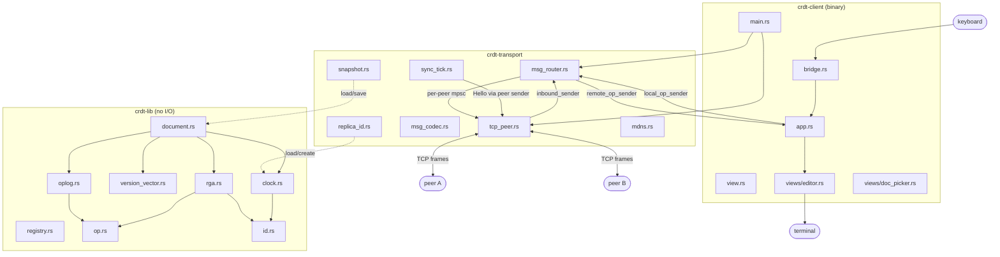

---

## crdt-lib - internal structure

Pure CRDT logic. `Document` is the only public facade the other crates use.

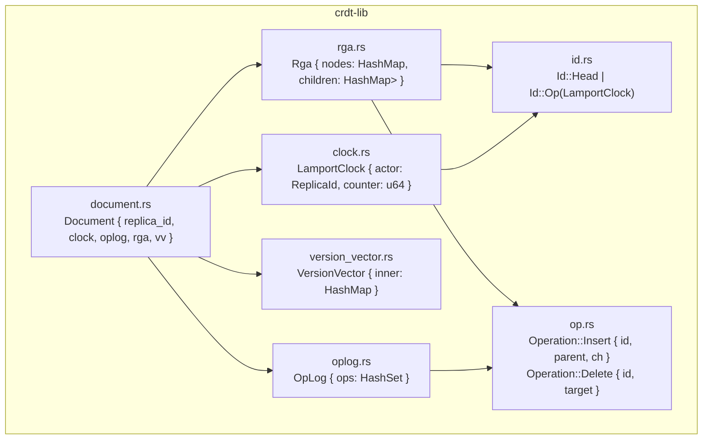

### Local insert flow (insert_after)

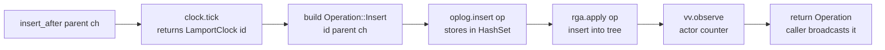

### Remote apply flow (apply)

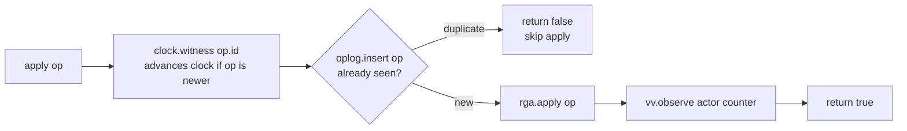

### ops_since - delta sync

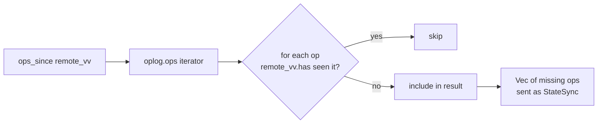

---

## crdt-transport - internal structure

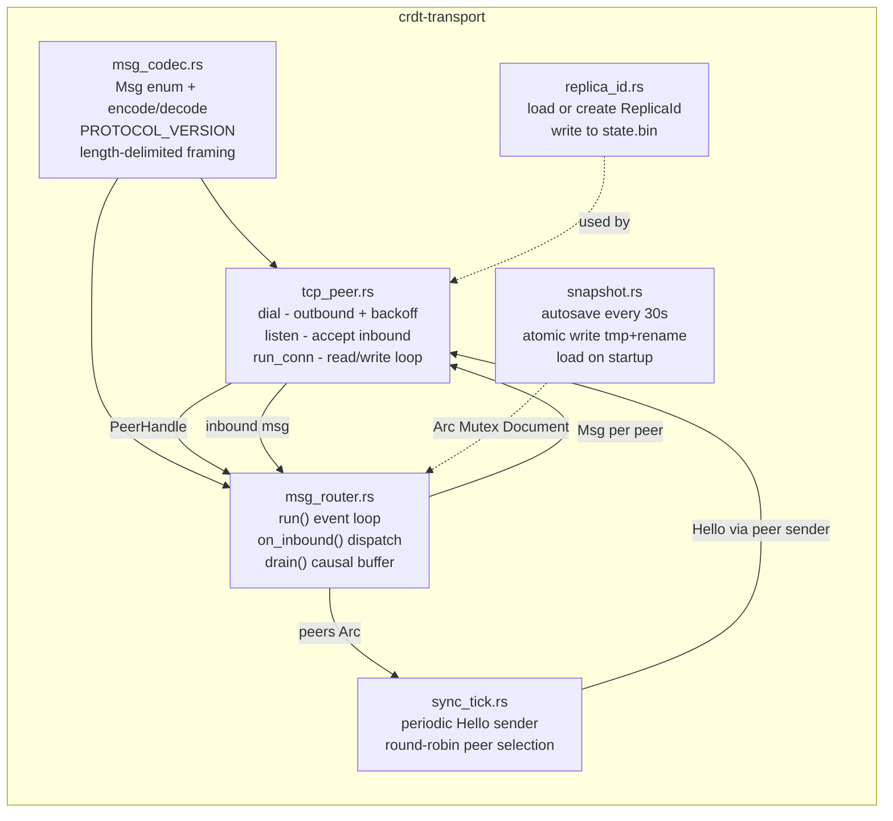

### tcp_peer - connection lifecycle

```mermaid
flowchart TD
    subgraph dial["dial (outbound)"]
        D1[create outbound_sender / receiver]
        D2[register PeerHandle with router\nbefore spawning task]
        D3[tokio::spawn loop]
        D4{TcpStream::connect}
        D5[set_nodelay true]
        D6[get fresh VV from doc]
        D7[run_conn]
        D8[sleep backoff\nbackoff x2 up to 30s]

        D1 --> D2 --> D3 --> D4
        D4 -->|ok| D5 --> D6 --> D7 --> D8 --> D4
        D4 -->|err| D8
    end

    subgraph listen["listen (inbound)"]
        L1[TcpListener::accept loop]
        L2[set_nodelay true]
        L3[create outbound_sender / receiver]
        L4[send PeerHandle to router]
        L5[tokio::spawn run_conn]

        L1 --> L2 --> L3 --> L4 --> L5 --> L1
    end

    subgraph run_conn["run_conn (shared)"]
        R1[split stream into read + write halves]
        R2[wrap with FramedRead / FramedWrite codec]
        R3[send Hello with PROTOCOL_VERSION + VV]
        R4[tokio::select loop]
        R5[frame from reader -> decode -> inbound_sender]
        R6[msg from outbound_receiver -> encode -> writer]

        R1 --> R2 --> R3 --> R4
        R4 --> R5 --> R4
        R4 --> R6 --> R4
    end
```

### msg_router - event loop

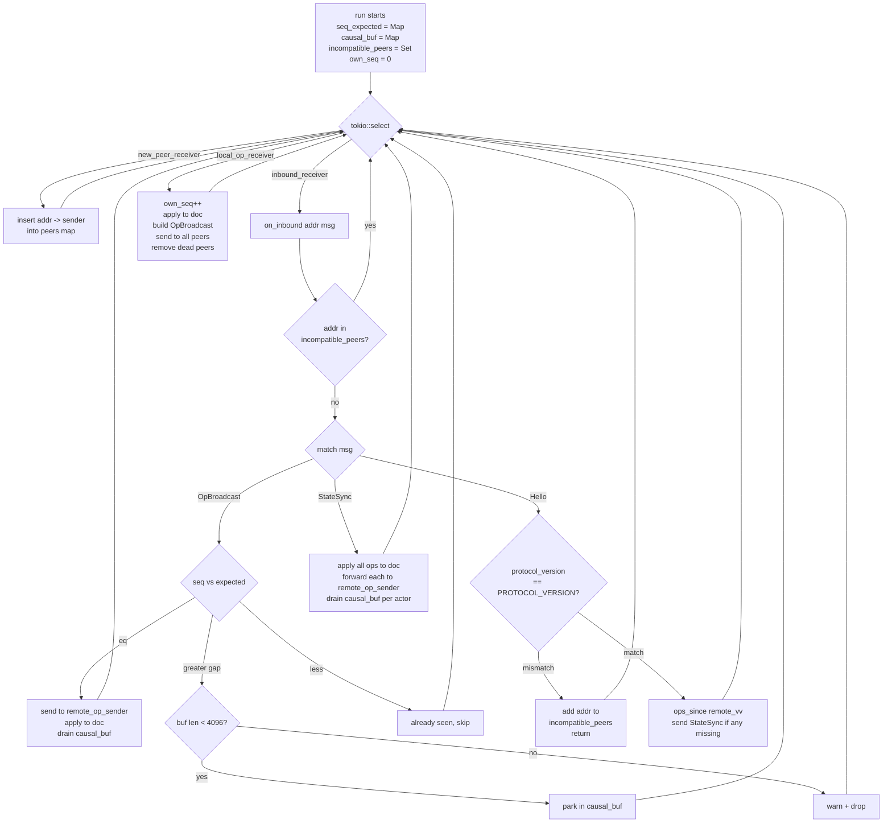

### sync_tick flow

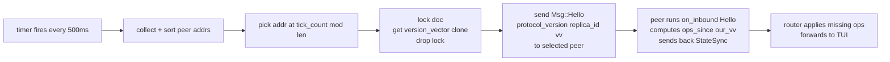

### snapshot - atomic write

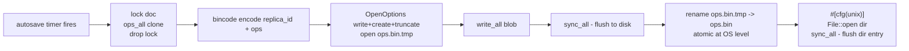

---

## crdt-client - internal structure

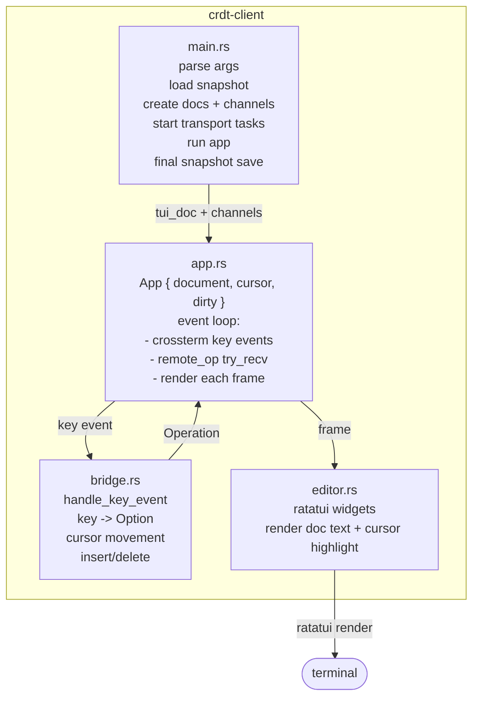

### main.rs wiring sequence (startup)

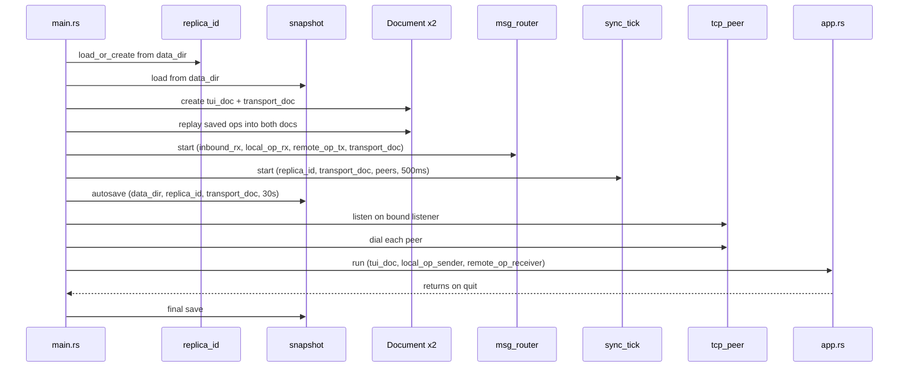

---

## End-to-end flows

### Local keystroke - across all crates

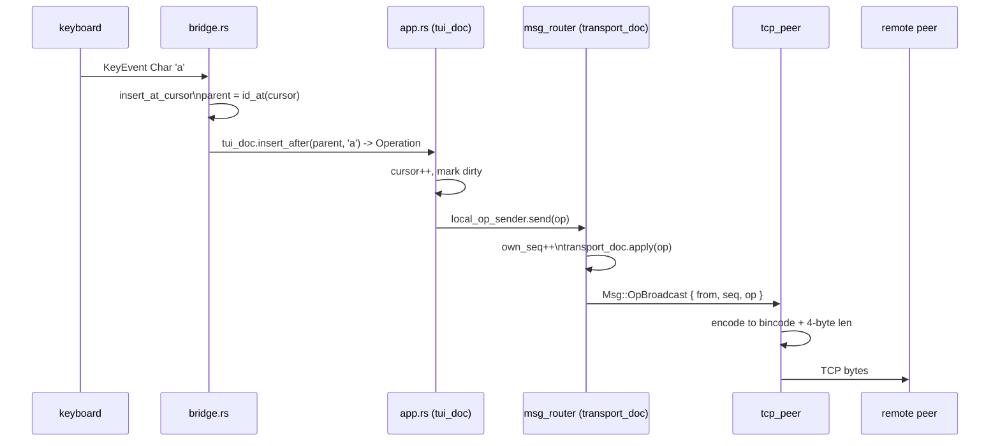

### Remote op arrives - across all crates

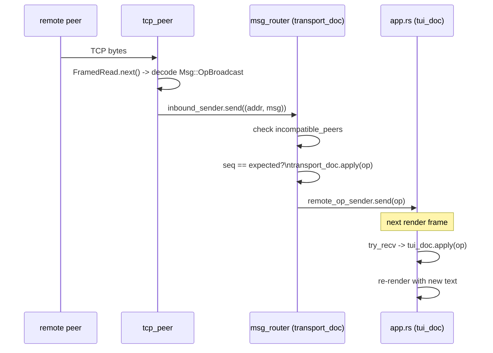

### Anti-entropy - node catches up after reconnect

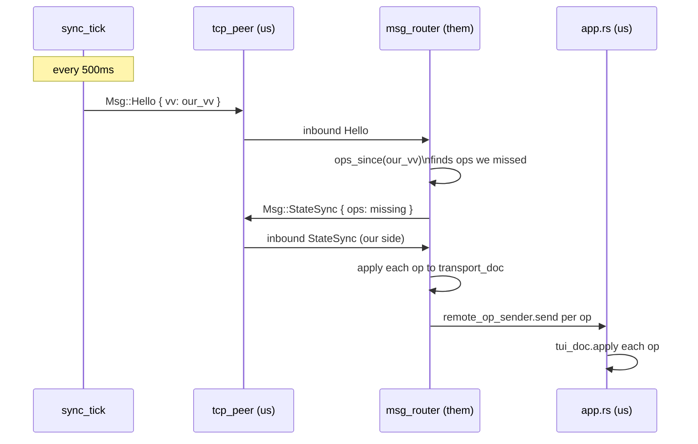

---

## Channel map - full system

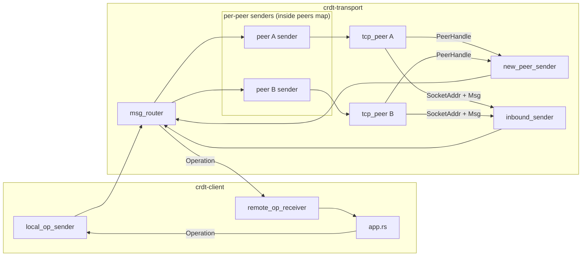

All channels: `tokio::sync::mpsc`. No shared memory between TUI and transport except `Arc<Mutex<Document>>` for the transport doc (used by router, sync_tick, autosave).

---

## Two-document design

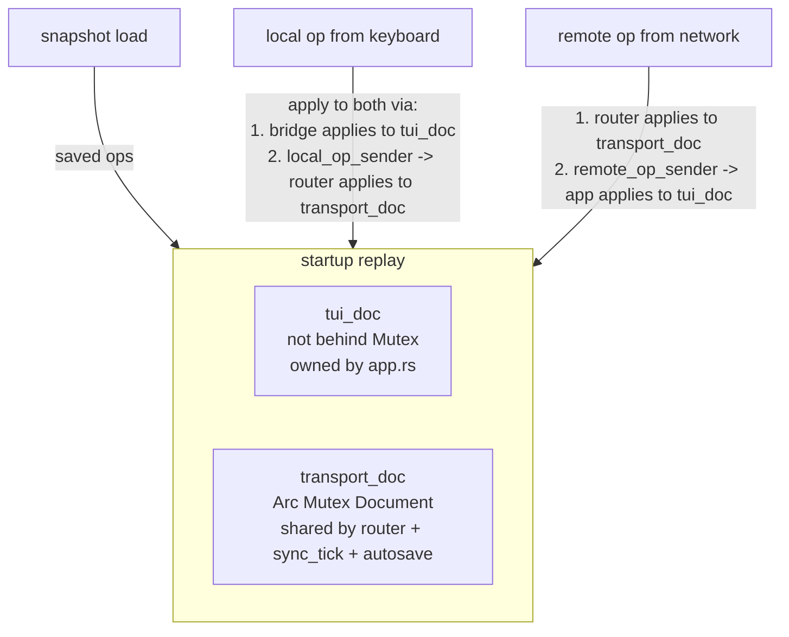

`transport_doc` must apply local AND remote ops to keep its VV accurate. If it only applies remote ops, sync_tick sends a stale VV and peers re-send their entire history every tick.
