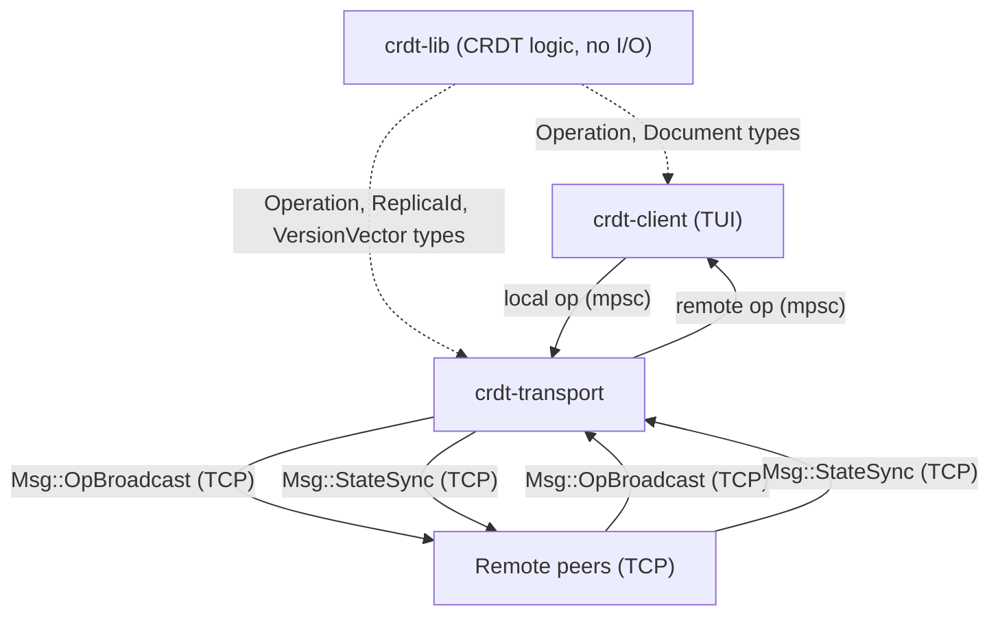
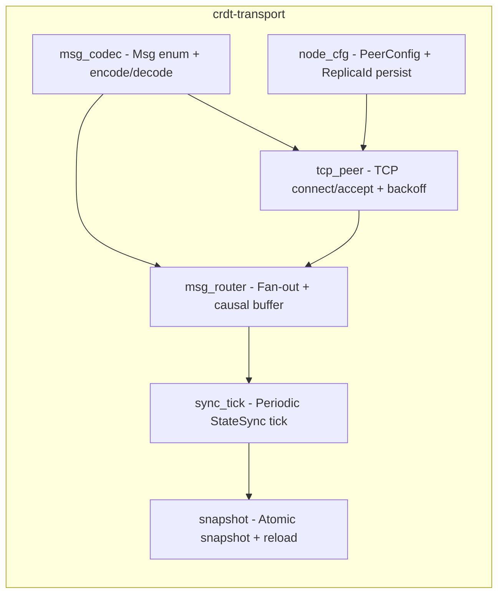
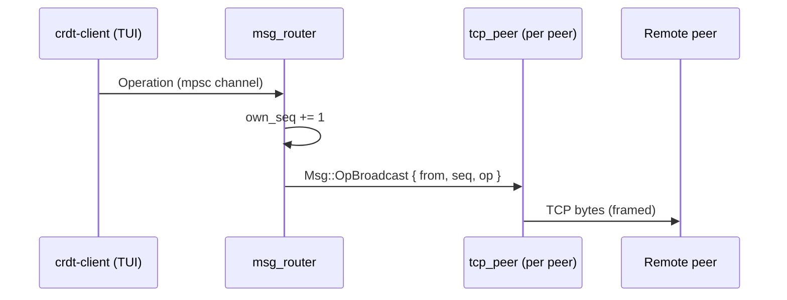
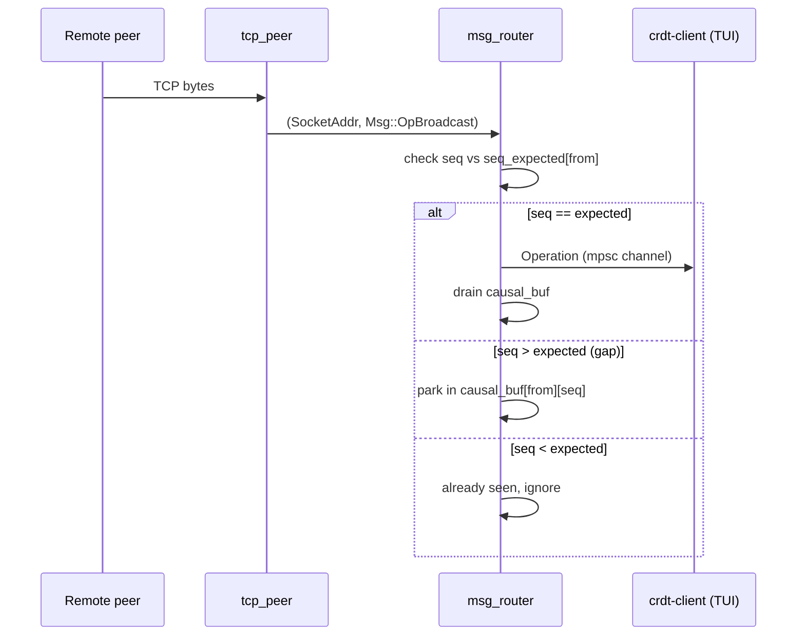
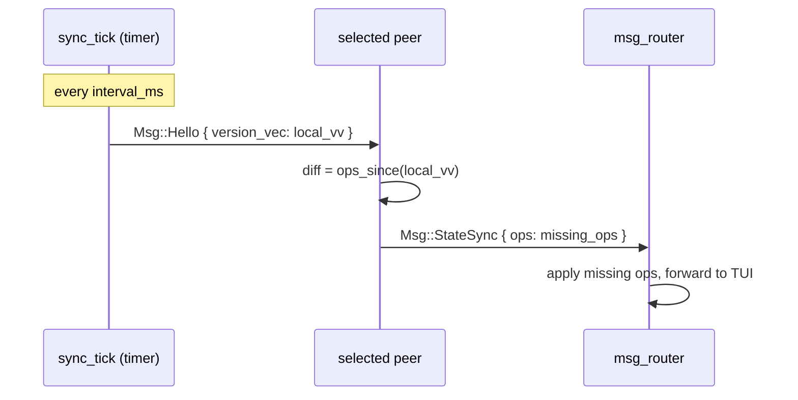
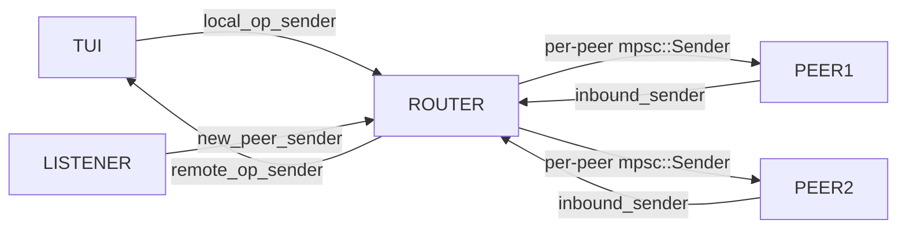

# Dev notes

---

## Rust async rule

Only functions that do I/O or call other async functions need `async`. Pure logic functions (CRDT merge, version vector compare) are plain `fn`.

---

## Two documents design

`main.rs` creates two separate Document instances from the same snapshot:
- `tui_doc` - owned by `app::run` (the TUI). Not behind a mutex.
- `transport_doc` - `Arc<Mutex<Document>>` shared between router, sync_tick, autosave.

Both start with identical state (replayed from snapshot). They stay in sync via channels:
- Local ops: TUI produces op -> router applies it to transport_doc
- Remote ops: router applies to transport_doc -> sends to TUI via channel -> TUI applies to tui_doc

`transport_doc` must apply ALL ops (local + remote) to keep its version vector current. If it only applies remote ops, sync_tick sends a stale VV and peers re-send their full history on every tick.

---

## Mutex lock scope

Never hold a mutex lock across an `.await` point. If you lock `peers` and then await sending a message, another task needing `peers` deadlocks.

```rust
let sender = {
    let map = peers.lock().await;
    map.get(&addr).cloned()
};  // lock drops here
sender.send(msg).await;  // await after lock is gone
```

---

## Atomic file write

Always write to a `.tmp` file first, then rename. Rename is atomic at OS level. If the process crashes mid-write, the old file is intact. Direct overwrite risks a half-written corrupt file.

After rename, `fsync` the directory entry - otherwise the rename itself might not survive a power loss on Linux ext4/xfs.

---

## Channel naming

Use `sender` / `receiver` not `tx` / `rx`. More readable when explaining the code.

---

## Snapshot file names

- `ops.bin` - operation log (`snapshot.rs`)
- `state.bin` - ReplicaId (`replica_id.rs`)

Do not use the same filename for both. They live in the same directory.

---

## Causal buffer

TCP guarantees delivery order per connection, but we track sequence numbers to detect reconnect gaps. If a message is lost (connection drop, reconnect), gaps appear. The causal buffer holds ops until the gap fills, then drains in order. Without it the TUI could apply op3 before op2 from the same peer.

---

## sync_tick vs OpBroadcast

`OpBroadcast` = fast path. Sent immediately on every local edit. Low latency.
`sync_tick` = recovery path. Fires every 500ms regardless of edits. Catches any ops missed due to dropped connections.

Both are needed. `OpBroadcast` alone loses ops on connection drops. `sync_tick` alone has 500ms latency.

---

## Why op-based over state-based

RGA is inherently op-based - each edit is an Insert or Delete operation with a unique ID. These operations are broadcast directly and buffered in causal order per peer. The version vector + `ops_since()` gives efficient delta sync without sending full state.

---

## Why plain TCP and not iroh/QUIC

iroh adds NAT hole-punching which is useful for demos across different networks. But it added dependency complexity and the course demo runs on loopback or LAN anyway. Plain TCP with tokio is simpler, easier to reason about, and sufficient for the use case.

---

## Why rejected approaches

| Approach | Why rejected |
|----------|--------------|
| Central server | Single point of failure, defeats the P2P point |
| OT (Operational Transformation) | Requires central server to sequence ops |
| Full state gossip | Works but wastes bandwidth. Op broadcast + VV delta is better. |
| LWW-Register as text | Last-write-wins loses concurrent edits. RGA preserves all. |

---

## Wireshark

Run on loopback interface. Filter: `tcp.port == 4001 or tcp.port == 4002 or tcp.port == 4003`. Shows `OpBroadcast` packets on every keystroke and `StateSync` packets on reconnect.

---

## Transport layer (crdt-transport)

### Crate overview



`crdt-lib` has no tokio, no I/O. Pure logic only.

### Files in crdt-transport



### Data flow - local write



### Data flow - incoming op from peer



### Data flow - sync_tick



### Channel map



All communication via `tokio::sync::mpsc` - no shared state, no mutex between TUI and network code.

### Causal buffer - why?

```
op1 arrives (seq=1, expected=1) -> deliver to TUI, expected=2
op3 arrives (seq=3, expected=2) -> park in causal_buf[A][3]
op2 arrives (seq=2, expected=2) -> deliver to TUI, drain finds op3, deliver that too
```

TUI always sees: op1, op2, op3.

### Forbidden crates

`automerge`, `yrs`, `crdts`, `diamond-types`, `loro`, `rust-crdt`. `tools/preflight.sh` enforces this in CI.
