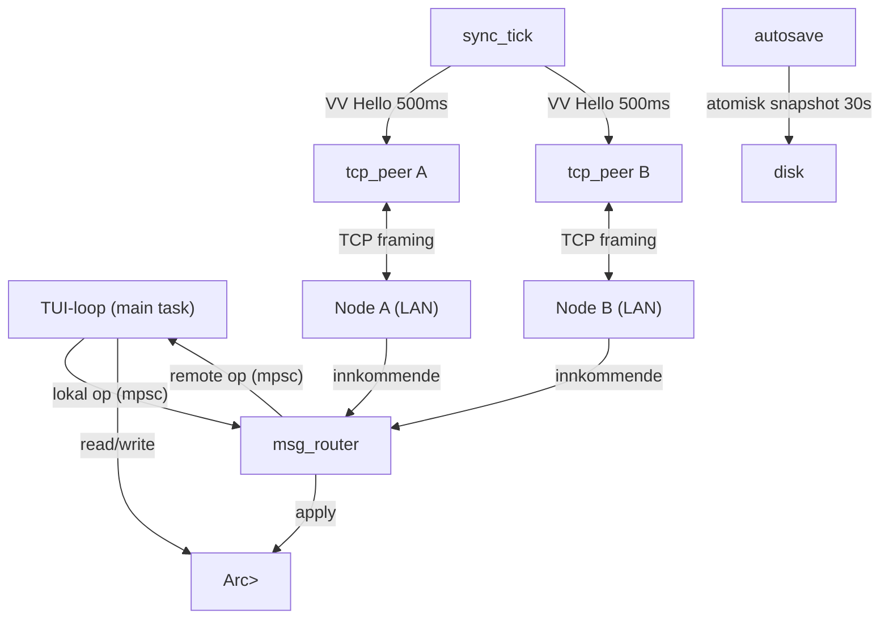
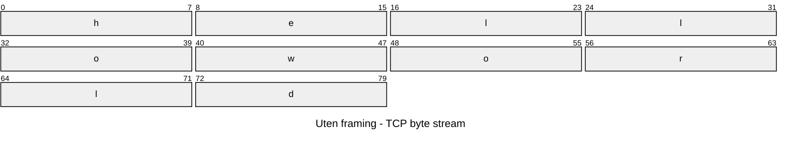
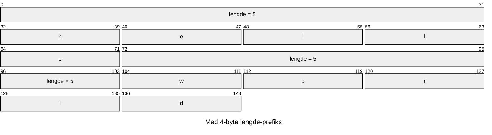
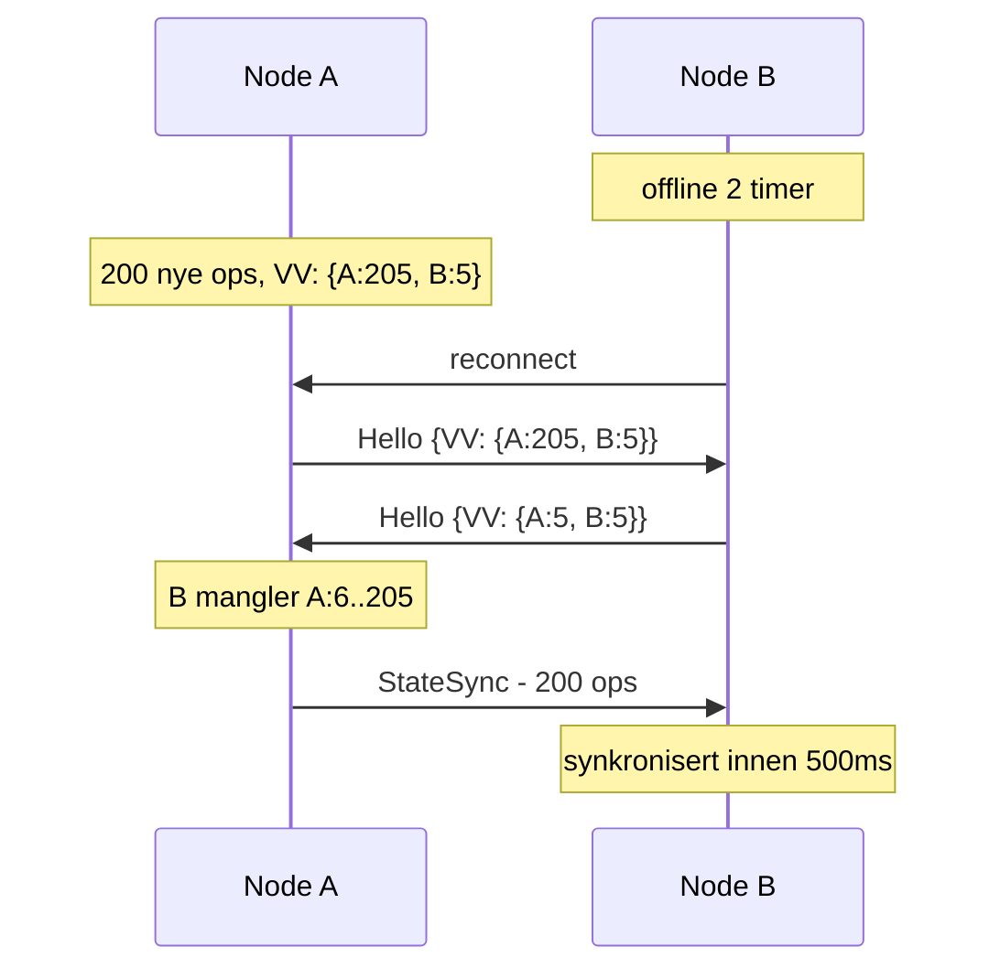
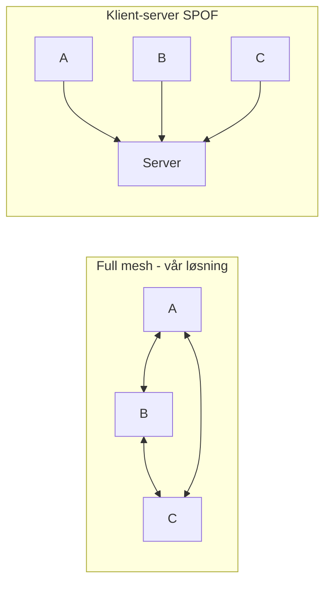

> **[handling]** = hva du gjør. Resten = nøyaktig hva du sier.

---

## Slide: Trådmodell (~1.5 min)

En CRDT-algoritme som kjører isolert på én maskin er ikke et nettverkssystem. Spørsmålet er: hvordan lar vi mange brukere kjøre den samme algoritmen over nettverket uten at de blokkerer hverandre?

**Slide skal vise:**



```rust
// main.rs - alle tasks startes her
let router = msg_router::start(
    replica_id, inbound_rx, local_op_rx,
    remote_op_tx, registry.clone(), presence.clone()
);
sync_tick::start(replica_id, listen_addr, registry.clone(), router.peers.clone(), 500);
snapshot::autosave(data_dir.clone(), registry.clone(), 30_000);
tokio::spawn(async move {
    tcp_peer::listen(listener, replica_id, listen_addr, reg, inbound_tx, new_peer_tx).await
});
```

---

**[Vis diagrammet]**

Vi bruker tokio sin async runtime. Tokio er M til N - noen få OS-tråder, typisk én per CPU-kjerne, med mange tasks fordelt over dem. En task gir fra seg kontroll ved hvert `await`, og mens den venter tar en annen task over på samme tråd. Null OS-overhead per tilkobling.

Vi har fem tasks. De tre viktigste:

**msg_router** er hjertet. Den bruker `tokio::select!` til å lytte på tre kanaler på en gang - meldinger fra peers, tastetrykk fra TUI, og nye tilkoblinger. Den sover til noe skjer, legger ops inn i dokumentet, og sender endringer tilbake til skjermen.

**sync_tick** sikrer offline-støtte. Hvert 500ms sjekker den én peer - har de alt vi har? Uten denne tasken ville en node som var nede aldri funnet ut hva den gikk glipp av.

**tcp_peer** - én per tilkobling - håndterer selve koblingen og prøver å koble til igjen ved feil, med eksponentiell backoff.

**[Pek på kanalene]**

Tasks kommuniserer via mpsc-kanaler, ikke delt minne - så ingen data races. Der begge trenger dokumentregisteret bruker vi `Arc<Mutex<T>>`: `Arc` deler instansen, `Mutex` sikrer at bare én task jobber med den om gangen.

---

## Slide: Transportlaget (~1.5 min)

**Slide skal vise:**

Framing:





VV anti-entropi:



---

TCP er en byte stream, ikke meldingsorientert. To meldinger sendt etter hverandre kan ankomme som en klump. Vi fikser det med framing: en 4-byte lengde foran hver melding. `LengthDelimitedCodec` leser lengden og gir oss én hel melding. Selve dataen er bincode - 3 til 5 ganger mindre enn JSON.

**[Vis VV anti-entropi-diagrammet]**
En node som har vært offline har gått glipp av alt. sync_tick løser det: hvert 500ms sender den version vectors til én peer - en map fra replika-ID til antall ops vi har sett. Begge noder utveksler Hello med sine VV-er, mottakeren beregner hva vi mangler og sender tilbake nøyaktig de ops vi ikke har. To timer offline? I sync innen ett tikk. Ingenting sendes når alle er oppdatert. Det gir Strong Eventual Consistency.

---

## Slide: Tekniske valg (~3 min)

De fleste som bygger noe lignende velger WebSocket, klient-server og sender bare og håper. Vi gikk annerledes.

**Slide skal vise:**



| Valg | Alternativ | Forkastet fordi |
|------|-----------|----------------|
| Raw TCP + bincode | WebSocket + JSON | WS-stakken eksisterer kun for nettlesere |
| mDNS | Manuelle --peer flagg | Brukeren må kjenne IP-er på forhånd |

---

**[Vis tabellen]**

Vi bruker raw TCP, ikke WebSocket. WebSocket er TCP pluss HTTP-handshake pluss WS-framing pluss XOR-masking av alle pakker. Alt det finnes fordi nettlesere ikke kan åpne rene TCP-sokler. Vi er en vanlig prosess - vi trenger ikke noe av det. Ingen HTTP-server, ingen handshake-overhead, og ingen sentral server som er single point of failure.

**[Pek på mDNS-raden]**

Med manuelle `--peer`-flagg må alle vite IP-en til alle andre på forhånd. Vi registrerer `_crdt-collab._tcp.local.` via mDNS - da finner noder hverandre automatisk. `--no-mdns` for nettverk som blokkerer multicast, som eduroam.

**[Nevn resten kort]**

Broadcast-only mister ops permanent hvis en peer er offline akkurat da - ingen måte å oppdage gapet etterpå. Version vectors løser det.

Klient-server: hvis serveren dør stopper alt. Full mesh: alle er likeverdige, ingen autoritetsnod å miste.

Snapshot: skriv direkte til fil, strøm kuttes = halvskrevet = uleselig. Tmp + fsync + rename er atomisk.
