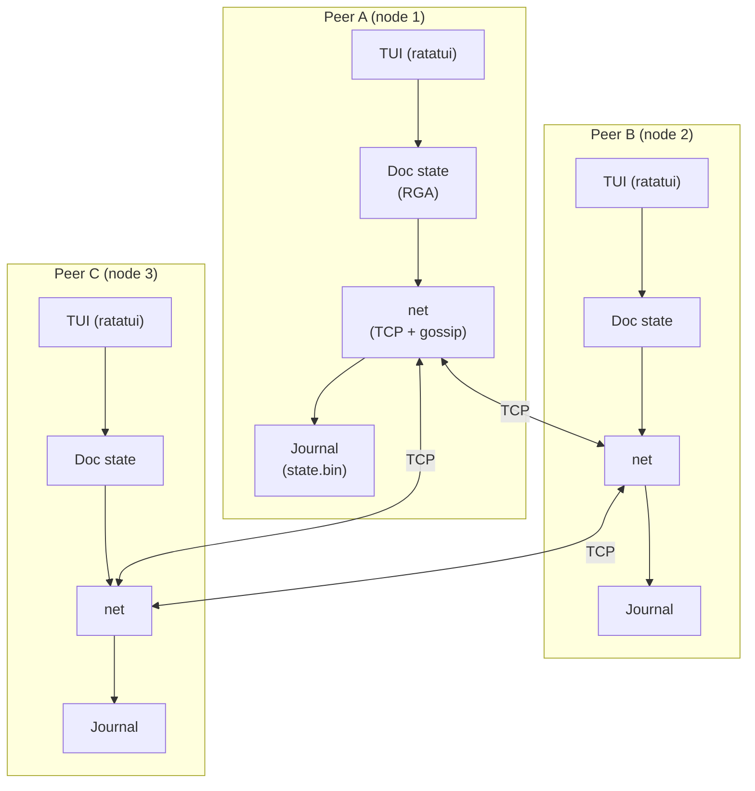

# Architecture

## What we are building

A peer-to-peer collaborative text editor that runs in the terminal. Three nodes
sync over a gossip network. Changes made on one node propagate to the others
without a central server. The system stays consistent even when messages arrive
out of order or nodes disconnect and rejoin.

Course: IDATT2104 Nettverksprogrammering, NTNU spring 2026.
Deadline: 2026-05-26 23:59.

---

## Scope

**One CRDT: RGA.** No PN-Counter, no OR-Set, no GCounter. RGA alone covers the
full design space the course cares about: op-based CRDT, causal ordering,
distributed clocks, convergence proof.

Not implemented: TLS/auth, tombstone GC, browser client, multi-tenant storage,
Fugue, Kleppmann move-tree.

**Banned crates** (course rule - no external CRDT implementations):
`automerge`, `yrs`, `crdts`, `diamond-types`, `loro`, `rust-crdt`.
Run `scripts/preflight.sh` before submission to verify.

---

## Ownership

| Crate | Owner | Defense questions |
|-------|-------|-------------------|
| `crates/crdt-lib` | Yazan | Q13-Q22: CRDT theory, op commutativity, Lamport tiebreak, interleaving anomaly |
| `crates/crdt-transport` | Tri | Q23-Q35: transport, gossip, anti-entropy, CI/CD |
| `crates/crdt-client` (minus main.rs) | Shakti | Q1-Q12: CRDT motivation, op-based vs state-based, ratatui architecture |
| `crates/crdt-client/src/main.rs`, CI, CD | Tri | - |

---

## System overview (C4 context)

Every node runs the same binary (`crdt-client`). There is no central server. Nodes
connect to each other directly via TCP. A static peer list in config bootstraps
initial connections; discovery is future work.



---

## Crate layout

Three crates with hard dependency boundaries enforced by the compiler.
Dependency direction: `crdt-client -> crdt-transport -> crdt-lib`. `crdt-lib` knows nothing about networking
or the TUI.

```
crdt-lib/           Pure CRDT logic. No I/O, no tokio.
  src/
    lib.rs
    traits.rs       CmRdt trait (apply)
    clock.rs        LamportClock (tick, observe)
    replica.rs      ReplicaId (uuid v7)
    rga.rs          Rga struct, Op enum, apply, local_insert, local_delete, text
  tests/
    rga_props.rs    proptest convergence (1024 cases, #[ignore] in fast run)
  benches/
    rga_bench.rs    criterion micro-bench

crdt-transport/     Transport + gossip. Depends on crdt-lib + tokio.
  src/
    lib.rs
    wire.rs         Msg<O> enum + bincode codec (4-byte BE length prefix)
    config.rs       PeerConfig (listen addr, peer list, tick interval, journal path)
    peer.rs         Per-peer connection task, exponential backoff reconnect
    gossip.rs       Op fan-out, causal buffer, per-replica seq tracking
    anti_entropy.rs 2s tick, random peer, version-vector compare, delta on mismatch
    journal.rs      Atomic write-tmp-then-rename snapshot, reload on start
  tests/
    three_peer.rs   3-node convergence integration test

crdt-client/        Binary. Depends on crdt-lib + crdt-transport + ratatui.
  src/
    main.rs         clap CLI entry point, tokio runtime, spawn tasks, wire channels
    app.rs          ratatui event loop, channels in/out, no I/O
    editor.rs       Text buffer rendering, cursor movement, status line
    bridge.rs       Keyboard events -> RGA ops, cursor position mapping
```

---

## Repository layout

```
crdt-collab/
  Cargo.toml              <- workspace manifest (no [package], members = ["crates/*"])
  rust-toolchain.toml     <- pins stable channel + rustfmt + clippy
  Cargo.lock              <- committed (binary in workspace, needed for cargo audit)
  README.md
  ARCHITECTURE.md         <- this file
  .impl-unlocked
  .github/
    workflows/
      ci.yml
      cd.yml
  crates/
    crdt-lib/
    crdt-transport/
    crdt-client/
  docs/
  scripts/
    preflight.sh
    demo.sh
  captures/
```

---

## Key design decisions

**RGA over Logoot/LSEQ**
RGA inserts each character "after" a specific existing node by unique id. Concurrent
inserts at the same spot sort by `(lamport DESC, replica_id DESC)` - deterministic,
no coordinator. Logoot/LSEQ require generating fractional position identifiers which
is more complex and still exhibits interleaving.

**CmRDT (op-based) over CvRDT (state-based)**
Op-based: ship only the operation (insert or delete), constant size regardless of
document length. State-based: send full state every sync, expensive at scale. The
tradeoff is causal delivery: ops must arrive in order per replica. Implemented via
causal buffer in `crdt-transport/src/gossip.rs`. Better oral defense point than state merge.

**Vec<Node> over BTreeMap for RGA sequence storage**
RGA iteration order must match document order, which is insertion-point order, not
NodeId sort order. BTreeMap sorted by NodeId would output characters sorted by
Lamport timestamp, not logical position. Vec maintains insertion order explicitly.

**Version-vector anti-entropy over SHA-256**
Version vectors tell a peer exactly which ops it is missing without serializing
full state. SHA-256 hashes full state on every tick and only tells you whether
states differ, not what is missing. Version vectors are explicit syllabus content.

**TCP over iroh+QUIC**
TCP is simpler to debug; demo runs on a LAN. The transport abstraction in
`crdt-transport/src/peer.rs` allows swapping without touching gossip or anti-entropy. iroh
deferred to stretch if demo needs cross-network peers.

**bincode over JSON on the wire**
bincode guarantees deterministic encoding, ~5x smaller than JSON. JSON kept for
on-disk journal only (human-readable for debugging). Wireshark can decode the
binary frame layout (4-byte length prefix + bincode payload).

**Clocks from scratch**
Lamport clock and vector clock are explicit syllabus content. Importing a crate
skips the hard part. Both implementations are under 100 lines.

---

## Gossip protocol

### Message types

```
Msg::Hello       { replica_id: ReplicaId, version_vec: VVec }
Msg::OpBroadcast { op: Op, seq: u64 }
Msg::StateSync   { blob: Vec<u8> }
Msg::Ack         { seen: VVec }
```

`OpBroadcast`: sent immediately on every local mutation. Receiver checks causal
preconditions (all prior ops from same replica seen), applies if satisfied, else
buffers in a per-replica BTreeMap.

`StateSync`: sent every 2s to one random peer. Contains serialised RGA state.
Receiver merges via `apply` for each op not yet seen. Anti-entropy backstop that
heals missed op-broadcasts.

### Connection lifecycle

1. Node starts, loads `state.bin` if present, restores `ReplicaId`.
2. Dials each peer in config. On connect, sends `Hello` with current version vector.
3. Peer responds with `Hello`. Both sides begin gossip.
4. Peer disconnect: mark dead, exponential backoff retry (1s, 2s, 4s, cap 30s).
5. On reconnect: `StateSync` immediately to catch up.

### Causal buffer

Op delivery requires causal order per replica: an op with `(replica_id, seq=n)`
is held until `(replica_id, seq=n-1)` has been applied. Out-of-order ops are
held in a `BTreeMap<(ReplicaId, u64), Op>`. The buffer is drained after each apply.

Duplicate delivery is safe: version-vector check skips already-seen ops.

### Crash recovery

Every 5 ticks, each node serialises RGA state with bincode and writes atomically
to `<journal_path>`. On restart, this file is loaded before joining gossip.
`StateSync` handles any ops missed during downtime.

---

## Data flow: insert character

1. User types `'x'` in TUI at cursor position `p`.
2. `bridge.rs` calls `rga.local_insert(p, 'x')` -> returns `Op::Insert{...}`.
3. RGA state updated locally. TUI re-renders via `app.rs`.
4. `app.rs` sends `Op` to net channel.
5. `gossip.rs` fans out `Msg::OpBroadcast` to all live peers.
6. Peers receive op, check causal preconditions, apply `rga.apply(op)`, re-render.

---

## CRDT state flow

```
                local mutation
                     |
                     v
         +------[ RGA state ]------+
         |                         |
      apply(op)               apply(op)
      (CmRdt)                 for each op
         |                    in state delta
         v                         ^
    Op fan-out -->       <-- StateSync (anti-entropy)
    (op broadcast)       (periodic, to random peer)
```

Both paths converge to the same state. The op path is low-latency; the state
sync path is the backstop.

---

## Threat model

Nodes are assumed to be trusted peers on a LAN or loopback. No authentication,
no encryption. Listed as future work.
