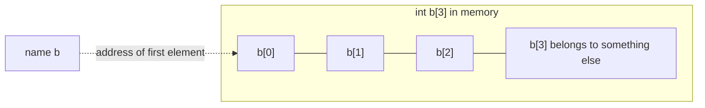
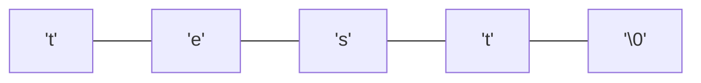
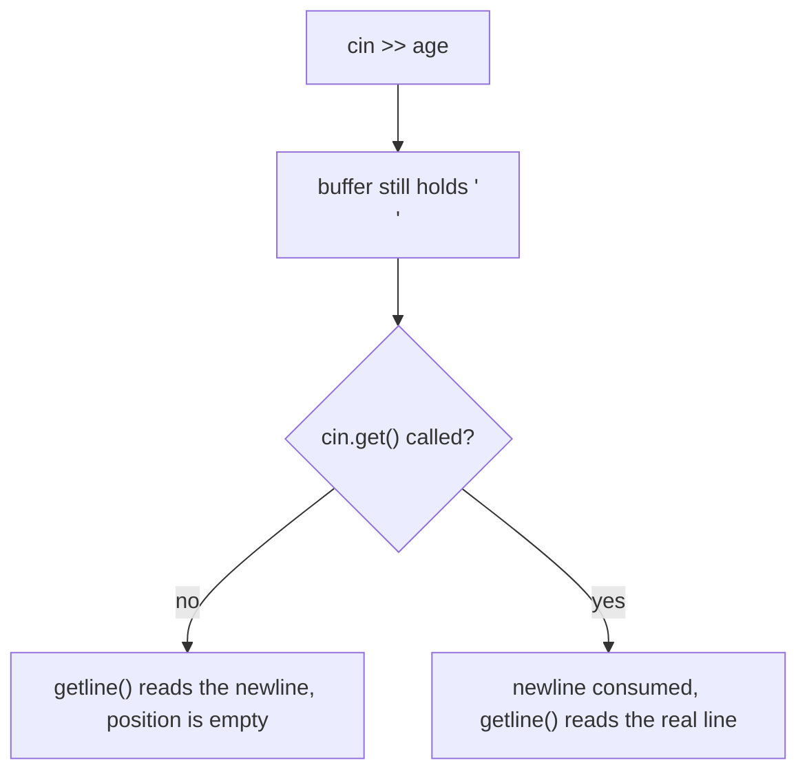
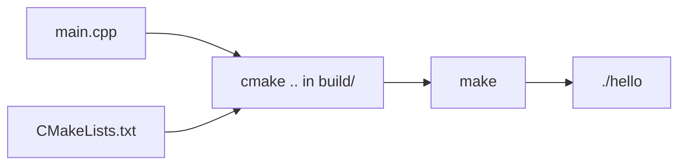

Source: `lessons/01-1-grunnleggende-lesson.html`, `lessons/01-1-grunnleggende-cmake.html`
Examples: https://gitlab.com/ntnu-iini4003/examples1
Book: A Tour of C++ 2nd ed, ch. 1 (basics), 1.7 (arrays), 10.7 (file streams)
## What the lesson is about
Writing simple C++ programs: control structures, one dimensional arrays, null terminated strings, and data files. The course angle throughout is what C++ does differently from Java.
## C++ does not look after you
```cpp
#include <iostream>
using namespace std;

int main() {
  int a;
  int b[3];
  double c;
  cout << "a = " << a << ", c = " << c << endl;
  for (int i = 0; i < 5; i++) {
    cout << "i = " << i << " tabellelement: " << b[i] << endl;
  }
  return 0;
}
```
Two things a Java programmer notices:
- `main()` is not inside a class. You can write a whole C++ program without classes.
- Nothing is initialised for you. `a` and `c` print whatever happened to be in that memory, and reading `b[3]` and `b[4]` past the end of the array gives no warning and no error.
The compiler may say `variable 'a' is uninitialized when used here`, but it will not stop you.
## Arrays are not objects
A C++ array is a run of variables of the same type sitting next to each other in memory. It is not created with `new`, it does not know its own length, and the array name gives you the address of the first element.

Later standards added wrappers that do know their length: `vector` in C++98, roughly like Java's `ArrayList`, and `array` in C++11, which works like a Java array. This lesson uses raw arrays on purpose.
## Null terminated strings
```cpp
#include <cctype>   // toupper, tolower
#include <cstring>  // strlen
#include <iostream>

using namespace std;

int main() {
  char text[5];
  cout << "Skriv et ord: ";
  cin >> text;
  for (int i = 0; i < strlen(text); i++) {
    text[i] = toupper(text[i]);
  }
  cout << "Bare store bokstaver: " << text << endl;
}
```
A string lives in a `char` array and ends with the character `'\0'`. So `char text[5]` holds a text of at most four characters.

Reading a word of five characters or more writes past the array. It usually looks fine, because the runtime just takes the space that follows, and it only breaks once something else is stored there.
Library functions are called without an object or class name in front, so in practice they behave like Java static methods. They are declared in the include files, and `#include` is a preprocessor directive: the content of the named file is pasted in at that spot before compilation.
## The size_t warning
```
comparison of integers of different signs: 'int' and 'size_t'
```
`strlen()` returns `size_t`, a non negative integer type whose exact width is compiler dependent. Write `for (size_t i = 0; ...)` to silence it. Most C++ programmers live with the warning in small examples, but the book is good about using `size_t`.
## File handling
Reading is the same as reading from the keyboard, writing the same as writing to the screen.
```cpp
#include <cstdlib>
#include <fstream>
#include <iostream>

using namespace std;

int main() {
  const char filename[] = "tallfil.dat";
  ifstream file;
  file.open(filename);
  if (!file) {                 // a stream works as a boolean
    cout << "Feil ved åpning av innfil." << endl;
    exit(EXIT_FAILURE);
  }
  int number;
  int sum = 0;
  while (file >> number) {     // reads until end of file
    sum += number;
  }
  cout << "Summen er " << sum << endl;
  file.close();
}
```
Output works the same way with `ofstream`. `setw(4)` from `<iomanip>` right aligns the next value over four columns. The file is looked up relative to the working directory unless you give an absolute path like `/home/ole/toerpot.dat`.
## Mixing >> and getline()
`>>` reads one word and skips whitespace, including the newline. `getline()` reads up to a newline and consumes it without storing it. Mixing them bites you here:
```cpp
cout << "Alder: ";
cin >> age;          // reads 26, leaves the newline in the buffer
cin.get();           // eats that newline
cout << "Stilling: ";
cin.getline(position, max_line_length);
```
Without the `cin.get()` line, `getline()` finds the leftover newline immediately and `position` ends up empty.

## CMake
`g++ main.cpp` is enough for one file, but CMake handles the project across platforms and finds libraries for you.
```cmake
cmake_minimum_required(VERSION 3.10)
project(hello)
set(CMAKE_CXX_FLAGS "${CMAKE_CXX_FLAGS} -std=c++1y -Wall -Wextra")
add_executable(hello main.cpp)
```
`add_executable()` says which source files become which executable. Add more calls for more executables, and list several sources in one call to link them into a single program.

Build in a separate `build/` directory, since the build produces files you do not want next to the sources. `make` ends up running roughly `g++ -std=c++1y -Wall -Wextra ../main.cpp -o hello`.
## Splitting into several files
```cpp
// answer.hpp
#pragma once

int answer();
```
```cpp
// answer.cpp
#include "answer.hpp"

int answer() {
  return 42;
}
```
The header holds the signature so the compiler can check the calls, the `.cpp` holds the implementation. Both source files go into the same `add_executable(hello main.cpp answer.cpp)`.
