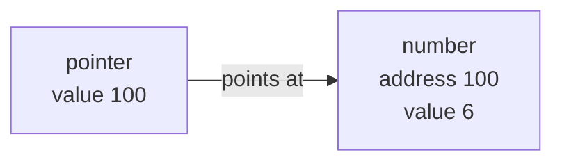
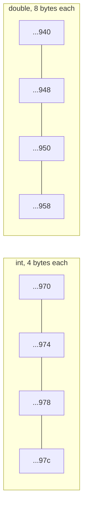
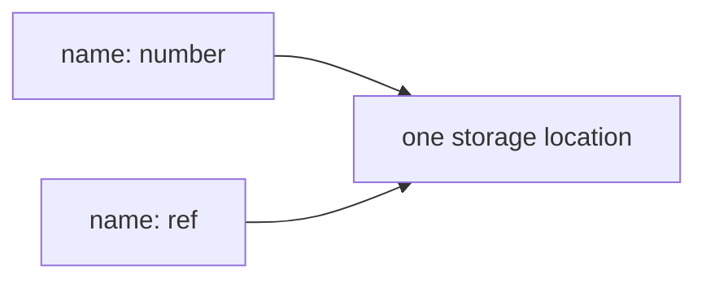
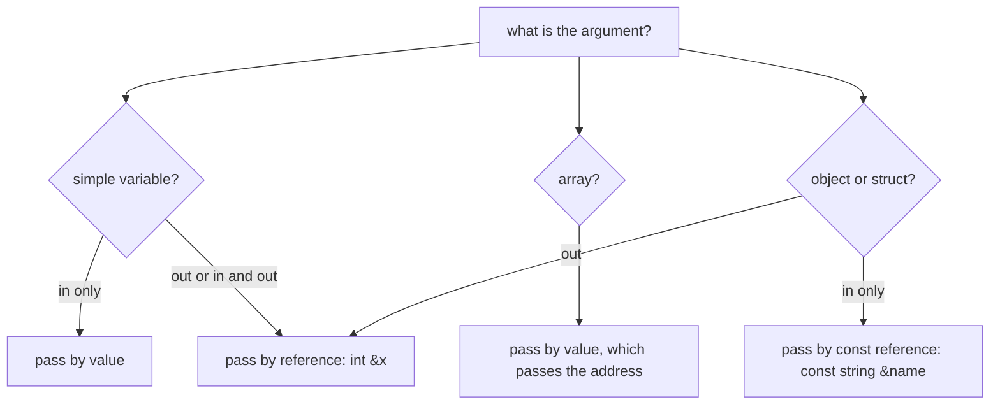

Source: `lessons/02-2-pekere-og-referanser-lesson.html`
Examples: https://gitlab.com/ntnu-iini4003/examples2
Book: A Tour of C++ 2nd ed, ch. 1.7 and 1.9
## What the lesson is about
Pointers, references, and how arguments are passed.
## Making and using a pointer
A pointer is a variable that holds the address of another variable. A star in the definition marks it.
```cpp
int number;
int *pointer;

pointer = &number;
*pointer = 6;
```

- `&` is the address operator, read as "the address of". On the right hand side of `=` it takes an address.
- `*` is the dereference operator, read as "what the variable points at". On the left hand side of an assignment it writes through the pointer.
- They cancel each other: `*&pointer`, `&*pointer` and `pointer` all mean the same.
`*pointer = 6` changes `number` and does nothing to `pointer` itself. That is indirect addressing.
## An array name is an address
```cpp
int table[10];
int *pointer = table;       // same as &table[0]
```
Written on its own, `table` is the address of the first element. Once a pointer points at the start of an array, the two can be used interchangeably:
```cpp
table[2] = 5;
pointer[3] = 8;    // same as table[3] = 8
*pointer = 0;      // same as table[0] = 0
*table = table[2]; // same as table[0] = table[2]
```
## const pointers
Where `const` sits decides what is frozen.
| Declaration | What is constant | Read as |
|-------------|------------------|---------|
| `const char *text` | what it points at | pointer to a constant char |
| `int *const pointer` | the pointer itself | constant pointer to int |
| `const int *const pointer` | both | constant pointer to a constant int |
`size_t strlen(const char *text)` promises the function will not touch the text. Writing `text[0] = 'A'` inside it is a compile error, but `text = &text[1]` is fine, since only the target is const.
A non const pointer cannot be pointed at what a const pointer points at, because that would be a way around the promise. The other direction is always safe, so a plain variable can be passed where a const pointer is expected.
## Pointer arithmetic
Only these operations make sense on addresses:
- add an integer to, or subtract an integer from, a pointer
- subtract one pointer from another
- compare two pointers for equality, or for which comes first in memory
Adding 1 moves to the next variable, counted in whole elements, not bytes.
```cpp
double table[5];
double *pointer = table;
*pointer = 0.0;
*(pointer + 1) = *pointer;  // table[1] = table[0]
pointer++;                  // now points at table[1]
```
`*(pointer + N)` means exactly `pointer[N]`. Beware precedence: `*pointer + 1` is `(*pointer) + 1`, so write `*(pointer + 1)` when you mean the next element's value.

Subtracting two pointers gives the number of elements between them:
```cpp
const char *text = "Et eksempel";
const char *start = text;
while (*text != '\0') text++;
int length = text - start;   // 11
```
Comparison is used mostly to walk to the end of an array:
```cpp
int *pointer = table;
int *end = &table[length];   // one past the last element
while (pointer < end) {
  pointer++;
}
```
## Pointers need care
A fresh pointer holds whatever was in that memory, and that value is read as an address. Writing through it can hit the part of memory that runs the program, or quietly change a variable you did not mean to touch. Sometimes nothing visible happens and the problem shows up much later.
Rule: initialise every pointer to `nullptr` (C++11, the same idea as Java's null) unless it gets a real value straight away. Address 0 is never used for anything, so you cannot destroy anything by writing there, and you tend to get a clear error instead.
A pointer is not an array. The compiler only sets aside room for the pointer.
```cpp
char *line;
strcpy(line, "Dette er farlig!!");   // no room reserved anywhere
```
```cpp
const char *line = "Dette går helt bra!";  // compiler reserves exactly enough
```
The second form reserves exactly enough, so keep it `const` and do not try to lengthen the text later.
## References
A reference is a second name for a variable that already exists.
```cpp
int number;
int &ref = number;

ref = 6;
number++;      // both names now read 7
```
`&` on the left hand side of a declaration makes a reference. A reference cannot be declared without saying what it refers to.

## Passing arguments

**By value.** The function works on a copy. Used for simple in arguments, and for arrays whatever their direction, where it is often called passing the address.
**By reference.** The function works on the caller's variable under another name. Used for simple out and in-out arguments, and for objects even as in arguments, to save copying. Mark those `const`, as in `const string &name`.
C has no references, so it passes addresses for out arguments too.
### Passing an array is passing a value
```cpp
void zero(int number, int *table) {
  for (int teller = 0; teller < number; teller++) {
    table[teller] = 0;
  }
}

int main() {
  int a_table[max_length];
  zero(max_length, a_table);
}
```
The call behaves as if you had written `int number = max_length; int *table = a_table;`. Both are by value, so passing an address is a special case of passing a value. Inside the function `table` is a pointer, and `sizeof(table)` gives the size of a pointer, not of the array. In `main()`, `sizeof(a_table)` gives the whole array.
Since the function only knows the start address, you can point it at the middle:
```cpp
zero(5, &a_table[3]);   // zeroes a_table[3] through a_table[7]
```
### Changing the pointer is local, changing the target is not
```cpp
void copy(const char *from, char *to) {
  while (*from != '\0') {
    *to = *from;
    from++;
    to++;
  }
  *to = '\0';
}
```
`from` and `to` are copies, so moving them has no effect outside. Only writes through them last. `const` on `from` says the function will not change the source.
### Passing by reference
```cpp
void swap(int &number_a, int &number_b) {
  int help = number_a;
  number_a = number_b;
  number_b = help;
}
```
The call works as if you had written `int &number_a = number1;`, so the names inside the function are the caller's variables. With by value it would have been `int number_a = number1`, two separate variables.
