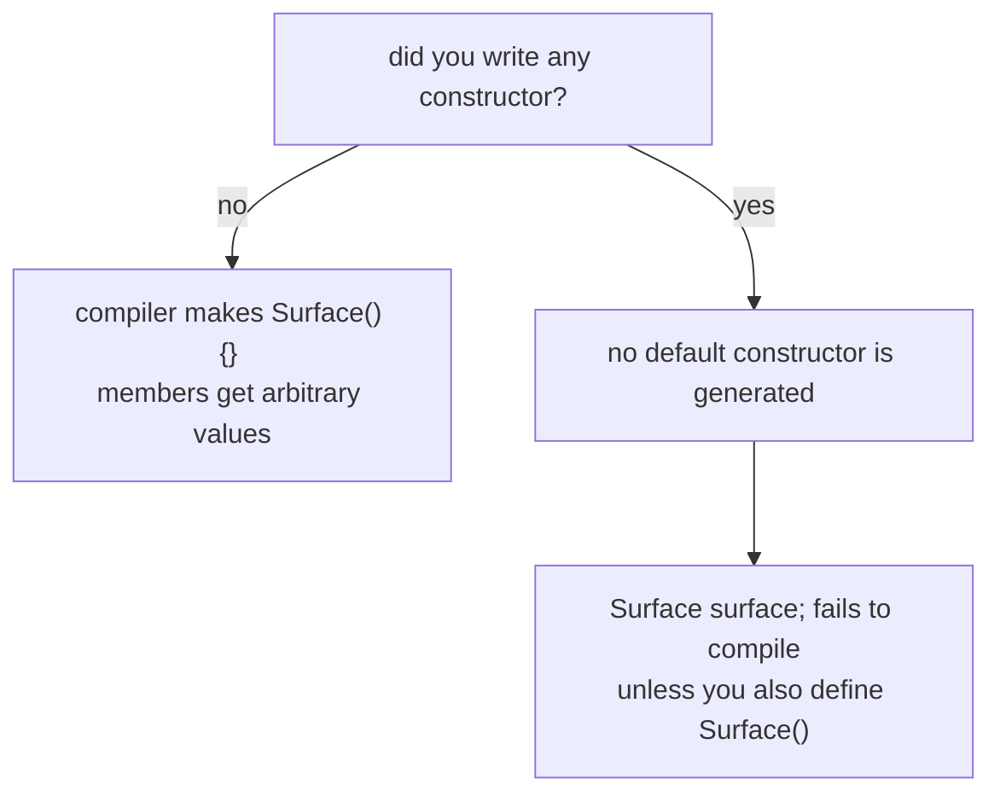
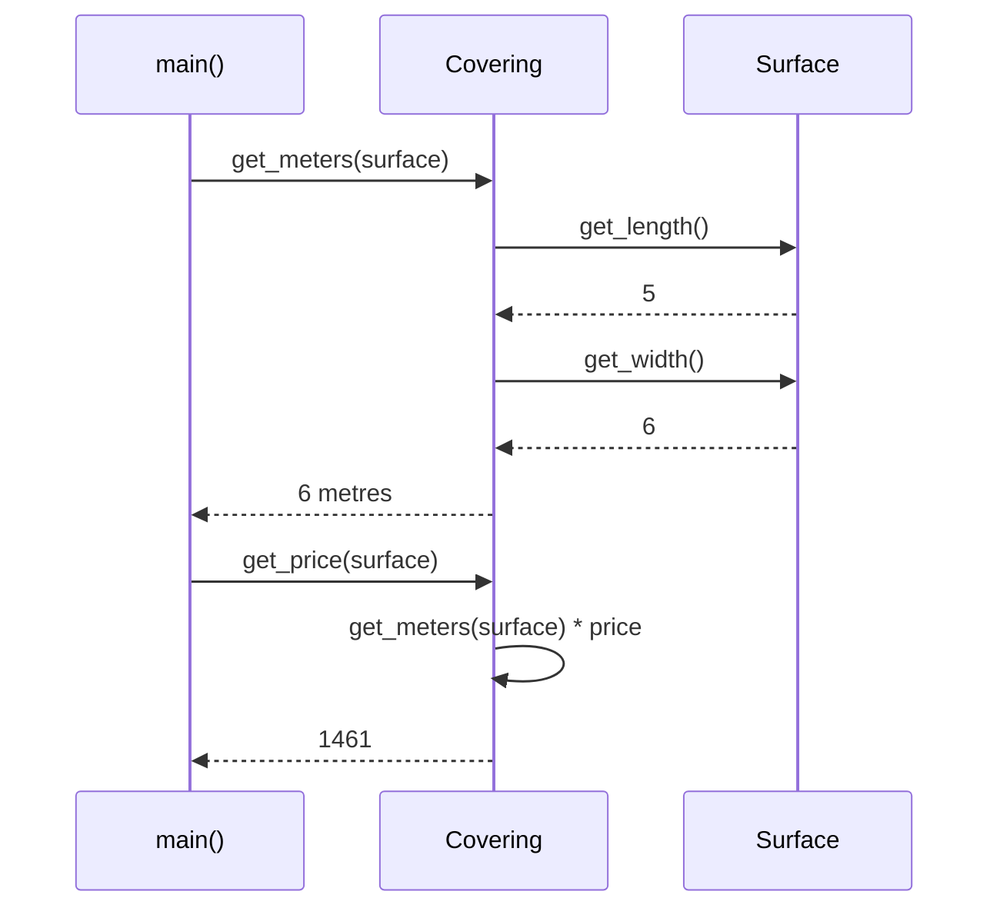
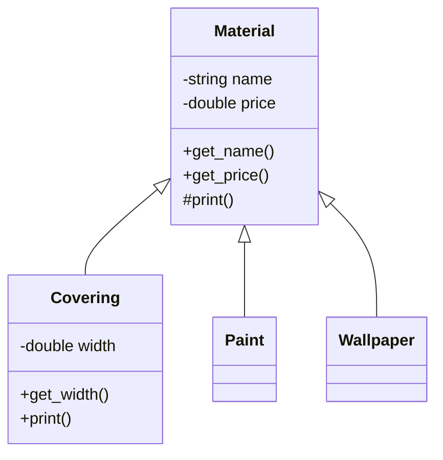

Source: `lessons/03-3-objektorientert-programmering-lesson.html`
Examples: https://gitlab.com/ntnu-iini4003/examples3
Book: A Tour of C++ 2nd ed, ch. 4
## What the lesson is about
Writing classes in C++, the `string` class, and the start of a running case about covering floors. Objects working together, and inheritance.
## Object oriented vocabulary
- An **object** models a thing the problem is about, always a noun, concrete like a car or abstract like a meeting. The focus is responsibility: what the object knows about itself.
- **State** is a situation in the object's life where it satisfies a condition, does an activity, or waits for something.
- An **attribute** is a named property with a defined value range, for example a student number that is always seven digits.
- **Identity** separates one object from every other.
- **Behaviour** is the set of operations the object can perform.
- **Encapsulation** hides how the object solves a task. The client only sees the behaviour, and the one who builds the object decides which services it offers.
- A **class** describes a set of objects with the same attributes and behaviour.
## The string class
```cpp
string name("Ole Pettersen");
size_t first_space = name.find(" ", 0);
string middle_name = "Johan ";
name.insert(first_space + 1, middle_name);
```
A constructor with exactly one argument can be written with `=`, so `string name = "Petter";` means the same as `string name("Petter");`.
`+` and `+=` are defined for strings:
```cpp
string name = first_name + " " + middle_name + " " + surname;
name += ", Åsveien 34, 1234 Buelv";
```
`string` has nothing for inspecting or converting single characters, so `<cctype>` and `<cstring>` are still needed for `toupper`, digit checks and so on.
`[]` works on both sides of an assignment, but the position has to exist:
```cpp
text = "hallo"; // valid positions 0 to 4
text[3] = 'Z';  // ok
text[5] = 'X';  // not ok
```
Comparison operators compare the contents. On `char` arrays they would compare addresses instead, which is rarely what you mean.
## Numbers to strings and back
Same idea as printing: a value stored in binary has to be turned into characters, so 76 becomes '7' and '6'. Instead of writing to a file or the terminal, you write to a string in memory.
```cpp
#include <sstream>

string to_string(int number) {
  ostringstream oss;
  oss << number;
  return oss.str();
}
```
```cpp
istringstream iss;
iss.str("10 12.5");
iss >> int_number;      // 10
iss >> double_number;   // 12.5
```
## Writing a simple class
```cpp
class Surface {
public:
  Surface(const string &name_, double length_, double width_);
  const string &get_name() const;
  double get_length() const;
  double get_width() const;
  double get_area() const;
  double get_circumference() const;

private:
  string name;
  double length;
  double width;
};

Surface::Surface(const string &name_, double length_, double width_)
    : name(name_), length(length_), width(width_) {}

double Surface::get_area() const {
  return width * length;
}
```
Data structures go under `private`, the services the class offers go under `public`. Both data and functions are members, so the terms are data members and function members.
Definitions outside the class need `Surface::` in front, which puts them in the class namespace and gives them access to the members.
## Splitting into header and source
Declaration in `surface.hpp`, implementation in `surface.cpp`, and the `.cpp` includes the header. The point is that the class does not have to be recompiled every time, which matters in large systems.
```cpp
#pragma once
```
at the top of the header stops it being declared twice when it is included more than once, directly or indirectly.
## const on member functions
A `const` after the parameter list says the function does not change the object, so callers know it is safe.
```cpp
double get_area() const;         // reads only
void set_length(double length);  // changes a member, no const
```
## Objects as arguments and return values
```cpp
Surface::Surface(const string &name_, double length_, double width_)
    : name(name_), length(length_), width(width_) {}
```
Objects are passed by reference even as in arguments, because a reference is only another name while a copy costs time and space. `const` marks it as an in argument and stops the function changing it.
```cpp
const string &Surface::get_name() const {
  return name;
}
```
Returning a `const` reference protects the member from the client. Returning by value instead makes a copy, and since C++11 the compiler moves that temporary into the caller's variable, so only one copy happens.
### Why const matters on the parameter
```cpp
double get_meters(const Surface &surface) const;
```
- **rvalue**: a value or object with no memory address, like `Surface("Berits golv", 5, 6)`
- **lvalue**: a value or object that has one, like a named variable
Without the `const`, only an lvalue could be passed, so the temporary form would not compile.
## Constructors
A constructor is a member function with the class name. You can write none, one, or several, and several have to differ in their argument lists.

Do not rely on the generated default constructor, since it leaves members with arbitrary starting values. Write your own with sensible values, or force the client to use a real one.
```cpp
Surface::Surface() {
  name = "NN";      // members were already default initialised first
  length = 0.0;
}
```
```cpp
Surface::Surface() : name("NN"), length(0.0), width(0.0) {}   // better
```
The initialiser list sets the members directly instead of assigning over defaults. Since C++11 you can also give them values in the declaration:
```cpp
private:
  string name = "NN";
  double length = 0.0;
  double width = 0.0;
```
Small function members are often written inline in the declaration, which is why `Surface() {};` can sit there directly.
## Objects working together
A `Covering` object works out how many metres are needed to cover a surface. It cannot store the surface, because it has to answer for any surface, so the surface is passed in as an argument.

```cpp
double Covering::get_meters(const Surface &surface) const {
  double surface_length = surface.get_length();
  double surface_width = surface.get_width();

  int antBredder = surface_length / width;
  double rest = surface_length - antBredder * width;
  if (rest >= grense)
    antBredder++;
  return antBredder * surface_width;
}

double Covering::get_price(const Surface &surface) const {
  return get_meters(surface) * price;
}
```
## Inheritance
Covering, paint and wallpaper all have a name, a price, a print operation and a price per unit. Pulling the common part up gives a base class `Material`, and the three become subclasses.

Generalisation always expresses an "is a" relation, read in the direction of the arrow: a covering is a material. The objects a subclass describes are a subset of the objects the base class describes. If you cannot say "is a", it is probably not real generalisation.
Do not confuse this with **aggregation**, where an object of one class is made up of objects of another. Aggregation is a relation between objects, generalisation is a relation between the classes themselves.
### Writing the class tree
```cpp
class Material {
public:
  Material(const std::string &name_, double price_);
  const std::string &get_name() const { return name; }
  double get_price() const { return price; }
  void print() const;

private:
  std::string name;
  double price;
};

class Covering : public Material {
public:
  Covering(const std::string &name_, double price_, double width_);
  double get_width() const { return width; }
  void print() const;

private:
  double width;
};
```
A class never knows its subclasses, but a subclass always names its base class. C++ allows more than one base class, which is multiple inheritance.
A subclass inherits both data and function members. Note the wording differs from Java, where private members are not inherited, though the data still ends up in the object. When writing the subclass you only write what differs.
```cpp
Covering::Covering(const string &name_, double price_, double width_)
    : Material(name_, price_),
      width(width_) {}

void Covering::print() const {
  Material::print();
  cout << "For belegg: " << endl
       << "Bredde:         : " << width << endl;
}
```
`Material::print()` has to be qualified, otherwise the function calls itself. Constructors are not inherited, so the subclass constructor calls the base constructor and then initialises its own extra member.
## protected
`protected` members are reachable in subclasses but not by clients. Useful when clients should not create `Material` objects directly and should not call `Material::print()`, while subclasses still need both.
```cpp
class Material {
public:
  const string &get_name() const { return name; }
  double get_price() const { return price; }
protected:
  Material(const string &name_, double price_);
  void print() const;
private:
  string name;
  double price;
};
```
