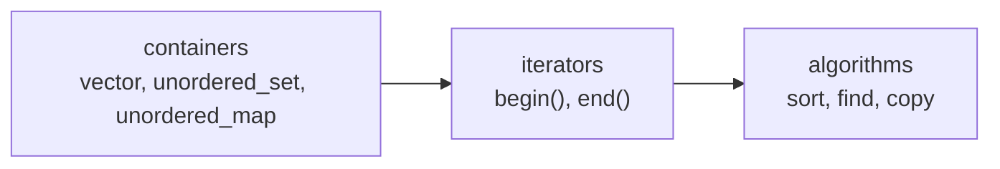
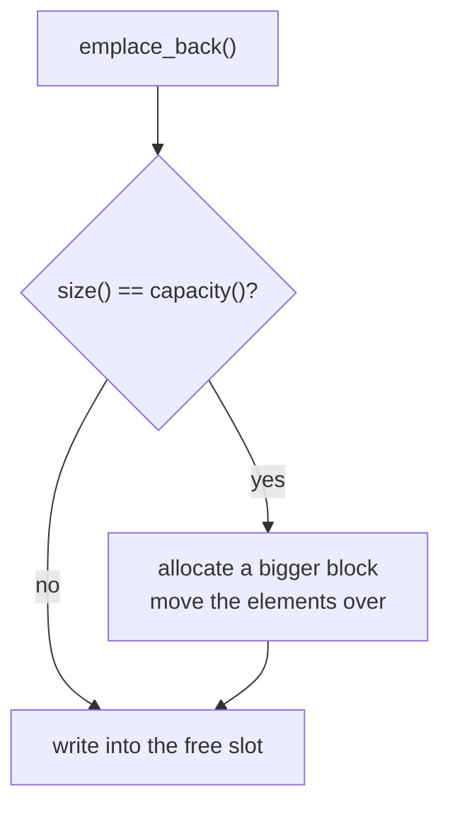
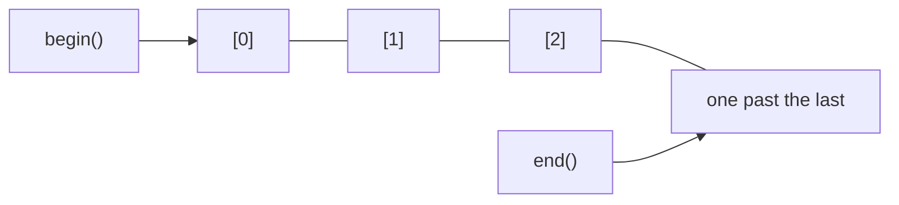

Source: `lessons/04-4-kontainere-auto-og-lambda-lesson.html`
Examples: https://gitlab.com/ntnu-iini4003/examples4
Book: A Tour of C++ 2nd ed, ch. 1.4.2 (auto), 6.3.3 (lambda), 11 (containers)
## What the lesson is about
The STL, mostly `vector`. Iterating with `auto`, iterators, the `sort` algorithm, and anonymous functions.
## What the STL is
Standard Template Library, part of the C++ standard library. Template means you state the data type when you use a part of it. Three parts:

- **Containers** hold data, and the type says how the data is organised. The three on the syllabus are `vector`, `unordered_set` and `unordered_map`.
- **Iterators** move from element to element.
- **Algorithms** do something with the contents. They are written free of any particular container, and iterators are the link between the two. You pass iterators to the algorithm so it knows which data to work on.
A vector is like an array except it grows itself when it fills up. Nothing to do with maths vectors.
Coming from Java: `vector` matches `ArrayList`, but with none of the runtime cost Java pays for leaving a plain array. In C++ there is no difference, so use `vector` rather than a raw array.
## A vector of numbers
```cpp
#include <algorithm>
#include <iostream>
#include <vector>

using namespace std;

int main() {
  vector<int> numbers;

  int number;
  cout << "Skriv positive tall (avslutt med 0): ";
  cin >> number;

  while (number > 0) {
    numbers.emplace_back(number);
    cin >> number;
  }

  cout << "Du har skrevet " << numbers.size() << " tall" << endl;
  for (size_t i = 0; i < numbers.size(); i++) {
    cout << numbers[i] << " ";
  }
  cout << endl;
}
```
`emplace_back()` puts a value at the back. Vectors work best when you add at the back. There is also `emplace()`, which takes an iterator saying where to insert, and it costs more.
## size and capacity
`size()` is how many elements are in there. The storage is a plain array, so the elements sit next to each other in memory. Capacity is always at least `size()`. It starts at 1 and grows in bigger and bigger jumps when needed, often doubling, but that is compiler dependent.

`capacity()` tells you the current capacity, and there are functions for controlling it yourself.
`[]` is overloaded and works on both sides of an assignment, but only for elements that already exist:
```cpp
for (size_t i = 0; i < numbers.size(); ++i) {
  numbers[i] += 100;
}
```
You cannot use indexing to add a new element at the back.
## A vector of objects
```cpp
#include <iostream>
#include <vector>

using namespace std;

class Surface {
public:
  string name;
  double length;
  double width;

  Surface(const string &name_, double length_, double width_)
      : name(name_), length(length_), width(width_) {}

  double get_area() const {
    return length * width;
  }
};

int main() {
  vector<Surface> surfaces;

  surfaces.emplace_back("aaa", 3, 3);
  surfaces.emplace_back("bbb", 1, 1);
  surfaces.emplace_back("ccc", 2, 2);

  cout << "Antall flater: " << surfaces.size() << endl;

  for (auto &surface : surfaces)
    cout << surface.name << " areal: " << surface.get_area() << endl;
}
```
Declaration and implementation sit in the same file here, and the data members are `public` instead of hidden behind get and set functions. That is fine for exercises and the exam, and it reads more easily. For a library or a bigger program, split into `.hpp` and `.cpp` and think twice about public data members.
`emplace_back` takes the constructor arguments directly, so you avoid writing `surfaces.emplace_back(Surface("aaa", 3, 3))`.
## Iterating, and auto
Three ways to walk a vector, from most typing to least:
```cpp
for (size_t i = 0; i < surfaces.size(); ++i) {
  cout << surfaces[i].name << " areal: " << surfaces[i].get_area() << endl;
}
```
```cpp
for (Surface &surface : surfaces) {
  cout << surface.name << " areal: " << surface.get_area() << endl;
}
```
```cpp
for (auto &surface : surfaces) {
  cout << surface.name << " areal: " << surface.get_area() << endl;
}
```
`auto` lets the compiler work out the type. It works elsewhere too:
```cpp
auto area = surface.get_area();
```
`area` gets whatever type `get_area()` returns, so the type is written once instead of twice.
## Iterators
Almost every container has `begin()` and `end()`. `begin()` gives an iterator to the first element, `end()` gives one to the position after the last.

```cpp
for (auto it = surfaces.begin(); it != surfaces.end(); ++it)
```
Part of a vector:
```cpp
for (auto it = surfaces.begin() + 2; it != surfaces.end() - 1; ++it)
```
That runs from index 2 up to and including the second to last element.
An iterator behaves like a pointer to an element, so `*` dereferences it:
```cpp
for (auto it = surfaces.begin(); it != surfaces.end(); ++it)
  cout << (*it).name << " areal: " << (*it).get_area() << endl;
```
`->` is shorter and means the same:
```cpp
for (auto it = surfaces.begin(); it != surfaces.end(); ++it)
  cout << it->name << " areal: " << it->get_area() << endl;
```
Use `++it` rather than `it++`. `it++` returns the old value as well as incrementing, so the compiler has to keep both the old and the new value. `++it` returns the new one, so only one value is needed.
## The sort algorithm
```cpp
#include <iostream>
#include <vector>

using namespace std;

int main() {
  vector<int> numbers;

  numbers.emplace_back(3);
  numbers.emplace_back(1);
  numbers.emplace_back(2);

  sort(numbers.begin(), numbers.end());

  for (auto &number : numbers)
    cout << number << endl;
}
/* Output:
1
2
3
*/
```
Because `sort` takes iterators, the same call works across different containers.
On objects the compiler has no idea what order you want, so you pass a function that compares two of them:
```cpp
bool compare(const Surface &a, const Surface &b) {
  return a.get_area() < b.get_area();
}

int main() {
  sort(surfaces.begin(), surfaces.end(), compare);
}
```
That sorts by increasing area. Sorting by width instead is a one line change:
```cpp
bool compare(const Surface &a, const Surface &b) {
  return a.width < b.width;
}
```
## Lambda expressions
Instead of a named `compare` function, pass an anonymous one written as a lambda:
```cpp
sort(surfaces.begin(), surfaces.end(), [](const Surface &a, const Surface &b) {
  return a.get_area() < b.get_area();
});
```
Same parameters as `compare`, and the compiler works out that it returns `bool`. You can state the return type if you want:
```cpp
sort(surfaces.begin(), surfaces.end(), [](const Surface &a, const Surface &b) -> bool {
  return a.get_area() < b.get_area();
});
```
### The capture list
The `[]` is the capture list. It says what from the surrounding scope the anonymous function gets hold of, separate from its parameters. You can capture by reference or by copy, and you call the function with `()` like any other.
| Capture | Meaning | Sees later changes |
|---------|---------|--------------------|
| `[&number]` | reference to `number` | yes |
| `[number]` | copy of `number` | no |
| `[this]` | the class instance, so data members are reachable | yes |
```cpp
int main() {
  int number = 1;
  auto print_number = [&number]() {
    cout << number << endl;
  };
  print_number();
  number = 2;
  print_number();
}
/* Output:
1
2
*/
```
```cpp
int main() {
  int number = 1;
  auto print_number = [number]() {
    cout << number << endl;
  };
  print_number();
  number = 2;
  print_number();
}
/* Output:
1
1
*/
```
By reference, the function follows the variable. By copy, it froze the value at the point the lambda was created.
## Lambdas in a GUI
A bigger example with gtkmm is at https://gitlab.com/ntnu-iini4003/gtkmm-example. Each GUI signal is connected to an anonymous function that says what happens. `this` is captured so the data members are reachable inside.
```cpp
#include <gtkmm.h>

class Window : public Gtk::Window {
public:
  Gtk::VBox vbox;
  Gtk::Entry entry;
  Gtk::Button button;
  Gtk::Label label;

  Window() {
    button.set_label("Click here");

    vbox.pack_start(entry);
    vbox.pack_start(button);
    vbox.pack_start(label);

    add(vbox);
    show_all();

    entry.signal_changed().connect([this]() {
      label.set_text("Entry now contains: " + entry.get_text());
    });

    entry.signal_activate().connect([this]() {
      label.set_text("Entry activated");
    });

    button.signal_clicked().connect([this]() {
      label.set_text("Button clicked");
    });
  }
};

int main() {
  Gtk::Main gtk_main;
  Window window;
  gtk_main.run(window);
}
```
