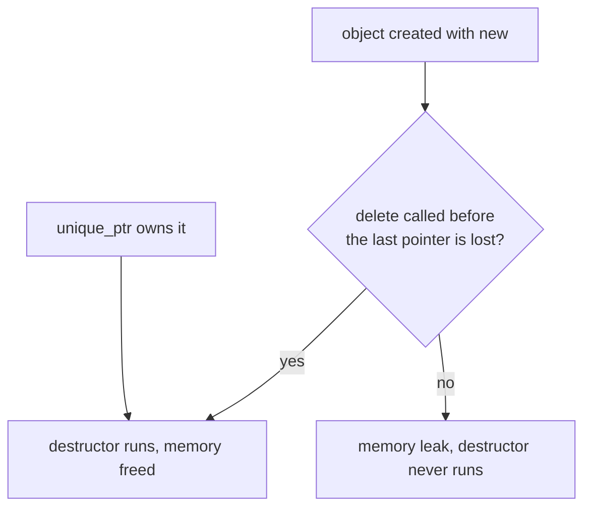
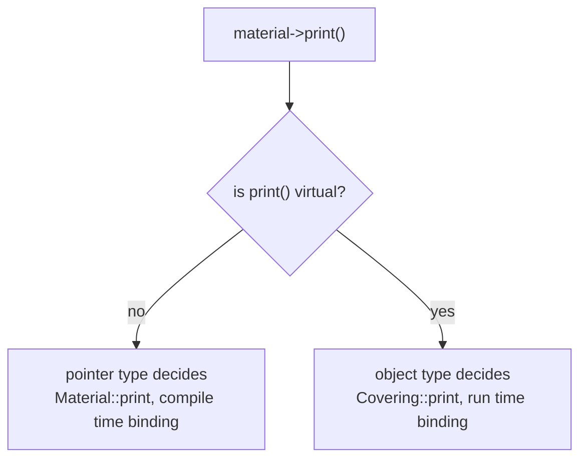

Source: `lessons/05-5-liv-og-dod-smarte-pekere-og-polymorfi-lesson.html`
Examples: https://gitlab.com/ntnu-iini4003/examples5
## What the lesson is about
When objects are created and destroyed, `new` and `delete`, `unique_ptr`, and polymorphism with `virtual` and `override`.
## Scope decides the lifetime
Variables and objects live on the stack inside a scope.
```cpp
int main() {
  {            // new scope
    int a = 2; // a is created
  }            // a is deleted when the scope ends
}
```
Every `{` opens a new scope. A destructor says what happens when the object is deleted.
```cpp
class A {
public:
  A() {
    cout << "Objektet blir opprettet" << endl;
  }
  ~A() {
    cout << "Objektet blir slettet" << endl;
  }
};

int main() {
  {
    A a;
  }
  cout << "Scopet er avsluttet" << endl;
}
// Objektet blir opprettet
// Objektet blir slettet
// Scopet er avsluttet
```
Some classes keep their data on the heap, but both the object on the stack and its content are freed when the scope ends:
```cpp
int main() {
  {
    string a = "test"; // a on the stack, "test" on the heap
  }                    // both are gone here
}
```
Data of unknown size normally sits on the heap, because the stack is far smaller. With ready made classes like `string` and `vector` you never have to think about it. Elsewhere you do.
## The free store
In Java every object is made with `new` and lands on the heap. C++ has `new` too, and it stores the object in dynamic memory, the free store or heap.
A variable in the free store has no name. A pointer points at it, and you say what type it is.
```cpp
int main() {
  {
    A *a = new A(); // anonymous object on the heap, a points at it
  }
  cout << "Scopet er avsluttet" << endl;
}
// Objektet blir opprettet
// Scopet er avsluttet
```
The destructor never ran. Objects on the heap are not deleted when the pointer goes out of scope. You have to say `delete`:
```cpp
int main() {
  {
    A *a = new A();
    delete a;
  }
  cout << "Scopet er avsluttet" << endl;
}
// Objektet blir opprettet
// Objektet blir slettet
// Scopet er avsluttet
```

## unique_ptr
Forgetting `delete` is easy, and sometimes it is genuinely hard to know when the object should go. Smart pointers solve it.
```cpp
#include <memory>

int main() {
  {
    unique_ptr<A> a(new A()); // when a dies, the object dies with it
  }
  cout << "Scopet er avsluttet" << endl;
}
// Objektet blir opprettet
// Objektet blir slettet
// Scopet er avsluttet
```
A later lesson covers `shared_ptr`, which does reference counting, a form of garbage collection, and is common in thread programming where the right moment to delete is not known in advance. Reference counting costs, so do not use it where it is not needed. `unique_ptr` costs nothing extra, but you cannot copy one. You can move the contents:
```cpp
int main() {
  unique_ptr<int> p1(new int(2)); // p1 points at 2 on the heap
  unique_ptr<int> p2;             // p2 holds nullptr

  // p2 = p1                      // not allowed
  p2 = move(p1);                  // p1 now holds nullptr

  if (!p1)
    cout << "p1 inneholder nullptr" << endl;

  if (p2) {
    cout << "p2 har addressen " << p2.get() << " som inneholder tallet " << *p2 << endl;
  }
}
```
`if (p2)` checks whether the smart pointer holds a real address. `get()` returns the raw pointer inside.
### make_unique
`p2 = nullptr` deletes the object. `p1 = unique_ptr<int>(new int(2))` makes a new one and deletes whatever `p1` held. `make_unique` is the shorter way to build them, and its arguments are the class constructor arguments.
```cpp
int main() {
  {
    auto a = make_unique<A>(); // same as unique_ptr<A> a(new A());
    a = make_unique<A>();
    a = nullptr;
    a = make_unique<A>();
  }
  cout << "Scopet er avsluttet" << endl;
}
```
The destructor runs exactly as many times as the constructor, which is what makes smart pointers safe. Name pointers after the thing they point at, so `a`, not `an_object_pointer`.
Use smart pointers only when you need them. If the object can live on the stack, put it there.
## Polymorphism
Polymorphism lets you handle objects with a common base class as one group, with each object deciding how it answers a shared message. To do that you need pointers.
Do not overuse it. You never need polymorphism to use the C++ standard library, and that is a deliberate choice by the ISO committee.
### Pointers in an inheritance tree
A base class pointer can point at an object of a class further down. The other direction is not allowed.
```cpp
Material *material_pointer;
Covering *covering_pointer;
Material material("SuperDuper", 200);
Covering covering("Dux", 300, 5);

material_pointer = &material;  // ok
material_pointer = &covering;  // ok
covering_pointer = &covering;  // ok

covering_pointer = &material;  // not ok
```
`Covering` is a specialisation of `Material` and usually has more member functions. Things you can do to a `Covering` you cannot do to a plain `Material`, so the compiler refuses. The other way round carries no risk: everything you can do to a `Material` you can also do to a `Covering`.
### Without virtual, the pointer type decides
```cpp
vector<Material *> materials;
materials.emplace_back(&covering);
materials.emplace_back(&wallpaper);
materials.emplace_back(&paint);

for (auto &material : materials) {
  material->print();
  cout << endl;
}
```
This compiles, but every object prints only the `Material` part:
```
Navn: Super Duper Dux
Pris: 433.5

Navn: Soldogg
Pris 200

Navn: Extra
Pris: 125
```
The choice was made at compile time. The compiler sees the element type is pointer to `Material`, so it binds `Material::print()`.
### virtual and override
Declaring the function `virtual` in the base class moves the decision to run time, and `override` marks the subclass version.
```cpp
class Material {
public:
  string name;
  double price;

  Material(const string &name_, double price_) : name(name_), price(price_) {}

  virtual void print() const {
    cout << "Navn: " << name << endl
         << "Pris: " << price << endl;
  };
};

class Covering : public Material {
public:
  double width;

  Covering(const string &name, double price, double width_)
      : Material(name, price), width(width_) {}

  void print() const override {
    Material::print();
    cout << "For belegg" << endl
         << "Bredde: " << width << endl;
  }
};
```
Now each object prints its own part as well:
```
Navn: Super Duper Dux
Pris: 433.5
For belegg
Bredde: 4
```

Java programmers: C++ needs `virtual` for polymorphism to work at all. Polymorphism costs, so it is opt in. In Java it is always on.
`virtual` and `override` go in the declaration only, not in the implementation.
### The same thing with unique_ptr
```cpp
int main() {
  vector<unique_ptr<Material>> materials;
  materials.emplace_back(new Covering("Super Duper Dux", 433.50, 4));
  materials.emplace_back(new Wallpaper("Soldogg", 200, 12, 0.6));
  materials.emplace_back(new Paint("Extra", 125, 2, 12));

  for (auto &material : materials) {
    material->print();
    cout << endl;
  }
}
```
## dynamic_cast
Use it when you want to do something only for pointers that happen to point at a particular subclass.
```cpp
for (auto &material : materials) {
  if (dynamic_cast<Paint *>(material.get()))
    material->print();
}
```
The cast returns null when the object is not of that type, so it works directly as a condition. You can also keep the result:
```cpp
int coatings_total = 0;
for (auto &material : materials) {
  if (auto paint = dynamic_cast<Paint *>(material.get()))
    coatings_total += paint->coatings;
}
```
## Virtual destructors
`example3.cpp` adds `virtual ~Material() {}`.
Every class has exactly one destructor. They run from the bottom of the hierarchy upwards, so the derived destructor runs before the base one. When you write destructors in an inheritance tree yourself, make them virtual, which is what guarantees all of them run when the object is deleted. Unlike constructors, you never call the base destructor yourself.
## Pure virtual and abstract classes
There is no formula for the amount of material needed for a general `Material`. The question has no meaning. Still, you want to say that the calculation exists for every kind of material, so the objects can be handled as one group.
```cpp
for (auto &material : materials) {
  cout << material->name << ": "
       << " Behov: " << material->units_needed(surface)
       << " enheter, pris: " << material->price_total(surface) << endl;
}
```
In UML an abstract operation is written in italics, and a class holding one is itself abstract, also in italics. In C++ you declare the virtual function equal to 0:
```cpp
virtual double units_needed(const Surface &surface) const = 0;
```
That function has no implementation in `Material`, not even an empty body. A class with at least one pure virtual function is abstract, and you cannot create objects of it. Subclasses implement it as ordinary virtual functions. A subclass that does not implement it becomes abstract itself.
`price_total()` is different. It is not abstract and not even virtual, because one definition works for every subclass:
```cpp
double Material::price_total(const Surface &surface) const {
  return units_needed(surface) * price;
}
```
It belongs to `Material` and is inherited. Note that it calls `units_needed()` even though `Material` has no implementation of it.
