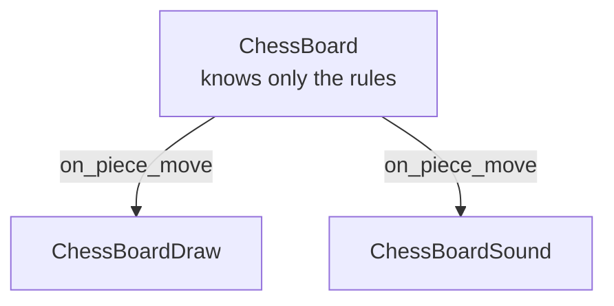
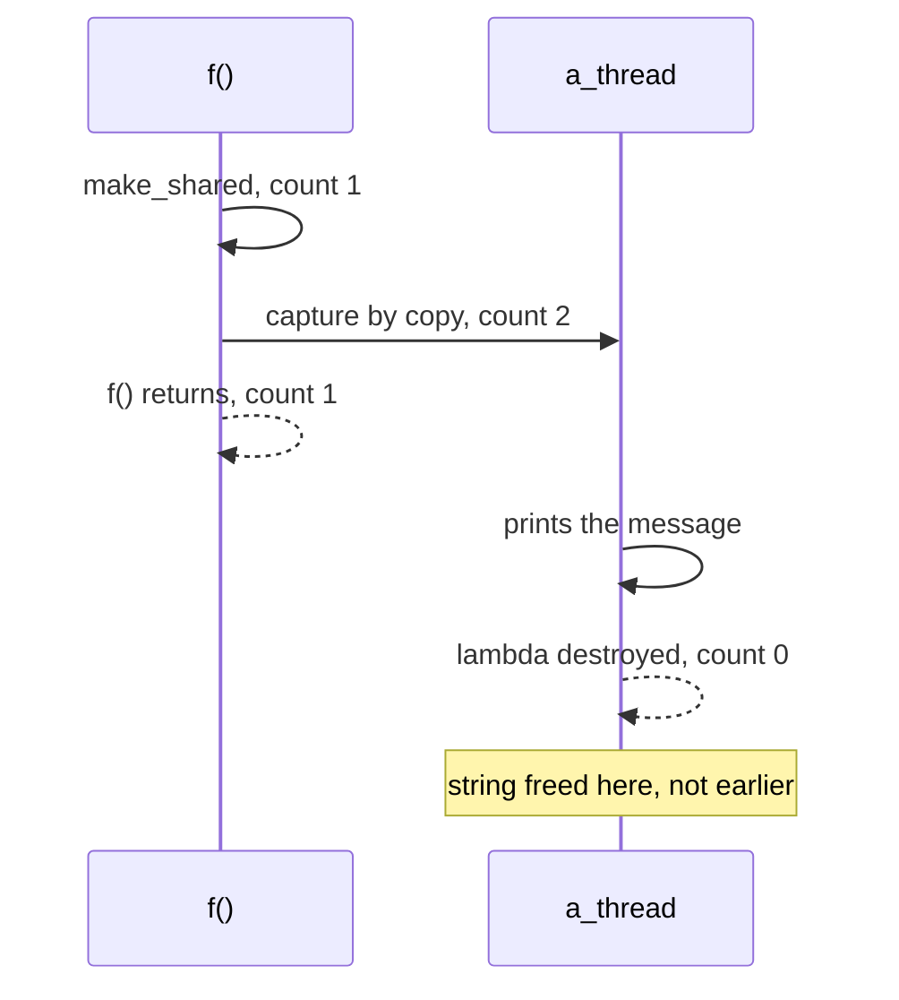
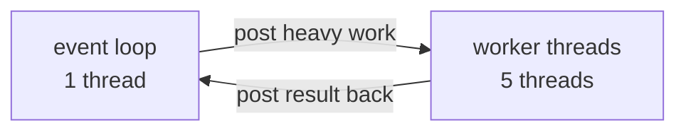

Source: `lessons/06-6-funksjonsobjekter-og-tradprogrammering-lesson.html`
Examples: https://gitlab.com/ntnu-iini4003/examples6
## What the lesson is about
`std::function` as a way to keep code out of a class, threads, `shared_ptr`, mutexes, and an async service built on Boost.Asio. Builds on exercise 5, so do that one first.
## Function objects
A lambda stored in a variable:
```cpp
int main() {
  auto add = [](int a, int b) {
    return a + b;
  };
  cout << add(2, 2) << endl;
}
```
The same thing with the type spelled out:
```cpp
#include <functional>

int main() {
  function<int(int, int)> add = [](int a, int b) {
    return a + b;
  };
  cout << add(2, 2) << endl;
}
```
A function is a block of memory holding instructions, so a pointer to the start of that block can be stored in an object. Here that object is `add`, of type `std::function`. Use it to move code that does not belong in a class out of the class.
### Why that matters
In exercise 5, `std::cout` is used to report whether a chess move is valid, so printing is hardcoded into `ChessBoard`. Put a GUI in front of it later and the class is hard to reuse. Instead give `ChessBoard` `std::function` members that callers can fill in.
```cpp
class ChessBoard {
  function<void(const Piece &piece, const string &from, const string &to)> on_piece_move;
  function<void(const Piece &piece, const string &square)> on_piece_removed;
  function<void(Color color)> on_lost_game;
  function<void(const Piece &piece, const string &from, const string &to)> on_piece_move_invalid;
  function<void(const string &square)> on_piece_move_missing;

  bool move_piece(const std::string &from, const std::string &to) {
    ...
    if (on_piece_move)
      on_piece_move(*piece_from, from, to);
    ...
  }
};
```
```cpp
board.on_piece_move = [](const ChessBoard::Piece &piece, const string &from, const string &to) {
  cout << piece.type() << " is moving from " << from << " to " << to << endl;
};
board.on_lost_game = [](ChessBoard::Color color) {
  if (color == ChessBoard::Color::WHITE)
    cout << "Black";
  else
    cout << "White";
  cout << " won the game" << endl;
};
```
Calling a `std::function` that was never set throws `std::bad_function_call`. That is why every call is guarded with `if (on_piece_move)`. A program using the class, a test for instance, is not obliged to set them.

```cpp
ChessBoard board;
ChessBoardDraw draw(board.squares);
ChessBoardSound sound;

board.on_piece_move = [&draw, &sound](const ChessBoard::Piece &piece, const string &from, const string &to) {
  draw.move_piece(piece, from, to);
  sound.move_piece(piece);
};
```
The board class now knows nothing about drawing or sound, and anyone reading the code can see where the drawing happens. Testing the board and the `Piece` subclasses makes sense, testing drawing and sound normally does not.
### Function objects versus virtual functions
This is the modern alternative to declaring a virtual function that a subclass has to implement, and it is often the better one. The old way was `virtual void on_piece_move`, forcing you to subclass `ChessBoard` just to fill it in. Same story in GUI code: you used to subclass `Gtk::Entry` and `Gtk::Button` to say what happens on change, activate and click. Now you connect a function object and put the implementation where it belongs. Fewer classes, and the class structure makes more sense to other programmers.
Rule of thumb: subclass `Gtk::Button` when you are making a new kind of button, use `button.signal_clicked().connect()` when you are saying what a normal button does.
## Threads
```cpp
#include <thread>

int main() {
  thread a_thread([] {
    cout << "from a_thread" << endl;
  });

  cout << "from main thread" << endl;

  a_thread.join(); // wait until a_thread is finished
}
```
On Linux you still need `-pthread` in `CMAKE_CXX_FLAGS`.
### Captured by reference, gone too soon
```cpp
void f() {
  string message("some message");
  thread a_thread([&message] {
    cout << "message from a_thread: " << message << endl;
  });
  a_thread.detach(); // runs on its own, even after a_thread goes out of scope
}

int main() {
  f();
  cout << "from main thread" << endl;
  this_thread::sleep_for(50ms);
}
// Segmentation fault
```
`message` may be freed before the thread is done with it. Capturing by copy would fix it but is usually not what you want. Use `shared_ptr` and let reference counting decide when the string dies.
```cpp
void f() {
  shared_ptr<string> message(new string("some message"));  // count 1
  thread a_thread([message] {                              // count 2
    cout << "message from a_thread: " << *message << endl;
  });                                                      // count back to 1
  a_thread.detach();
}                                                          // count 0 only once the thread is done
```

When the count reaches 0 the `shared_ptr` deletes the `string` on the heap. The shorter spelling, same idea as `make_unique`:
```cpp
auto message = make_shared<string>("some message");
```
## Mutex
Several threads touching the same object at once goes wrong.
```cpp
int main() {
  string message;

  vector<thread> threads;
  for (int c = 0; c < 4; ++c) {
    threads.emplace_back([c, &message] {
      message += "thread " + to_string(c) + " says hello\n";
    });
  }

  for (auto &thread : threads)
    thread.join();

  cout << message << endl;
}
// malloc: *** error for object 0x7fb968600080: double free
```
A mutex locks read and write access:
```cpp
threads.emplace_back([c, &message] {
  static mutex message_mutex;
  lock_guard<mutex> lock(message_mutex);
  message += "thread " + to_string(c) + " says hello\n";
});
```
`lock_guard` locks when it is constructed and unlocks when it is destroyed at the end of the scope, including when an exception is thrown. Safer than calling `lock()` and `unlock()` yourself.
`static` here means the object is initialised once and lives until the program ends. It is not initialised before it is needed, or at all if it never is, and C and C++ guarantee that initialising a static object is thread safe.
### Singleton
That guarantee is how singletons are written in C++.
```cpp
class SingletonClass {
  SingletonClass() {} // private, so get() is the only way in

public:
  static SingletonClass &get() {
    static SingletonClass instance;
    return instance;
  }
};

int main() {
  SingletonClass::get(); // created and returned
  SingletonClass::get(); // the existing one is returned
}
```
### Reference counted singleton (not on the syllabus)
The instance goes away once nothing is using it.
```cpp
class ReferenceCountedSingletonClass {
  ReferenceCountedSingletonClass() {}

public:
  static shared_ptr<ReferenceCountedSingletonClass> get() {
    static weak_ptr<ReferenceCountedSingletonClass> cache;
    static mutex cache_mutex;
    lock_guard<mutex> lock(cache_mutex);
    auto instance = cache.lock();
    if (!instance)
      cache = instance = shared_ptr<ReferenceCountedSingletonClass>(new ReferenceCountedSingletonClass());
    return instance;
  }
};
```
Used in https://gitlab.com/ntnu-tdat3023/sfml-modern-opengl-example for graphics card shaders, which are dropped when no longer needed to free resources on the card.
## Asynchronous service
Sometimes posting tasks to a service beats managing threads by hand, and you get to pick how many threads run them. Occasionally one thread is exactly what you want. Boost.Asio does this.
```cpp
#include <boost/asio.hpp>

class Workers {
public:
  boost::asio::io_service service;

private:
  boost::asio::io_service::work work; // keeps service.run() waiting for tasks
  vector<thread> threads;

public:
  Workers(size_t number_of_threads) : work(service) {
    for (size_t c = 0; c < number_of_threads; ++c) {
      threads.emplace_back([this] {
        service.run(); // wait for and run tasks until service.stop()
      });
    }
  }

  void stop() {
    service.stop();
    for (auto &thread : threads) {
      thread.join();
    }
  }
};
```
```cpp
int main() {
  Workers workers(4);

  workers.service.post([&workers] {
    cout << "task A is being performed by a worker" << endl;

    workers.service.post([] {
      cout << "task B is being performed by a worker" << endl;
    });
  });
  workers.service.post([] {
    cout << "task C is being performed by a worker" << endl;
  });

  string line;
  getline(cin, line);
  workers.stop();
}
```
`post` returns immediately. Output order varies between runs, since the printing happens in parallel.
### One worker means sequential
Turn it around and use a single worker to run functions called from many threads one at a time.
```cpp
int main() {
  Workers worker(1);

  std::vector<thread> threads;
  for (size_t c = 0; c < 4; ++c) {
    threads.emplace_back([&worker, c] {
      this_thread::sleep_for(1s); // pretend this is heavy work

      auto result = make_shared<string>("some result from thread " + to_string(c));
      worker.service.post([result] {
        cout << "The result was: " << *result << endl;
      });
    });
  }

  string line;
  getline(cin, line);
  worker.stop();

  for (auto &thread : threads)
    thread.join();
}
```
Only the thread number varies in the output, and no mutex was needed.
### The event loop pattern

Many libraries work this way. Node.js does it with libuv, and most GUI libraries let you program in one thread, which avoids the problems that come with several. Heavy things like file handling and network traffic run in worker threads, and the result is posted back to the single threaded event loop.
```cpp
int main() {
  Workers event_loop(1);
  Workers worker_threads(5);

  event_loop.service.post([&event_loop, &worker_threads] {
    cout << "Starting heavy work from a worker thread here" << endl;
    worker_threads.service.post([&event_loop] {
      this_thread::sleep_for(2s);
      auto result = make_shared<string>("Some result");
      event_loop.service.post([result] {
        cout << "Result from a worker thread: " << *result << endl;
      });
    });
  });

  string line;
  getline(cin, line);
  worker_threads.stop();
  event_loop.stop();
}
```
## Single threaded echo server
An efficient network application in one thread, often faster than several, still handling more than one connection at a time.
```cpp
class EchoServer {
private:
  class Connection {
  public:
    tcp::socket socket;
    Connection(boost::asio::io_service &io_service) : socket(io_service) {}
  };

  boost::asio::io_service io_service;
  tcp::endpoint endpoint;
  tcp::acceptor acceptor;

  void handle_request(shared_ptr<Connection> connection) {
    auto read_buffer = make_shared<boost::asio::streambuf>();
    async_read_until(connection->socket, *read_buffer, "\r\n",
                     [this, connection, read_buffer](const boost::system::error_code &ec, size_t) {
      if (!ec) {
        istream read_stream(read_buffer.get());
        std::string message;
        getline(read_stream, message);
        message.pop_back();

        if (message == "exit")
          return;

        auto write_buffer = make_shared<boost::asio::streambuf>();
        ostream write_stream(write_buffer.get());
        write_stream << message << "\r\n";

        async_write(connection->socket, *write_buffer,
                    [this, connection, write_buffer](const boost::system::error_code &ec, size_t) {
          if (!ec)
            handle_request(connection);
        });
      }
    });
  }

  void accept() {
    auto connection = make_shared<Connection>(io_service);

    acceptor.async_accept(connection->socket, [this, connection](const boost::system::error_code &ec) {
      accept();
      if (!ec) {
        handle_request(connection);
      }
    });
  }

public:
  EchoServer() : endpoint(tcp::v4(), 8080), acceptor(io_service, endpoint) {}

  void start() {
    accept();
    io_service.run();
  }
};
```
Points worth noticing:
- The `async_` functions return immediately, and the lambdas run once the operation completes.
- Every `shared_ptr` (`connection`, `read_buffer`, `write_buffer`) is copied into the lambda to keep the resource alive as long as it is needed.
- The buffers hold the bytes received or about to be sent, the streams let you read from and write to the buffers.
- It looks recursive, but it is safe: the async calls return at once, so the scope ends and the stack frame is released.
- You can still spin up threads for heavy work, as long as you copy the connection object along as shown.
