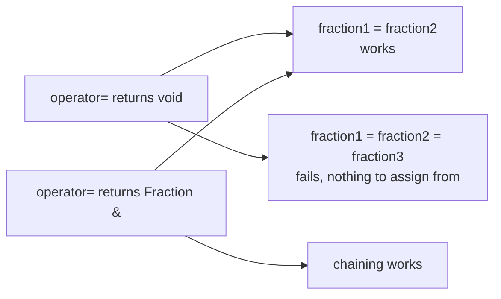

Source: `lessons/07-7-operator-overloading-lesson.html`
Examples: https://gitlab.com/ntnu-iini4003/examples7
Book: A Tour of C++ 2nd ed, ch. 4.2.1
## What the lesson is about
Giving the ordinary operators a meaning for your own classes. They are written as normal functions with a special name. Some are easy, some are not, and the assignment operator always deserves attention when a data member is a pointer.
## What overloading means
Several functions can share a name as long as the parameter lists differ. The same goes for operators. It already happens without you noticing: `+` works on integers and on floating point numbers, and since those are stored differently, the compiler treats them as two separate operations. Same with `<` on ints, doubles and chars.
In C++ you can define what an operator means yourself, as long as it is tied to a class.
```cpp
void sort(int *table, int number_of_elements) {
  if (table[index] < table[index_smallest]) {
    ...
}
```
Write the same sort for objects, and it works as soon as `<` is defined for that type. `string` already has it.
## Comparing surfaces
Start from a member function that compares one surface with another.
```cpp
int Surface::compare(const Surface &other) const {
  const double toleranse = 0.00001;
  double area1 = get_area();
  double area2 = other.get_area();
  if (fabs(area2 - area1) < toleranse)
    return 0;
  else if (area1 < area2)
    return -1;
  else
    return 1;
}
```
Two computed decimal values are compared, so `==` is avoided and the difference is checked against a tolerance instead. `fabs()` comes from `<cmath>`.
The operator is a one liner on top of it:
```cpp
bool Surface::operator<(const Surface &other) const {
  return (compare(other) < 0);
}
```
The only unusual thing is the name. `<` is binary, so the function takes exactly one argument, the left operand being the object itself. You pick the return type, and `bool` is the natural one here. It can be called like any member function:
```cpp
if (surface1.operator<(surface2)) cout << surface1.name << " er minst\n";
```
but the point is this:
```cpp
if (surface1 < surface2) cout << surface1.name << " er minst\n";
```
so a table of surfaces sorts with the same code as a table of ints. The names are fixed: `operator<`, `operator+`, `operator!=` and so on.
## Binary and unary
A binary operator takes two operands, multiplication for instance. A unary one takes one. Plus and minus are usually binary but can be unary, as in `-number`, which is the value of `number` with the sign flipped.
## The Fraction class
Fractions can be added, subtracted, multiplied, divided, compared and assigned, all binary. Adding 1 and flipping the sign are unary.
```cpp
class Fraction {
public:
  int numerator;
  int denominator;

  Fraction();
  Fraction(int numerator, int denominator);
  void set(int numerator_, int denominator_ = 1);
  Fraction operator+(const Fraction &other) const;
  Fraction operator-(const Fraction &other) const;
  Fraction operator*(const Fraction &other) const;
  Fraction operator/(const Fraction &other) const;
  Fraction operator-() const;
  Fraction &operator++(); // preincrement
  Fraction &operator--(); // predecrement
  Fraction &operator+=(const Fraction &other);
  Fraction &operator-=(const Fraction &other);
  Fraction &operator*=(const Fraction &other);
  Fraction &operator/=(const Fraction &other);
  Fraction &operator=(const Fraction &other);
  bool operator==(const Fraction &other) const;
  bool operator!=(const Fraction &other) const;
  bool operator<=(const Fraction &other) const;
  bool operator>=(const Fraction &other) const;
  bool operator<(const Fraction &other) const;
  bool operator>(const Fraction &other) const;

private:
  void reduce();
  int compare(const Fraction &other) const;
};
```
With those in place, fractions behave like `int` or `double` in client code:
```cpp
int main() {
  Fraction a(10, 20);
  Fraction b(3, 4);
  Fraction c;
  c.set(5);
  Fraction d = a / b;

  b += a;
  ++c;
  d *= d;

  c = a + b - d * a;
  c = -c;

  if (a + b != c + d)
    cout << "a + b != c + d" << endl;
  while (b > a)
    b -= a;
}
// a = 1 / 2
// b = 3 / 4
// c = 5 / 1
// d = 2 / 3
// b = 5 / 4
// c = 6 / 1
// d = 4 / 9
// c = -55 / 36
// a + b != c + d
// b = 1 / 4
```
## Three groups by return type
| Group | Returns | Operators | Why |
|-------|---------|-----------|-----|
| 1 | a new object | `+ - * / %`, unary `+ -` | a third value is produced, the operands are untouched |
| 2 | reference to `*this` | `= += -= *= /= ++ --` | the left operand itself changes, and the result must be usable again |
| 3 | something else | `== != < > <= >=` | a comparison answers yes or no, so `bool` |
### Group 1, object as return value
The two operands must not change, so the function builds a new object, fills it, and returns it.
```cpp
Fraction Fraction::operator-() const {
  Fraction fraction;
  fraction.numerator = -numerator;
  fraction.denominator = denominator;
  return fraction;
}
```
```cpp
Fraction Fraction::operator*(const Fraction &other) const {
  Fraction fraction = *this;
  fraction *= other;
  return fraction;
}
```
`set()` is used rather than writing the members directly, because it checks for a zero denominator and reduces the fraction.
`fraction2 = -fraction1;` first runs `operator-()`, and the object that comes out is then the argument to `operator=()`. Same for binary ones: `fraction1 + fraction2` is an object, so `fraction1 + fraction2 + fraction3` works, and left associativity makes it `(fraction1 + fraction2) + fraction3`.
### Group 2, *this as return value
`this` is a predefined pointer holding the address of the object being worked on, the same idea as Java's `this` reference, so `*this` is the object itself. When the operator changes the object, return a reference to it.
```cpp
Fraction &Fraction::operator=(const Fraction &other) {
  numerator = other.numerator;
  denominator = other.denominator;
  return *this;
}
```
That makes chaining work. Assignment is right associative, so
```cpp
fraction1 = fraction2 = fraction3;
```
means `fraction1 = (fraction2 = fraction3)`. First `fraction2` takes the value of `fraction3`, then the return value, the changed `fraction2`, is assigned to `fraction1`.

If you write no `operator=` at all, the compiler makes one that copies every data member across. That is not good enough as soon as a data member is a pointer. The `Fraction` version above does exactly what the generated one would, so it could have been left out, and is only there for completeness.
### Group 3, other return types
```cpp
bool Fraction::operator==(const Fraction &other) const {
  return (compare(other) == 0) ? true : false;
}
```
`compare()` returns +1, 0 or -1 the same way `Surface::compare()` does, and every comparison operator is built on it.
## Implementation notes
New operators are often written in terms of existing ones, so `*` uses `*=` and `=`.
```cpp
Fraction &Fraction::operator+=(const Fraction &other) {
  set(numerator * other.denominator + denominator * other.numerator,
      denominator * other.denominator);
  return *this;
}

Fraction &Fraction::operator++() {
  numerator += denominator;
  return *this;
}
```
```cpp
void Fraction::set(int numerator_, int denominator_) {
  if (denominator_ != 0) {
    numerator = numerator_;
    denominator = denominator_;
    reduce();
  } else {
    throw "nevneren ble null";
  }
}
```
`reduce()` keeps the denominator positive and cancels the fraction using Euclid's algorithm:
```cpp
void Fraction::reduce() {
  if (denominator < 0) {
    numerator = -numerator;
    denominator = -denominator;
  }
  int a = numerator;
  int b = denominator;
  int c;
  if (a < 0)
    a = -a;

  while (b > 0) {
    c = a % b;
    a = b;
    b = c;
  }
  numerator /= a;
  denominator /= a;
}
```
```cpp
int Fraction::compare(const Fraction &other) const {
  Fraction fraction = *this - other;
  if (fraction.numerator > 0)
    return 1;
  else if (fraction.numerator == 0)
    return 0;
  else
    return -1;
}
```
## Operators as non member functions
Two reasons to write an operator outside the class:
- the first operand is not an object of that class
- the class belongs to someone else and you cannot change it
### First operand is not an object
```cpp
Fraction Fraction::operator+(int integer) const {
  Fraction fraction;
  fraction.set(integer);
  fraction += *this;
  return fraction;
}
```
That gives you `fraction1 + 3`, read as `fraction1.operator+(3)`. It does not give you `3 + fraction1`, because the left operand is no longer a `Fraction`. Declare a free function next to the class:
```cpp
Fraction operator+(int integer, const Fraction &other);
```
```cpp
Fraction operator+(int integer, const Fraction &other) {
  Fraction fraction;
  fraction = other + integer;
  return fraction;
}
```
No `Fraction::` in front, since it is not a member. Now `3 + fraction1` means `operator+(3, fraction1)`.
### A class you do not own
`<<` and `>>` are really bit shift operators, redefined for files and streams. `cout << tall;` means `cout.operator<<(tall);` and the operator is declared as
```cpp
ostream &operator<<(type var);
```
There are many versions for different argument types. The return value is `*this`, which is what lets the calls chain, so `cout << "A = " << A << endl;` means `((cout << "A = ") << A) << endl`.
`<<` belongs to `ostream`, which you cannot change, so a member function is out. A free function works:
```cpp
ostream &operator<<(ostream &out, const Fraction &fraction) {
  out << fraction.numerator << "/" << fraction.denominator;
  return out;
}
```
```cpp
cout << "A = " << a << endl;
```
`cout << "a = "` uses the built in meaning for strings and yields `cout`. Then `cout << a` uses your function, called as `operator<<(cout, a)`, which returns `cout` again. Finally `cout << endl` uses the built in meaning once more.
## What cannot be overloaded
`.`, `.*`, `::`, `?:` and `sizeof`. Everything else can be, but only in connection with a class. On other types the built in meaning always applies.
## Operators with special rules
The postfix `++` and `--` are declared as if binary and used as if unary. The prototype takes an unused `int` argument, left unnamed, whose only job is to tell the two versions apart.
```cpp
Fraction Fraction::operator++(int) { // postfix
  Fraction fraction;
  fraction = *this;
  ++(*this);
  return fraction;
}
```
```cpp
Fraction fraction;
fraction.set(1, 2);
Fraction broekB = fraction++;
```
`->` counts as a unary operator when overloaded. `new` and `delete` have their own rules and are not covered here. Do not write your own until you know exactly what you are doing.
## When not to overload
You can define `+` to mean subtraction, and it would be chaos for whoever uses it. Stay close to the natural meaning, and if you invent one, make it impossible to misread.
`+` and `-` for fractions, complex numbers and matrices are fine. `+` for joining strings is fine, `-` on strings is doubtful. `-` between two points in time gives a difference, `+` between two points in time means nothing useful. `+` between a date and an integer read as days does make sense.
Overloading cannot change precedence, associativity or the number of operands, and sometimes that alone is a reason to stop. In Pascal `^` means exponentiation, and it is tempting to write `fraction1 ^ 8`. Mathematically that operator is right associative and binds tighter than multiplication, but in C++ it would be left associative and bind looser, so
```cpp
fraction1 * fraction2 ^ 8
```
would mean `(fraction1 * fraction2) ^ 8`, not `fraction1 * (fraction2 ^ 8)`. Better to leave it alone. There is no good substitute either, since every right associative operator that binds tighter than multiplication is unary.
## Type conversion through constructors
Only loosely related to operator overloading, but worth watching for.
```cpp
Surface surface2 = surface1;   // same as Surface surface2(surface1);
```
That creates a new object using the copy constructor, or the generated one if you did not write your own. In modern C++ the generated one is usually what you want.
The equals sign works for any constructor taking one argument.
```cpp
Surface::Surface(double area) {
  name = "ukjent";
  length = sqrt(area);
  width = length;
}
```
```cpp
Surface surface3 = 25;  // square with length = width = 5
surface2 = 50;          // int converted to Surface
```
That is user defined type conversion, and it can produce surprises. Constructors are normally written to create objects, not to convert during assignment or argument passing, and in many cases this conversion means the programmer made a logical mistake. `explicit` shuts it off:
```cpp
explicit Surface(double area);
```
It also blocks the equals form for normal construction, so you then write:
```cpp
Surface surface3(25);
```
## friend
```cpp
class A {
public:
  friend class B;
};
```
`B` becomes a friend of `A` and can reach `A`'s private parts, but not the other way round unless `A` is also declared a friend of `B`. Friendship is not inherited, which is the point: anyone can subclass any class, so inherited friendship would hand the private parts to everyone.
Do not declare friends to save typing. Change the data structure in `A` and you now have to walk through `B` as well, and every other friend after that. The reason should be that the class genuinely needs access to data or functions that should not be public, or even protected. Efficiency is occasionally a reason too.
The useful case here is friend functions, especially for operators that cannot be member functions. Declaring the `<<` operator as a friend lets it reach the data members directly, and it also puts the function declaration next to the rest of the class.
```cpp
class Fraction {
public:
  Fraction();
  Fraction(int numerator, int denominator);
  void set(int numerator_, int denominator_ = 1);
  friend ostream &operator<<(ostream &ut, const Fraction &fraction);
};
```
