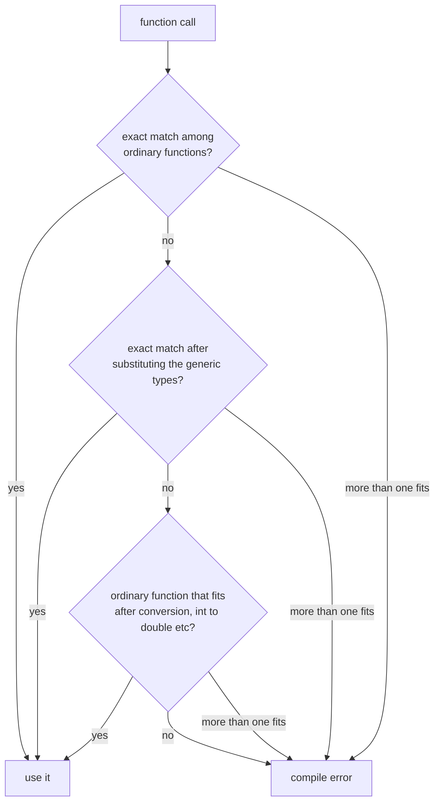

Source: `lessons/08-8-templates-lesson.html`
Examples: https://gitlab.com/ntnu-iini4003/examples8
Book: A Tour of C++ 2nd ed, ch. 6
## What the lesson is about
Writing classes and functions that work whatever data type they are handed. This is how the STL is built. You write one general algorithm or class and apply it later to whatever data you have.
## Function templates
Sorting a table is the same algorithm whether it holds integers, decimals or names. The only requirement is that the elements have an order, so you can say one is smaller than another.
The algorithm: find the smallest element and put it first, then the next smallest second, and so on.
```cpp
template <typename Type>
void sort(Type &data) {
  for (size_t i = 0; i < data.size(); ++i) {
    int smallest = i;
    for (size_t j = i + 1; j < data.size(); ++j) {
      if (data[j] < data[smallest])
        smallest = j;
    }
    auto help = data[i];
    data[i] = data[smallest];
    data[smallest] = help;
  }
}
```
`Type` is the generic type. `template <typename Type>` tells the compiler this is a template and that the generic type is called `Type`. Any legal name works, and the literature often uses `T`. For historical reasons `class` can be written instead of `typename`, but newer code uses `typename`.
```cpp
int main() {
  std::default_random_engine generator;
  std::uniform_real_distribution<double> distribution(0.0, 10.0);

  vector<double> table;
  for (size_t i = 0; i < 10; ++i)
    table.emplace_back(distribution(generator));

  sort(table);

  for (auto &e : table)
    cout << e << endl;
}
```
The call looks like any other function call. The compiler works out that this is a template, that `table` is a `vector<double>`, and that `Type` should be replaced with `vector<double>` here. That replacement is called instantiation, and it produces a real function.
## Same generic type used twice
```cpp
template <typename Type>
size_t search(const vector<Type> &table, Type search_element) {
  size_t pos = 0;
  while (pos < table.size() && table[pos] != search_element)
    ++pos;
  if (pos < table.size())
    return pos;
  else
    return -1;
}
```
`Type` appears twice in the argument list, so both arguments in the call have to agree.
```cpp
vector<double> table;
auto pos = search(table, 0.5);                    // ok
auto pos = search(table, 1);                      // error, 1 is an int
auto pos = search(table, static_cast<double>(1)); // ok
```
Prefer `static_cast` and `dynamic_cast` over C style casts like `(double)1`, because they report errors at compile time. `static_cast` is the simple everyday one, `dynamic_cast` is for polymorphism.
## Several generic types
```cpp
template <typename Type1, typename Type2>
void print(const Type1 &first, const Type2 &second) {
  cout << first << " " << second << endl;
}

int main() {
  int number = 5;
  print("Svaret er ", number);
  print(100, 0.05);
  print('\n', "Hallo");
}
```
Every generic type has to appear in the argument list. Otherwise the compiler has no way to know which type you meant and refuses. If you need a separate type for the return value or an internal variable, add an extra argument of that type and pass any value of it at the call site.
## Templates among the polymorphic functions
| Kind | Argument types | Algorithm |
|------|----------------|-----------|
| inherited virtual functions | fixed from call to call | varies |
| templates | vary | fixed |
| overloaded functions | vary between prototypes | may be the same or not |
A template is an automated way of writing overloaded functions. You write the mould, the compiler builds the real functions, and only the versions it works out that it needs.
### How the compiler picks

This is useful when you want one template covering most types plus a special version for a few. Write ordinary functions for the special types and a template of the same name for the general case, and the compiler tries the special ones first.
When writing a template, think about which data types it does not fit. Note the limits in the header comment, or write more versions so every case is covered.
## Class templates
A class template can have data members of the generic type as well as member functions taking it.
```cpp
template <typename Type>
class Point {
public:
  Type x, y, z;

  Point(Type x, Type y, Type z) : x(x), y(y), z(z) {}

  Point operator+(const Point &other) {
    Point point = *this;
    point.x += other.x;
    point.y += other.y;
    point.z += other.z;
    return point;
  }

  friend ostream &operator<<(ostream &os, const Point &punkt) {
    return os << "(" << punkt.x << ", " << punkt.y << ", " << punkt.z << ")";
  }
};

int main() {
  {
    Point<int> p1(1, 2, 3), p2(2, 2, 2);
    cout << (p1 + p2) << endl;
  }
  {
    Point<double> p1(1.5, 2.5, 3.5), p2(2.0, 2.0, 2.0);
    cout << (p1 + p2) << endl;
  }
}
/* Output:
(3, 4, 5)
(3.5, 4.5, 5.5)
*/
```
Unlike a function template, the type is written out at the point of use, `Point<int>` or `Point<double>`, since there are no arguments for the compiler to deduce it from.
