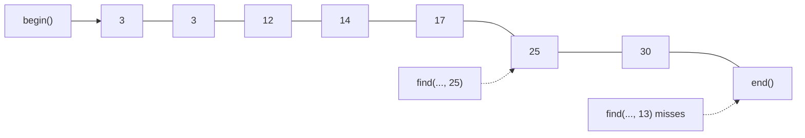
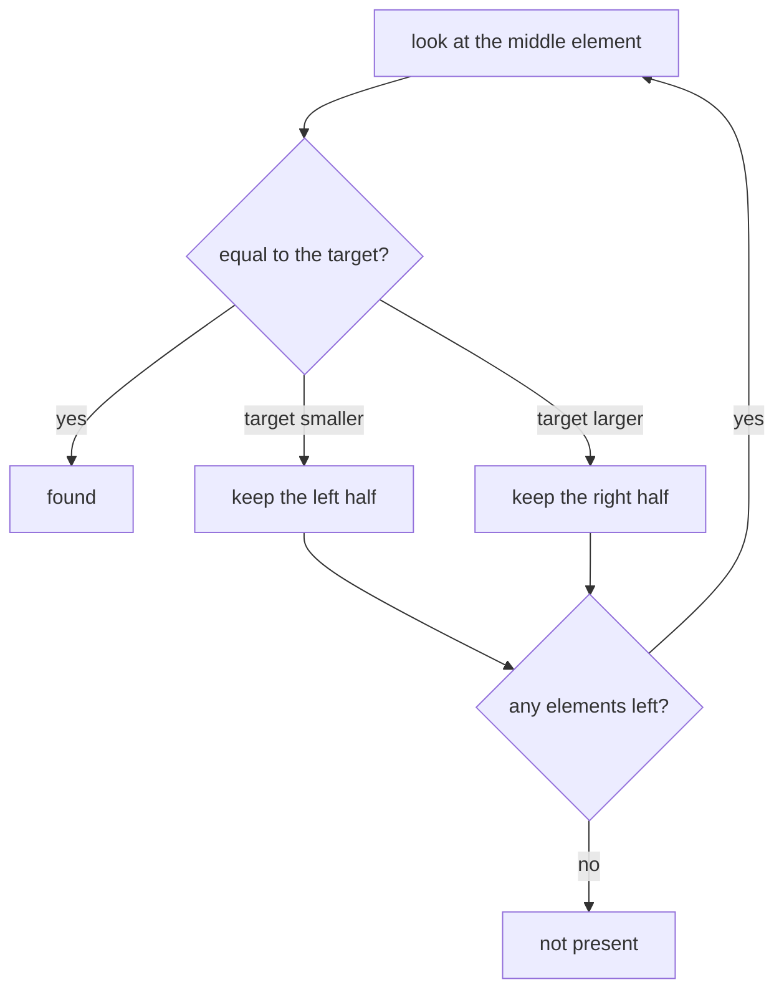

Source: `lessons/09-9-algorithms-lesson.html`
Examples: https://gitlab.com/ntnu-iini4003/examples9
Book: A Tour of C++ 2nd ed, ch. 12
## What the lesson is about
Examples of the different kinds of STL algorithm: linear search, algorithms that move or change data, and algorithms that need the data sorted.
The two test vectors used throughout:
```cpp
vector<int> v1 = {3, 3, 12, 14, 17, 25, 30};
vector<int> v2 = {2, 3, 12, 14, 24};
```
and a helper so a whole vector can be printed:
```cpp
ostream &operator<<(ostream &out, const vector<int> &table) {
  for (auto &e : table)
    out << e << " ";
  return out;
}
```
## Linear search
Compare each element with the value you are after and stop at the first hit. These functions return an iterator to the result.
```cpp
auto pos = find(v1.begin(), v1.end(), 25);
if (pos != v1.end()) {
  cout << "25 fins i v1 på indeks " << (pos - v1.begin()) << endl;
} else
  cout << "25 fins ikke i v1" << endl;
```
The index is the distance between the returned iterator and the start, so `pos - v1.begin()`. A miss returns `end()`, which is why the check is against `v1.end()`.

Searching part of the vector works the same way, since the algorithm only ever sees the two iterators you hand it:
```cpp
auto start = v1.begin() + 2;
auto end = v1.end() - 2;
pos = find(start, end, 14);
if (pos != end) { ... }
```
| Call | What it does | Result on v1 |
|------|--------------|--------------|
| `find(v1.begin(), v1.end(), 25)` | first element equal to a value | index 5 |
| `find_first_of(v1.begin(), v1.end(), v2.begin() + 2, v2.end())` | first element matching any of several values | index 2 |
| `adjacent_find(v1.begin(), v1.end())` | first pair of equal neighbours | index 0 |
| `count(v1.begin(), v1.end(), 3)` | how many equal a value | 2 |
| `max_element(v1.begin(), v1.end())` | iterator to the largest, so dereference it | 30 |
## Algorithms that move or change data
### swap
```cpp
swap(v1, v2);
```
Swaps the contents of two vectors. There is a member function too, so `v1.swap(v2)` and `swap(v1, v2)` mean the same.
### copy
```cpp
auto old_size = v1.size();
v1.resize(v1.size() + v2.size()); // v1 has to be big enough first
copy(v2.begin(), v2.end(), v1.begin() + old_size);
```
Three iterators: the first two mark the range to copy, the last says where the copy goes. The target elements have to exist already.
`resize()` often moves the data in memory, so any iterator, reference or pointer into the vector may be broken afterwards.
```cpp
vector<int>::iterator it = v1.end();
v1.resize(v1.size() + v2.size()); // it is destroyed here
copy(v2.begin(), v2.end(), it);   // wrong
```
Several STL algorithms put their result in a different vector from the input. That vector has to be big enough beforehand, normally through `resize()`. If it is not, anything can happen, the same as writing past the end of an array.
Insert iterators avoid the whole problem, not covered here, and the member function `insert()` uses one automatically:
```cpp
v1.insert(v1.end(), v2.begin(), v2.end());
```
which grows `v1` inside the call.
### The rest of the moving algorithms
```cpp
swap_ranges(v1.begin(), v1.begin() + 5, v1.begin() + 5);
```
Three arguments. The first two mark the range to swap out, and that also fixes how many elements move. The third is the start of the second range, which is necessarily the same length. `v1.end() - 7` would have worked instead of `v1.begin() + 5`.
```cpp
fill(v1.begin(), v1.begin() + 5, 3);
```
```cpp
vector<int> copy;
copy.resize(v1.size());
replace_copy(v1.begin(), v1.end(), copy.begin(), 3, 300);
```
```cpp
vector<int> v1_reversed(v1.size());
reverse_copy(v1.begin(), v1.end(), v1_reversed.begin());
```
```cpp
rotate(v1.begin(), v1.begin() + 3, v1.end());
```
```cpp
vector<int> table = {1, 2, 3};
// 3! = 6 permutations, so the seventh is the first again
for (size_t i = 0; i < 7; ++i) {
  next_permutation(table.begin(), table.end());
  cout << "Permutasjon " << (i + 1) << ": " << table << endl;
}
```
A permutation is a reshuffle of the elements of a set.
## Algorithms on sorted data
Searching a sorted set is far more efficient than searching an unsorted one.
### Binary search
In a sorted table the small values are at the start and the large ones at the end. Compare the middle element with what you are after and you know which half it must be in, so the other half can be discarded. Repeat on the half that is left, until you hit the value or run out of elements, at which point it is not there.

```cpp
if (binary_search(v1.begin(), v1.end(), 17)) {
  cout << "17 fins i v1\n";
}
```
`binary_search()` only says whether the value is there. To find where it is, or where it would have to go to keep the sequence sorted, use `lower_bound()` or `upper_bound()`.
Take the sequence 2, 3, 3, 3, 12, 14, 17, 25, 30 and search for 3:
| Function | Returns | Index here |
|----------|---------|------------|
| `lower_bound` | first element greater than or equal to the value | 1 |
| `upper_bound` | first element after the run of 3s | 4 |
`upper_bound()` gives the highest position a new 3 could go and keep the sequence sorted. For the position of the last 3, subtract 1.
```cpp
auto v3 = v2;
pos = lower_bound(v3.begin(), v3.end(), 25);
cout << "25 skal inn på posisjon " << (pos - v3.begin()) << endl;
v3.insert(pos, 25);
```
The index is only printed. `insert()` takes the iterator, not the index.
### includes
Are all the elements of one sorted set present in another sorted set?
```cpp
if (includes(v1.begin(), v1.end(), v2.begin() + 1, v2.begin() + 3))
  cout << "Er med!\n";
else
  cout << "Er ikke med!\n";
```
### merge
Merging joins two sorted sequences into one. Make sure there is room for the result:
```cpp
vector<int> result;
result.resize(v1.size() + v2.size()); // exactly the right size
merge(v1.begin(), v1.end(), v2.begin(), v2.end(), result.begin());
```
### unique and set operations
```cpp
auto end = unique(result.begin(), result.end());
result.erase(end, result.end()); // this is what shrinks it
```
```cpp
result.resize(v1.size() + v2.size()); // at least big enough
end = set_union(v1.begin(), v1.end(), v2.begin(), v2.end(), result.begin());
result.erase(end, result.end());

result.resize(v1.size() + v2.size());
end = set_intersection(v1.begin(), v1.end(), v2.begin(), v2.end(), result.begin());
result.erase(end, result.end());
```
Union and intersection usually produce fewer elements than you started with. The functions return an iterator to the new end, but they do not remove what is behind it, so `erase()` is what actually shrinks the vector. The result is not necessarily a set in the mathematical sense either, since it can hold duplicates. `unique()` removes those.
Output from the sorted examples:
```
V1 og V2 flettet: 2 3 3 3 12 12 14 14 17 24 25 30
V1 og V2 flettet, uten dubletter: 2 3 12 14 17 24 25 30
V1 union V2: 2 3 3 12 14 17 24 25 30
V1 snitt V2: 3 12 14
```
