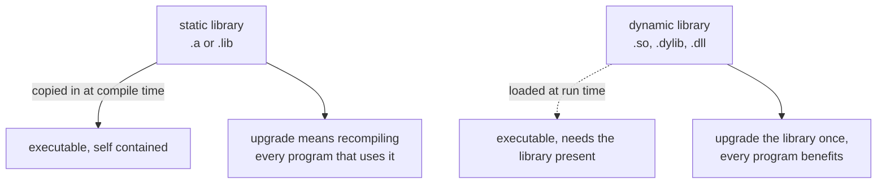

Source: `lessons/10-10-tredjeparts-biblioteker-lesson.html`
## What the lesson is about
What a library is, static versus dynamic linking, how build files work, and which third party libraries are worth knowing.
## Programming libraries
A library holds precompiled implementations of classes or functions your program can reuse. The format varies between platforms, and also between static and dynamic libraries.

### Static libraries
Originally the only kind. They are added to the executable at compile time, so an updated library, say one with a better run time, meant recompiling every program that used it. Fine when programs were simple and used few libraries. Today programs are more complex and reuse is unavoidable.
| | Linux | MacOS/iOS | Windows |
|---|-------|-----------|---------|
| OS and third party libraries | a few `lib[name].a` in `/usr/lib` or `/usr/local/lib` | a few `lib[name].a` under `/usr/lib`, `/usr/local/lib`, `/System/Library`, `/Library` | `[name].lib` and `lib[name].a`, usually installed by third party applications |
| Object files from compiling your own source, c or cpp files without a main | `[name].o` | `[name].o` | `[name].o` or `[name].obj` |
Object files are combined with the file holding `main` to produce the executable.
MacOS carries only a handful of static libraries, and you cannot link static libraries into executables there at all, object files aside. That is deliberate on Apple's part: programs should always run against the latest OS libraries, which makes good sense for security. Linux does not have many usable static libraries either. You can normally build the ones you need yourself and pull out the `.a` files, but it is not recommended.
### Dynamic libraries
A dynamically linked program loads its libraries at run time, so each start uses the newest installed version. The cost is that the libraries have to be installed for the program to run at all.
| | Linux | MacOS/iOS | Windows |
|---|-------|-----------|---------|
| OS and third party libraries | `lib[name].so` in `/usr/lib` or `/usr/local/lib` | Frameworks under `/System/Library` and `/Library`, `lib[name].dylib` under `/usr/lib`, `/usr/local/lib`, `/System/Library`, `/Library` | `[name].dll` in the `C:\Windows` tree, and also next to the executables |
`libssl`, which holds functions for secure network communication, is `/usr/lib/libssl.so` on Linux and `/usr/lib/libssl.dylib` on MacOS. On MacOS a Framework is a package of related libraries bundled together.
Linux has had package systems for a long time that record which libraries a program needs, so installing a program installs its dependencies first. On upgrade a library may be reinstalled with security fixes, and the programs using it get the fix without being reinstalled, though they do have to be restarted, and the package system knows that too. That is how you avoid rebooting after an upgrade. One of the most used systems is Debian's Advanced Packaging Tool from 1998. MacOS has HomeBrew.
Windows never had a good package system, particularly for programming libraries, until MSYS2 arrived in 2013. It gives you a Unix-like environment on Windows plus the most used open source libraries and programs precompiled, and it tries to use Microsoft's own libraries where possible so the overhead stays small. It is not as stable or as secure as Linux, and Windows is missing parts of Posix. That is one reason the course recommends Linux or MacOS.
## Makefile
Build information used to live in one or more files all called `Makefile`, sitting in the source directories, with a root level one driving the whole project. Typical commands:
| Command | What it does |
|---------|--------------|
| `make` | the default, `all`. Visits every listed directory and calls its Makefile, building everything in the project |
| `make clean` | deletes libraries, object files and executables |
| `make install` | installs the built programs so they can be run without naming the directory, usually under `/usr/local`, normally needing administrator rights |
| `make uninstall` | removes them again |
`make` has to be installed, though installing a C++ compiler usually brings it along.
```makefile
CPP=g++
CPPFLAGS = -std=c++11
LDFLAGS = -lboost_system
BINDIR = /usr/local/bin

OS = $(shell uname -s)

#Linux
ifeq ($(OS),Linux)
endif

#OS X
ifeq ($(OS),Darwin)
endif

#Windows
ifeq ($(OS),windows32)
        CPPFLAGS+=-I"c:/Program Files/Boost"
endif

all:
        $(CPP) example.cpp -o example $(CPPFLAGS) $(LDFLAGS)
clean:
        -rm example
install:
        install example $(BINDIR)
uninstall:
        -rm $(BINDIR)/example
```
This uses the Boost library `boost_system`, and on Windows the include directory has to be spelled out. `uname -s` can return names other than `windows32` on Windows, which is part of why Windows Makefiles are painful. Running `make` here builds and runs `g++ example.cpp -o example -std=c++11 -lboost_system`.
Writing complete Makefiles for every operating system gets hard once several libraries are involved. Nothing checks whether those libraries are installed either, so you get cryptic compile errors instead. CMake fixes both.
## CMake
Write a `CMakeLists.txt`, run `cmake`, and it generates a Makefile, Xcode project files or Visual Studio project files, whatever suits the platform and IDE.
```cmake
cmake_minimum_required(VERSION 3.10)
project (ExampleProject)
set(CMAKE_CXX_FLAGS "${CMAKE_CXX_FLAGS} -std=c++1y -Wall -Wextra")

find_package(Boost 1.55.0 REQUIRED)
include_directories(${Boost_INCLUDE_DIRS})

add_executable(example example.cpp)
target_link_libraries(example ${Boost_LIBRARIES})
```
On Linux or OS X, generate the Makefile with `cmake ..`. Run `cmake` on its own to see what else it can generate. The `..` is the directory holding `CMakeLists.txt`. Build in a separate directory rather than next to the sources:
```
mkdir build && cd build && cmake ..
```
`find_package` checks that Boost System is installed and at least version 1.55, and sets variables like `Boost_INCLUDE_DIRS` when it finds a new enough one. If the library is missing, cmake stops and tells you what to install.
The catch is that someone has to have written the CMake script that goes looking for the library. On Debian the Boost one lives at `/usr/share/cmake-3.0/Modules/FindBoost.cmake`. Most popular libraries ship such a script with their installation.
## Third party libraries worth knowing
The C++ standard library is smaller than Java's or C#'s, so you depend on projects that implemented what it lacks. Work on the standard library is ongoing, but choices for future versions are made carefully, which makes it slow.
- **Boost**, http://www.boost.org/ The most important addition to the standard library. Smaller libraries for network programming, big number arithmetic, compression, parallelism, reading and writing JSON and XML, and file handling. First place to look for something the standard library does not have. Many Boost libraries have ended up in the standard library, which says something about the quality.
- **SFML**, http://www.sfml-dev.org/ Sound, images and input handling from keyboard and mouse, and an easy way to set up a window for OpenGL. https://www.libsdl.org/ is similar and widely used, but it is pure C. SFML aims to be the C++ replacement for SDL.
- **gtkmm**, http://www.gtkmm.org/ GUI library for buttons, text fields, menus, progress bars and file dialogs. It is the official C++ interface to GTK+, which many Linux desktop environments use.
