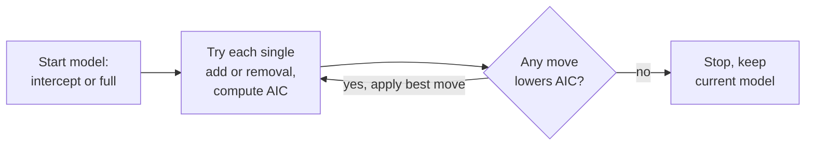

Materials: [[materials/reference/formulae-sta2020-2025.pdf|formula sheet]], [[week-02-multiple-regression]].

Ordered to follow the annotated lectures as they were taught, not deck by deck. Logistic regression came first and model building second.

| Lecture | Covers | Deck pages |
|---|---|---|
| [[materials/lectures/week-03/L9_Annotated.pdf\|L9]] | Logistic regression, intro through odds ratios | LR 1-14 |
| [[materials/lectures/week-03/L10_Annotated.pdf\|L10]] | Rest of logistic regression, then start of model building | LR 15-24, MB 1-9 |
| [[materials/lectures/week-03/L11_Annotated.pdf\|L11]] | Rest of model building | MB 10-20 |

Decks: LR = [[materials/lectures/week-03/STA2020___Logistic_Regression2.pdf|logistic regression]] (24 slides), MB = [[materials/lectures/week-03/STA2020___Model_Building.pdf|model building]] (20 slides). Worked example and R handouts are separate documents, pulled inline below where the lecture used them.
# L9: Logistic Regression (LR p1-14)
## Intro to Logistic Regression (p3-7)
**The binary response setup (p3, board work)**
A binary response is Bernoulli, which is the Binomial with $n = 1$:
$$P(Y = y) = \binom{n}{y} p^y (1-p)^{n-y}, \quad y = 0, 1, 2, \ldots, n$$
Set $n = 1$ so $y \in \{0, 1\}$:
$$f(y; p) = \begin{cases} p & \text{if } y = 1 \\ 1-p & \text{if } y = 0 \end{cases} \quad \Longleftrightarrow \quad P(Y = y) = p^y (1-p)^{1-y}$$
So $P(Y = 1) = p$ and $P(Y = 0) = 1 - p$.

For each observation pair $(x_i, y_i)$ we model $p_i = P(y_i = 1)$, and $1 - p_i = P(y_i = 0)$.

**Linear versus logistic regression (p4)**
- **Linear regression**: relationship between continuous response and continuous/categorical predictors is linear
- **Logistic regression**: relationship between **binary** response and continuous/categorical predictors is logistic (S-shaped curve)
- Binary outcome: $y \in \{0, 1\}$, modeled as probability of event

**The logit transformation (p5)**
If $p_i$ is the probability of event:
$$\text{logit}(p_i) = \log\left(\frac{p_i}{1-p_i}\right)$$
Logit-transformed $p_i$ has linear relationship with predictors/independent variables:
$$\log\left(\frac{p_i}{1-p_i}\right) = \beta_0 + \beta_1 x_{1i} + \ldots + \beta_p x_{pi}$$

- $\text{logit}(p_i)$ = log-odds of event of interest occuring
- $\frac{p_i}{1-p_i}$ = odds of event occuring (probability of event / probability of no event)

**$p_i$ vs x and $logit(p_i)$ vs x (p6)**
- Plot of $p_i$ vs $x$: S-shaped curve between 0 and 1. Plot of $\text{logit}(p_i)$ vs $x$: straight line
```functionplot
---
title: S-shaped logistic curve, p = 1/(1+e^-x) (p6)
xLabel: x
yLabel: p
bounds: [-6, 6, -0.05, 1.05]
grid: true
---
f(x) = 1/(1 + exp(-x))
```
**Back-transforming $logit(p_i)$ (p7)**
The transformation exists so a linear model can be fit to a non-linear relationship. But we do not want log-odds of an event occuring, but probability of its occuring. To recover probabilities after fitting, use inverse logit:
$$p_i = \frac{e^{\beta_0 + \beta_1 x_{1i} + \ldots + \beta_p x_{pi}}}{1 + e^{\beta_0 + \beta_1 x_{1i} + \ldots + \beta_p x_{pi}}} = \frac{e^{LO}}{1 + e^{LO}}$$

Simplified:
$$p_i = \frac{1}{1 + e^{-LO}}$$

This S-shaped curve ensures $0 \le p_i \le 1$ for all $x$ values (probabilities bounded correctly).

**Where that comes from (p8, board work)**
Worth being able to reproduce, it was derived on the board. Write $LO = \beta_0 + \beta_1 x_1 + \beta_2 x_2$, then:
$$\log\left(\frac{p_i}{1-p_i}\right) = LO \implies \frac{p_i}{1-p_i} = e^{LO}$$
$$p_i = e^{LO}(1 - p_i) = e^{LO} - p_i e^{LO}$$
$$p_i + p_i e^{LO} = e^{LO}$$
$$p_i(1 + e^{LO}) = e^{LO} \implies p_i = \frac{e^{LO}}{1 + e^{LO}}$$
Multiply top and bottom by $e^{-LO}$ to get the simplified form:
$$p_i = \frac{e^{LO}}{1 + e^{LO}} \times \frac{e^{-LO}}{e^{-LO}} = \frac{1}{1 + e^{-LO}}$$
## Example Problem: O-rings (p9)
Space Shuttle Challenger disaster (January 28, 1986): 73 seconds after launch, failure caused by low temperature ($-0.5°C$) exposure. Study relationship between temperature and O-ring failure.

Data: 24 past launches with temperature and whether O-ring failure occurred ($y = 1$ failure, $y = 0$ no failure).

Logit model relates temperature to probability of failure:
$$\log\left(\frac{p_i}{1-p_i}\right) = \beta_0 + \beta_1 (\text{Temperature})$$
## Logistic Regression Analysis with Example (p11-14)
**Performing logistic regression in R (p11)**
```R
orings$Temperature <- ((orings$Temperature - 32) * 5) / 9  # convert F to C first
fit <- glm(Failure ~ Temperature, data = orings, family = "binomial")
summary(fit)
```
Must know how to fit this with data in a data frame and interpret the output.

Regression equation for the example:
$$\log\left(\frac{p_i}{1-p_i}\right) = \beta_0 + \beta_1 (\text{Temperature})$$

$$\log\left(\frac{p_i}{1-p_i}\right) = 5.3931 - 0.3084 (\text{Temperature})$$

- $\hat{\beta}_0 = 5.3931$ (intercept, on log-odds scale), $SE = 3.0535$, $z = 1.766$, p = 0.0774
- $\hat{\beta}_1 = -0.3084$ (slope, on log-odds scale), $SE = 0.1502$, $z = -2.053$, p = 0.0400

Reading the rest of the `glm` output: null deviance 28.975 on 23 df, residual deviance 23.030 on 22 df, AIC 27.03.

**Interpreting $\beta$ coefficients (p12)**
Going from log-odds to odds turns the sum into a product, which is why the odds interpretation is multiplicative:
$$\log\left(\frac{p_i}{1-p_i}\right) = \hat{\beta}_0 + \hat{\beta}_1(\text{Temperature}) \implies \frac{p_i}{1-p_i} = e^{\hat{\beta}_0} \times e^{\hat{\beta}_1(\text{Temperature})}$$

On log-odds scale:
- On average, log-odds of O-ring failure decrease by 0.3084 units for each 1°C increase in temperature

On odds scale (exponentiate): $e^{\hat{\beta}_1} = e^{-0.3084} = 0.73$
- On average, odds of O-ring failure **change by a factor of** 0.73 for each 1°C increase in temperature
- Translates to 27% $((1 - 0.73) \times 100)$ decrease in odds of failure per 1°C increase

**General interpretation on odds scale (p13)**
- If $\beta_1 > 0$: $e^{\beta_1} > 1$, odds increase with $x_1$ (positive relationship)
- If $\beta_1 < 0$: $e^{\beta_1} < 1$, odds decrease with $x_1$ (negative relationship)
- If $\beta_1 = 0$: $e^{\beta_1} = 1$, no relationship

Example: if $\beta_1 = 0.8$, then $e^{0.8} = 2.226$. Odds of event increase by factor of 2.226 (122.55% increase) for each 1-unit increase in $x$.

Example: if $\beta_1 = -0.6$, then $e^{-0.6} = 0.549$. Odds change by a factor of 0.549, a 45.11% decrease.

**Odds-ratios for dichotomous independent variables (p14)**
For binary predictor (1 = exposure, 0 = no exposure):
$$\log\left(\frac{p_i}{1-p_i}\right) = \beta_0 + \beta_1 x_{1i}$$

- Odds of event among unexposed: $\frac{p_0}{1-p_0} = e^{\beta_0}$
- Odds of event among exposed: $\frac{p_1}{1-p_1} = e^{\beta_0 + \beta_1}$

Odds ratio (OR) = ratio of odds for exposed vs unexposed:
$$OR = \frac{p_1/(1-p_1)}{p_0/(1-p_0)} = \frac{e^{\beta_0 + \beta_1}}{e^{\beta_0}} = e^{\beta_1}$$
# L10, part 1: Logistic Regression continued (LR p15-24)
**Odds-ratios for continuous independent variables (p15)**
For continuous predictor, OR represents change at $X = x + 1$ vs $X = x$:
$$OR = \frac{e^{\beta_0 + \beta_1(x+1)}}{e^{\beta_0 + \beta_1 x}} = e^{\beta_1}$$

Odds ratio is change in odds for a 1-unit increase in $x$ (same as dichotomous case).

**Testing significance of estimated beta coefficients (p16-17)**
Six-step hypothesis test:
1. $H_0: \beta_1 = 0$
2. $H_a: \beta_1 \neq 0$ (two-sided)
3. $\alpha = 0.05$
4. Test statistic: $$z_{\text{score}} = \frac{\hat{\beta}_1 - \beta_1}{SE(\hat{\beta}_1)} = \frac{\hat{\beta}_1}{SE(\hat{\beta}_1)} \sim N(0,1)$$
5. Find p-value (standard normal distribution)
6. Conclude: reject $H_0$ if p-value $< \alpha$

Note the **z**, not t. Logistic regression uses the standard normal, so $df$ never enters.

Example: For O-rings, $z = -0.3084 / 0.1502 = -2.053$.

Getting the p-value off the table (p17): the table gives the area between 0 and $z$, so
$$p = 2 \times (0.5 - 0.4798) = 0.0404$$
In R: `2 * pnorm(-2.053, lower.tail = TRUE)`. Same 0.0404, matching `summary(fit)`.

Conclude: reject $H_0$, significant relationship between temperature and O-ring failure.

**Confidence intervals (p18)**
$$CI = \hat{\beta}_j \pm Z_{\alpha/2} \times SE(\hat{\beta}_j)$$

For 95% CI on $\hat{\beta}_1$:
$$CI = -0.3084 \pm 1.96 \times 0.1502$$
$$CI = [-0.603, -0.014]$$

Two R functions, and they do not agree:
- `confint(fit)` profiles the likelihood, giving $[-0.6803, -0.0550]$, width 0.625
- `confint.default(fit)` assumes asymptotic normality, giving $[-0.6027, -0.0140]$, width 0.5887

`confint.default` is the one that matches the hand calculation, and it is narrower.

**Prediction (p19)**
**Predicted log-odds** for new observation:
$$\log\left(\frac{p_i}{1-p_i}\right) = \hat{\beta}_0 + \hat{\beta}_1 (\text{Temperature})$$

$$\log\left(\frac{p_i}{1-p_i}\right) = 5.3931 - 0.3084(20) = -0.7749$$

**Predicted probabilities** via inverse logit:
$$p_i = \frac{1}{1 + e^{-LO}} = \frac{1}{1 + e^{-(-0.7749)}} = 0.3155$$

Both steps carry marks. In R:
```R
newdat <- list(Temperature = 20)
pred_logodds <- predict(fit, newdata = newdat, type = "link")      # -0.7744449
pred_prob    <- predict(fit, newdata = newdat, type = "response")  # 0.3155184
```
```functionplot
---
title: Fitted O-rings model, P(failure) vs temperature C (p19)
xLabel: temperature C
yLabel: P(failure)
bounds: [-5, 30, -0.05, 1.05]
grid: true
---
f(x) = 1/(1 + exp(-(5.3931 - 0.3084*x)))
g(x) = 0.5
```

**Using predictions for classification (p20)**
When predicting with logistic regression, assign each individual to class based on predicted probability:
- Choose threshold probability $\pi$
- If predicted $p_i < \pi$, assign to class 0 (no event)
- If predicted $p_i \ge \pi$, assign to class 1 (event)
- Common threshold: $\pi = 0.5$, but can adjust based on cost of misclassification

Worked on the board: at $\pi = 0.5$ and $x = 20$, $p_i = 0.315 < 0.5$, so classify $y = 0$.

**Confusion matrix (p21)**
Standard notation, columns are observed 1 then 0. Green is a correct call, red is a mistake:

<table style="border-collapse:collapse;text-align:center;font-family:system-ui,sans-serif;font-size:15px">
<tr>
<td colspan="2" style="border:none"></td>
<th colspan="2" style="border:none;padding:6px 12px;color:inherit">Observed</th>
<td style="border:none"></td>
</tr>
<tr>
<td colspan="2" style="border:none"></td>
<th style="border:1px solid #888;padding:8px 14px;color:inherit">1</th>
<th style="border:1px solid #888;padding:8px 14px;color:inherit">0</th>
<th style="border:1px solid #888;padding:8px 14px;color:inherit">Total</th>
</tr>
<tr>
<th rowspan="2" style="border:none;padding:6px 10px;color:inherit">Predicted</th>
<th style="border:1px solid #888;padding:8px 14px;color:inherit">1</th>
<td style="border:1px solid #888;padding:10px 14px;background:#7bd88f;color:#000">a (true positive)</td>
<td style="border:1px solid #888;padding:10px 14px;background:#ff9e9e;color:#000">b (false positive)</td>
<td style="border:1px solid #888;padding:10px 14px;color:inherit">a+b</td>
</tr>
<tr>
<th style="border:1px solid #888;padding:8px 14px;color:inherit">0</th>
<td style="border:1px solid #888;padding:10px 14px;background:#ff9e9e;color:#000">c (false negative)</td>
<td style="border:1px solid #888;padding:10px 14px;background:#7bd88f;color:#000">d (true negative)</td>
<td style="border:1px solid #888;padding:10px 14px;color:inherit">c+d</td>
</tr>
<tr>
<th colspan="2" style="border:1px solid #888;padding:8px 14px;color:inherit">Total</th>
<td style="border:1px solid #888;padding:10px 14px;color:inherit">a+c</td>
<td style="border:1px solid #888;padding:10px 14px;color:inherit">b+d</td>
<td style="border:1px solid #888;padding:10px 14px;color:inherit">n</td>
</tr>
</table>

**Performance metrics**:
- **Positive Predictive Value**: $PPV = \frac{a}{a+b}$ (of predicted positives, how many correct?)
- **Negative Predictive Value**: $NPV = \frac{d}{c+d}$ (of predicted negatives, how many correct?)
- **Sensitivity**: $\frac{a}{a+c}$ (of observed positives, how many detected?)
- **Specificity**: $\frac{d}{b+d}$ (of observed negatives, how many detected?)

The two denominators to keep straight: PPV and NPV divide by a **row** (what you predicted), sensitivity and specificity divide by a **column** (what was observed).

**Sensitivity and specificity trade-off (p22)**
Same model at two thresholds:

$\pi = 0.2$

<table style="border-collapse:collapse;text-align:center;font-family:system-ui,sans-serif;font-size:15px">
<tr>
<td colspan="2" style="border:none"></td>
<th colspan="2" style="border:none;padding:6px 12px;color:inherit">Observed</th>
<td style="border:none"></td>
</tr>
<tr>
<td colspan="2" style="border:none"></td>
<th style="border:1px solid #888;padding:8px 14px;color:inherit">1</th>
<th style="border:1px solid #888;padding:8px 14px;color:inherit">0</th>
<th style="border:1px solid #888;padding:8px 14px;color:inherit">Total</th>
</tr>
<tr>
<th rowspan="2" style="border:none;padding:6px 10px;color:inherit">Predicted</th>
<th style="border:1px solid #888;padding:8px 14px;color:inherit">1</th>
<td style="border:1px solid #888;padding:10px 14px;background:#7bd88f;color:#000">6 (tp)</td>
<td style="border:1px solid #888;padding:10px 14px;background:#ff9e9e;color:#000">8 (fp)</td>
<td style="border:1px solid #888;padding:10px 14px;color:inherit">14</td>
</tr>
<tr>
<th style="border:1px solid #888;padding:8px 14px;color:inherit">0</th>
<td style="border:1px solid #888;padding:10px 14px;background:#ff9e9e;color:#000">1 (fn)</td>
<td style="border:1px solid #888;padding:10px 14px;background:#7bd88f;color:#000">9 (tn)</td>
<td style="border:1px solid #888;padding:10px 14px;color:inherit">10</td>
</tr>
<tr>
<th colspan="2" style="border:1px solid #888;padding:8px 14px;color:inherit">Total</th>
<td style="border:1px solid #888;padding:10px 14px;color:inherit">7</td>
<td style="border:1px solid #888;padding:10px 14px;color:inherit">17</td>
<td style="border:1px solid #888;padding:10px 14px;color:inherit">24</td>
</tr>
</table>

Sensitivity = 6/7 = 0.857, Specificity = 9/17 = 0.529

$\pi = 0.8$

<table style="border-collapse:collapse;text-align:center;font-family:system-ui,sans-serif;font-size:15px">
<tr>
<td colspan="2" style="border:none"></td>
<th colspan="2" style="border:none;padding:6px 12px;color:inherit">Observed</th>
<td style="border:none"></td>
</tr>
<tr>
<td colspan="2" style="border:none"></td>
<th style="border:1px solid #888;padding:8px 14px;color:inherit">1</th>
<th style="border:1px solid #888;padding:8px 14px;color:inherit">0</th>
<th style="border:1px solid #888;padding:8px 14px;color:inherit">Total</th>
</tr>
<tr>
<th rowspan="2" style="border:none;padding:6px 10px;color:inherit">Predicted</th>
<th style="border:1px solid #888;padding:8px 14px;color:inherit">1</th>
<td style="border:1px solid #888;padding:10px 14px;background:#7bd88f;color:#000">1 (tp)</td>
<td style="border:1px solid #888;padding:10px 14px;background:#ff9e9e;color:#000">0 (fp)</td>
<td style="border:1px solid #888;padding:10px 14px;color:inherit">1</td>
</tr>
<tr>
<th style="border:1px solid #888;padding:8px 14px;color:inherit">0</th>
<td style="border:1px solid #888;padding:10px 14px;background:#ff9e9e;color:#000">6 (fn)</td>
<td style="border:1px solid #888;padding:10px 14px;background:#7bd88f;color:#000">17 (tn)</td>
<td style="border:1px solid #888;padding:10px 14px;color:inherit">23</td>
</tr>
<tr>
<th colspan="2" style="border:1px solid #888;padding:8px 14px;color:inherit">Total</th>
<td style="border:1px solid #888;padding:10px 14px;color:inherit">7</td>
<td style="border:1px solid #888;padding:10px 14px;color:inherit">17</td>
<td style="border:1px solid #888;padding:10px 14px;color:inherit">24</td>
</tr>
</table>

Sensitivity = 1/7 = 0.143, Specificity = 17/17 = 1
- Lower threshold $\pi$ increases sensitivity, decreases specificity
- Higher threshold $\pi$ decreases sensitivity, increases specificity
- Choose threshold based on cost of false positives vs false negatives in application

**Confusion matrix in R (p23)**
```R
# get predicted probabilities
probs <- predict(fit, type = "response")

# create vector of zeros to store classification in
preds <- rep(0, length(probs))

# if the probability is > 0.5 then replace the 0 in preds with a 1
# (can use a different threshold to 0.5)
preds[probs > 0.5] <- 1

# make confusion matrix
table(preds, as.numeric(orings$Failure))
##      obs
## preds  0  1
##     0 16  4
##     1  1  3
```
Reading that output: 16 is tn, 3 is tp. Know the difference between `type = "link"` (log-odds) and `type = "response"` (probabilities).

**Standard notation vs R notation (p24)**
R's `table()` output lists 0 before 1, so the matrix is mirrored: true negatives sit top-left and true positives bottom-right. Check row and column labels before reading off tp/fp/fn/tn

<div style="display:flex;flex-wrap:wrap;gap:32px;align-items:flex-start">
<div>
<p style="font-weight:700;margin:0 0 8px;font-family:system-ui,sans-serif;color:inherit">Standard notation</p>
<table style="border-collapse:collapse;text-align:center;font-family:system-ui,sans-serif;font-size:15px">
<tr>
<td colspan="2" style="border:none"></td>
<th colspan="2" style="border:none;padding:6px 12px;color:inherit">Observed</th>
<td style="border:none"></td>
</tr>
<tr>
<td colspan="2" style="border:none"></td>
<th style="border:1px solid #888;padding:8px 14px;color:inherit">1</th>
<th style="border:1px solid #888;padding:8px 14px;color:inherit">0</th>
<th style="border:1px solid #888;padding:8px 14px;color:inherit">Total</th>
</tr>
<tr>
<th rowspan="2" style="border:none;padding:6px 10px;color:inherit">Predicted</th>
<th style="border:1px solid #888;padding:8px 14px;color:inherit">1</th>
<td style="border:1px solid #888;padding:10px 14px;background:#7bd88f;color:#000">True Positive (tp)</td>
<td style="border:1px solid #888;padding:10px 14px;background:#ff9e9e;color:#000">False Positive (fp)</td>
<td style="border:1px solid #888;padding:10px 14px;color:inherit">tp+fp</td>
</tr>
<tr>
<th style="border:1px solid #888;padding:8px 14px;color:inherit">0</th>
<td style="border:1px solid #888;padding:10px 14px;background:#ff9e9e;color:#000">False Negative (fn)</td>
<td style="border:1px solid #888;padding:10px 14px;background:#7bd88f;color:#000">True Negative (tn)</td>
<td style="border:1px solid #888;padding:10px 14px;color:inherit">fn+tn</td>
</tr>
<tr>
<th colspan="2" style="border:1px solid #888;padding:8px 14px;color:inherit">Total</th>
<td style="border:1px solid #888;padding:10px 14px;color:inherit">tp+fn</td>
<td style="border:1px solid #888;padding:10px 14px;color:inherit">fp+tn</td>
<td style="border:1px solid #888;padding:10px 14px;color:inherit">n</td>
</tr>
</table>
</div>
<div>
<p style="font-weight:700;margin:0 0 8px;font-family:system-ui,sans-serif;color:inherit">R notation</p>
<table style="border-collapse:collapse;text-align:center;font-family:system-ui,sans-serif;font-size:15px">
<tr>
<td colspan="2" style="border:none"></td>
<th colspan="2" style="border:none;padding:6px 12px;color:inherit">Observed</th>
<td style="border:none"></td>
</tr>
<tr>
<td colspan="2" style="border:none"></td>
<th style="border:1px solid #888;padding:8px 14px;color:inherit">0</th>
<th style="border:1px solid #888;padding:8px 14px;color:inherit">1</th>
<th style="border:1px solid #888;padding:8px 14px;color:inherit">Total</th>
</tr>
<tr>
<th rowspan="2" style="border:none;padding:6px 10px;color:inherit">Predicted</th>
<th style="border:1px solid #888;padding:8px 14px;color:inherit">0</th>
<td style="border:1px solid #888;padding:10px 14px;background:#7bd88f;color:#000">True Negative (tn)</td>
<td style="border:1px solid #888;padding:10px 14px;background:#ff9e9e;color:#000">False Negative (fn)</td>
<td style="border:1px solid #888;padding:10px 14px;color:inherit">tn+fn</td>
</tr>
<tr>
<th style="border:1px solid #888;padding:8px 14px;color:inherit">1</th>
<td style="border:1px solid #888;padding:10px 14px;background:#ff9e9e;color:#000">False Positive (fp)</td>
<td style="border:1px solid #888;padding:10px 14px;background:#7bd88f;color:#000">True Positive (tp)</td>
<td style="border:1px solid #888;padding:10px 14px;color:inherit">fp+tp</td>
</tr>
<tr>
<th colspan="2" style="border:1px solid #888;padding:8px 14px;color:inherit">Total</th>
<td style="border:1px solid #888;padding:10px 14px;color:inherit">tn+fp</td>
<td style="border:1px solid #888;padding:10px 14px;color:inherit">fn+tp</td>
<td style="border:1px solid #888;padding:10px 14px;color:inherit">n</td>
</tr>
</table>
</div>
</div>

Green stays on the diagonal in both, but the diagonal itself flips: standard notation puts tp top-left, R puts tn top-left. Read the labels, not the position.
# L10, part 2: Model Building (MB p1-9)
## Intro to Model Building (p3-4)
**Choosing variables to include in a regression analysis**
When datasets include many variables, choosing which to include is challenging. Must decide which predictors belong in the model and which should be excluded.
## Example Problem: Fresh Detergent (p5-6)
Company A produces Fresh, a brand of liquid laundry detergent. To manage inventory and project revenue they want to predict demand. Data covers the last 30 sales periods.

- $y$ (demand): demand for Fresh (100 000s of bottles)
- $x_1$ (fresh_price): price of Fresh detergent (in 10 rands)
- $x_2$ (ads_expenditure): company's advertising expenditure (in 1000 rands)
- $x_3$ (size): size of company (Big or Small)
- $x_4$ (ads_campaign): advertising campaign (A: TV commercials, B: mixture of TV and radio, C: mixture of TV, radio, magazine and newspaper ads)
- $x_5$ (competitor_price): average industry price of competitor's similar detergents (in 10 rands)

Two of the five predictors are categorical, so the fitted model carries dummies for `size` and `ads_campaign`.
## Akaike Information Criterion (p7-9)
**Akaike Information Criterion (AIC) (p8)**
AIC is a criterion to compare different models fitted to the same dataset. It assesses relative quality, that is, how well models fit the data used to generate them.
$$AIC = n \times \log\left(\frac{SS_{\text{resid}}}{n}\right) + 2p + 2$$
- $\log(SS_{\text{resid}}/n)$ higher when model fit is bad, lower when fit is good
- $2p$ penalty for including more variables
- Lower AIC = better model

So AIC is a trade-off between goodness-of-fit and complexity.

**Why AIC and not R squared (p9)**
- Using AIC instead of $R^2$ is important when comparing different models because $R^2$ only measures explained variance in the response, not the trade-off between goodness-of-fit and complexity
- Consequence worth remembering: a model can have lower RSE but higher AIC, because the parameter penalty outweighs the fit gain
# L11: Model Building continued (MB p10-20)
**AIC seeks to balance precision and bias (p10)**
- **Precision**: how close predictions are to actual observations (how accurately the model predicts the response in our dataset)
- **Bias**: how much uncertainty exists around model estimates (how much they change when the model is refit to different data)
  - Including too many independent variables can lead to the model fitting our dataset very well (precise) but not fitting unseen data well (biased). Dangerous.
  - Including too few or the wrong independent variables leads to a model that fits poorly (imprecise) and does not generalise (biased). Worst case.
  - Unbiased and precise is the gold standard, unbiased but imprecise is not useful
- AIC tradeoff: good fit (lower $SS_{\text{resid}}$) vs parsimony (fewer variables)
## Model Building Approaches (p11-20)
**Checking all model subsets (p12)**
One way to choose a model is to fit models with all possible combinations of independent variables. For three independent variables:
```
y ~ 1                  (intercept model)
y ~ x1
y ~ x2
y ~ x3
y ~ x1 + x2
y ~ x1 + x3
y ~ x2 + x3
y ~ x1 + x2 + x3       (full model)
```
Compare all with AIC and pick the lowest.

- With $r$ independent variables this means fitting $2^r$ models: 3 variables = 8 models, manageable but already a lot
- 10 variables = $2^{10} = 1024$ models, not practical

**Variable selection procedures (p13)**
To avoid comparing all possible subsets, use iterative selection procedures:
- **Forward selection**: start with intercept model, add variables one at a time
- **Backward elimination**: start with full model, remove variables one at a time
- **Step-wise selection**: combination of forward and backward
- All three evaluate AIC at each iteration and stop when AIC cannot be reduced further

**Forward selection algorithm (p14)**
1. Start with intercept model: $y \sim 1$
2. Add each remaining independent variable to the model separately and calculate AIC of each resulting model
3. The variable that reduces AIC the most is added to the model in this iteration
4. Repeat steps 2 and 3 until no further reductions to AIC (adding no independent variables results in best AIC value)
- Important note: once a variable is added, it cannot be removed at a later stage

**Forward selection in R (p15)**
```R
# model with just intercept
fit.intercept <- lm(demand ~ 1, data = fresh)
# full model with all variables
fit.full <- lm(demand ~ ., data = fresh)

# need to specify intercept model as lower and full model as upper,
# and use intercept as starting point
step(fit.intercept, direction = "forward",
     scope = list(lower = fit.intercept, upper = fit.full))
```
The AIC trace, one line per accepted step:

| Step | Model after the step | AIC |
|---|---|---|
| start | `demand ~ 1` | -22.05 |
| + size | `demand ~ size` | -64.46 |
| + ads_expenditure | `+ ads_expenditure` | -76.03 |
| + competitor_price | `+ competitor_price` | -81.67 |
| + ads_campaign | `+ ads_campaign` | -91.29 |
| + fresh_price | `+ fresh_price` | **-109.77** |

Best model is the full one, `demand ~ size + ads_expenditure + competitor_price + ads_campaign + fresh_price`, with coefficients:

| Term | Estimate |
|---|---|
| (Intercept) | 8.2974 |
| sizeSmall | -0.1942 |
| ads_expenditure | 0.4326 |
| competitor_price | 1.4689 |
| ads_campaignB | 0.2226 |
| ads_campaignC | 0.4148 |
| fresh_price | -2.3103 |

**Backwards elimination algorithm (p16)**
1. Start with full model: $y \sim x_1 + \ldots + x_p$
2. Remove each remaining independent variable from the model separately and calculate AIC of each resulting model
3. The variable that reduces AIC the most is removed from the model in this iteration
4. Repeat steps 2 and 3 until no further reductions to AIC (removing no independent variables results in best AIC value)
- Important note: once a variable is removed, it cannot be added back at a later stage

**Backwards elimination in R (p17)**
```R
# use full model as starting point
step(fit.full, direction = "backward")
```
Starts at AIC -109.77 with the full model. Every candidate removal makes AIC worse:

| Move | AIC |
|---|---|
| `<none>` | **-109.772** |
| - size | -108.410 |
| - fresh_price | -91.294 |
| - ads_expenditure | -89.507 |
| - ads_campaign | -85.648 |
| - competitor_price | -79.473 |

`<none>` wins, so nothing is removed and the full model stands. Same answer as forward selection.

**Step-wise selection algorithm (p18)**
1. Start with intercept model: $y \sim 1$
2. Add each independent variable to the model separately and calculate AIC of each resulting model
3. The independent variable that reduces AIC the most is added to the model in this iteration
4. Add each remaining independent variable to the model separately and calculate AIC of each resulting model. Also remove all currently included independent variables and calculate AIC of resulting model
5. The independent variable that reduces AIC the most is added (if it is not currently included) or removed (if it is currently included) from the model in this iteration
6. Repeat steps 4 and 5 until there are no further reductions to the AIC (adding or removing independent variables results in best AIC value)
- We can now remove variables once they have been added and add variables once they have been removed

**Step-wise selection in R (p19)**
```R
# also need to specify lower and upper and use intercept as starting point
step(fit.intercept, direction = "both",
     scope = list(lower = fit.intercept, upper = fit.full))
```
Same path as forward selection, but each step also considers removals. Nothing ever gets removed, and it lands on the same final model at AIC -109.77.

All three procedures agree here. That is not guaranteed in general, and none of them guarantees the global optimum.

**Why most data analysts will not rely on these algorithms (p20)**
- The algorithm does not take into account practical knowledge about the data: is there correlation between independent variables (multicollinearity), does it make real-world sense to include certain variables, should certain variables be included because they are control variables
- Inflated chance of capitalising on chance features of the sample, so the model will not fit new data well
- Instead: fit models based on extensive exploratory data analysis and good understanding of the data being modelled
# Worked example: Credit Card Default (example deck p1-9)
A separate deck worked through end to end, and the closest thing to a full exam question in this week's material. Code from [[materials/lectures/week-03/STA2020___Logistic_Regression_Example_Code.pdf|the example code handout]] is inline.

**The data (p2)**
Simulated dataset with 10 000 customers. Goal: predict which will default on credit card debt.

- $y$ (default): binary, whether customer defaulted ("No" or "Yes")
- $x_1$ (student): binary, whether customer is a student ("No" or "Yes")
- $x_2$ (balance): average credit card balance remaining after the monthly payment (dollars)
- $x_3$ (income): customer income (dollars)

Binary variables are stored as "No" and "Yes", not 0 and 1.
```R
library(ISLR)
data(Default)
```

**Fitting the model (p3)**
```R
fit <- glm(default ~ student + balance + income, data = Default, family = "binomial")
summary(fit)
```
Regression equation:
$$\log\left(\frac{p_i}{1-p_i}\right) = \beta_0 + \beta_1(\text{student}) + \beta_2(\text{balance}) + \beta_3(\text{income})$$

$$\log\left(\frac{p_i}{1-p_i}\right) = -10.869 - 0.647(\text{student}) + 0.006(\text{balance}) + 0.000003(\text{income})$$

**Interpreting beta coefficients (p4)**
$$\frac{p_i}{1-p_i} = e^{\hat{\beta}_0} \times e^{\hat{\beta}_1(\text{student})} \times e^{\hat{\beta}_2(\text{balance})} \times e^{\hat{\beta}_3(\text{income})}$$

- **student**: odds of default change by factor of $e^{-0.647} = 0.5236$ (52.36% decrease) for a student compared to non-student, holding balance and income constant
- **balance**: odds of default change by factor of $e^{0.006} = 1.006$ (0.6% increase) for each $1 increase in balance, holding student status and income constant
- **income**: odds of default change by factor of $e^{0.000003} = 1.000003$ (0.0003% increase) for each $1 increase in income, holding student status and balance constant

**Hypothesis tests and conclusions (p5-6)**
Six-step process for each coefficient:
- $\beta_1$ (student): $z = -2.738$, p-value = 0.006. Reject $H_0$. Significant difference in default likelihood between students and non-students.
- $\beta_2$ (balance): $z = 24.738$, p-value $< 0.001$. Reject $H_0$. Balance significantly affects default likelihood.
- $\beta_3$ (income): $z = 0.370$, p-value = 0.711. Fail to reject $H_0$. No significant relationship between income and default likelihood.

**95% confidence intervals (p7)**
$$CI = \hat{\beta}_j \pm Z_{0.025} \times SE(\hat{\beta}_j)$$
```R
confint(fit)
```
- $\beta_1$ (student): $CI = [-1.110, -0.184]$
- $\beta_2$ (balance): $CI = [0.005, 0.006]$
- $\beta_3$ (income): $CI = [-0.00001, 0.00002]$

Income's interval contains 0, matching its non-significant p-value.

**Prediction (p8)**
Predicted log-odds for: student = No, balance = $2020, income = $48500
$$\log\left(\frac{p_i}{1-p_i}\right) = -10.869 - 0.647(0) + 0.006(2020) + 0.000003(48500) = 0.866$$

Predicted probabilities via inverse logit:
$$p_i = \frac{1}{1 + e^{-0.866}} = 0.704$$
```R
newdata <- data.frame(student = "No", balance = 2020, income = 48500)
predict(fit, newdata = newdata, type = "link")      # log-odds
predict(fit, newdata = newdata, type = "response")  # probability
```

**Confusion matrix (p9)**
```R
probs <- predict(fit, type = "response")
preds <- rep(0, length(probs))
preds[probs > 0.5] <- 1
table(preds, Default$default)
```
With $\pi = 0.5$:

<table style="border-collapse:collapse;text-align:center;font-family:system-ui,sans-serif;font-size:15px">
<tr>
<td colspan="2" style="border:none"></td>
<th colspan="2" style="border:none;padding:6px 12px;color:inherit">Observed</th>
<td style="border:none"></td>
</tr>
<tr>
<td colspan="2" style="border:none"></td>
<th style="border:1px solid #888;padding:8px 14px;color:inherit">1</th>
<th style="border:1px solid #888;padding:8px 14px;color:inherit">0</th>
<th style="border:1px solid #888;padding:8px 14px;color:inherit">Total</th>
</tr>
<tr>
<th rowspan="2" style="border:none;padding:6px 10px;color:inherit">Predicted</th>
<th style="border:1px solid #888;padding:8px 14px;color:inherit">1</th>
<td style="border:1px solid #888;padding:10px 14px;background:#7bd88f;color:#000">169 (a, tp)</td>
<td style="border:1px solid #888;padding:10px 14px;background:#ff9e9e;color:#000">137 (b, fp)</td>
<td style="border:1px solid #888;padding:10px 14px;color:inherit">306</td>
</tr>
<tr>
<th style="border:1px solid #888;padding:8px 14px;color:inherit">0</th>
<td style="border:1px solid #888;padding:10px 14px;background:#ff9e9e;color:#000">164 (c, fn)</td>
<td style="border:1px solid #888;padding:10px 14px;background:#7bd88f;color:#000">9530 (d, tn)</td>
<td style="border:1px solid #888;padding:10px 14px;color:inherit">9694</td>
</tr>
<tr>
<th colspan="2" style="border:1px solid #888;padding:8px 14px;color:inherit">Total</th>
<td style="border:1px solid #888;padding:10px 14px;color:inherit">333</td>
<td style="border:1px solid #888;padding:10px 14px;color:inherit">9667</td>
<td style="border:1px solid #888;padding:10px 14px;color:inherit">10000</td>
</tr>
</table>

PPV, NPV, sensitivity and specificity are **not on the formula sheet**. Compute them by hand or in R.
- PPV = 169/(169+137) = 0.552, NPV = 9530/(164+9530) = 0.983
- Sensitivity = 169/(169+164) = 0.508, Specificity = 9530/(137+9530) = 0.986

The table above is in standard notation. `table(preds, Default$default)` prints it in R notation with 0 first, so the counts appear in mirrored positions. Check the labels before reading off tp and tn.

Sensitivity is barely above a coin flip while specificity is 0.986, which is what an unbalanced dataset does: only 333 of 10 000 actually defaulted, so predicting "no default" is right almost every time.
# R code handout (LR_MB_in_R.pdf)
Page refs: (pNN) = PDF page in [[materials/lectures/week-03/LR_MB_in_R.pdf|model building and logistic regression R code]] (4 pages). The theory for each block is above; this is the code kept together for drilling.
## Logistic Regression: O-rings (p1-2)
**Fitting the model (p1)**
```R
# read in the dataset (binary response y, continuous explanatory x)
orings <- read.csv("orings.csv")
# fit the logistic regression model with the glm() function
fit <- glm(Failure ~ Temperature, data = orings, family = "binomial")
summary(fit)
```

**Testing significance of beta1 (p1-2)**
```R
# manually calculate the test statistic
b1 <- -0.3084     # read off from summary(fit)
se_b1 <- 0.1502   # read off from summary(fit)
zstat_b1 <- b1/se_b1
zstat_b1

# "manually" calculate the p-value
pval_b1 <- 2*pnorm(q = zstat_b1, lower.tail = TRUE)
pval_b1

# OR just read it off from summary(fit)
```

**Confidence intervals for beta1 (p2)**
```R
# calculate confidence intervals for beta1 "manually"
ci_b1_lower <- b1 + qnorm(p = 0.025, lower.tail = T) * se_b1
ci_b1_upper <- b1 - qnorm(p = 0.025, lower.tail = T) * se_b1
print(paste("Beta1 CI: (", ci_b1_lower, ci_b1_upper, ")"))

# OR with R's built-in functions:
confint(fit)          # by profiling, based on method (glm) specified in "fit"
confint.default(fit)  # based on asymptotic normality, matches the hand calculation
```

**Prediction and confidence intervals (p2)**
```R
newdat <- list(Temperature = 20)

# predicted LOG-ODDS:
pred_logodds <- predict(fit, newdata = newdat, type = "link")
pred_logodds

# predicted PROBABILITIES
pred_prob <- predict(fit, newdata = newdat, type = "response")
pred_prob
```

**Confusion matrix at different thresholds (p2)**
```R
# pi = 0.2
probs <- predict(fit, type = "response")
preds <- rep(0, length = length(probs))
preds[probs > 0.2] = 1
preds[probs <= 0.2] = 0
tab <- table(preds, as.numeric(orings$Failure))
tab
sensit <- tab[2,2]/(tab[2,2]+tab[1,2])   # sensitivity
sensit
spec <- tab[1,1]/(tab[1,1]+tab[2,1])     # specificity
spec

# pi = 0.8
probs <- predict(fit, type = "response")
preds <- rep(0, length = length(probs))
preds[probs > 0.8] = 1
preds[probs <= 0.8] = 0
tab <- table(preds, as.numeric(orings$Failure))
tab
sensit <- tab[2,2]/(tab[2,2]+tab[1,2])
sensit
spec <- tab[1,1]/(tab[1,1]+tab[2,1])
spec
```
Note the index order: because R puts 0 first, `tab[2,2]` is tp and `tab[1,1]` is tn.
## Model Building: Fresh detergent (p3-4)
```R
# read in the dataset
fresh <- read.csv("fresh.csv")

fit.intercept <- lm(demand ~ 1, data = fresh)   # intercept model
fit.full <- lm(demand ~ ., data = fresh)        # full model

# forward selection (p3)
step(fit.intercept, direction = "forward",
     scope = list(lower = fit.intercept, upper = fit.full))

# backward elimination (p4)
step(fit.full, direction = "backward")

# step-wise selection (p4)
step(fit.intercept, direction = "both",
     scope = list(lower = fit.intercept, upper = fit.full))
```
All three land on the full model as the smallest AIC.
# Comparing nested models
Not in any of the three week 3 lectures, and not in the model building deck outline, which runs Intro, Example Problem, AIC, Model Building Approaches. Kept because [[ct1-prep]] lists it under model building and the 2025 S paper examined it. Confirm which lecture it actually came from before relying on the page refs.

**Coefficient of partial determination**
$$R^2_{\text{partial}} = \frac{SSE_{\text{reduced}} - SSE_{\text{full}}}{SSE_{\text{reduced}}}$$
- Share of remaining variation (after accounting for reduced model) explained by added variables
- Ranges 0 to 1; higher is better

**Partial F-test**
$$F_{\text{partial}} = \frac{(SSE_{\text{reduced}} - SSE_{\text{full}})/r}{SSE_{\text{full}}/(n-p-1)} \sim F_{r, n-p-1}$$
- Tests whether $r$ variables should be added to a model
- $H_0$: all $r$ added variables have coefficient zero
- $H_a$: at least one added variable coefficient is non-zero
- Reject $H_0$ if $F_{\text{partial}} > F_{\alpha, r, n-p-1}$
# R Lab Week 4: Logistic Regression and Model Building
Source: [[materials/labs/week-04/RStudio Lab Week 4 - Logistic Regression and Model Building.docx|lab sheet]], [[materials/labs/week-04/Pictorial Week 4.pdf|pictorial]]. Data: `data/logreg.csv`, `data/step.csv`.
## Part 1: Logistic regression (logreg.csv)
Depression study, 150 individuals. Response `cases` = depression diagnosis (binary), explanatory `sex` and `income` (in R100 000s per year).
```R
logreg <- read.csv("logreg.csv")
fit <- glm(cases ~ sex + income, family = "binomial", data = logreg)
summary(fit)
```
Cheat sheet row 20: `glm(y ~ x1 + x2 + x3)` fits generalized linear models; add `family = "binomial"` for logistic.
## Part 2: Model building (step.csv)
Hospital data. Response `length` = average length of stay (days). Ten explanatory variables:

| Variable | Description |
|---|---|
| age | average patient age (years) |
| infect | infection risk, average estimated probability of acquiring infection in hospital (%) |
| culture | cultures performed per patient without infection signs, x100 |
| xray | X-rays per patient without pneumonia signs, x100 |
| beds | average number of beds |
| medschl | medical school affiliation: 1 = yes, 2 = no |
| region | 1 = North East, 2 = North West, 3 = South, 4 = West |
| census | average patients per day |
| nurses | full-time equivalent nurses (full time + half of part time) |
| facs | % of 35 potential facilities and services provided |

`medschl` and `region` are coded numeric but are categorical, so convert with `as.factor()` before fitting.
