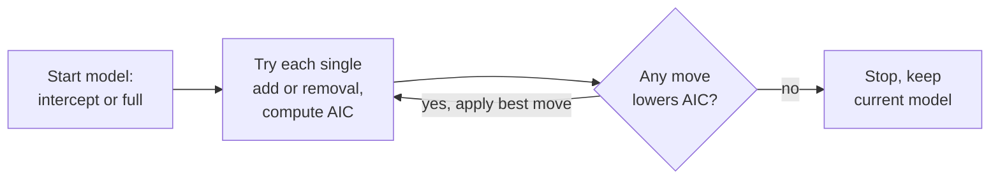

Materials: [[materials/reference/formulae-sta2020-2025.pdf|formula sheet]], [[week-02-multiple-regression]].
## Model Building
Page refs: (pNN) = PDF page in [[materials/lectures/week-03/STA2020___Model_Building.pdf|model building deck]] (20 slides).
### Intro to Model Building  
**Choosing variables to include in a regression analysis**
When datasets include many variables, choosing which to include is challenging. Must decide which predictors belong in the model and which should be excluded.
### Comparing Nested Models
**Coefficient of partial determination**
$$R^2_{\text{partial}} = \frac{SSE_{\text{reduced}} - SSE_{\text{full}}}{SSE_{\text{reduced}}}$$
- Share of remaining variation (after accounting for reduced model) explained by added variables
- Ranges 0 to 1; higher is better

**Partial F-test**
$$F_{\text{partial}} = \frac{(SSE_{\text{reduced}} - SSE_{\text{full}})/r}{SSE_{\text{full}}/(n-p-1)} \sim F_{r, n-p-1}$$
- Tests whether $r$ variables should be added to a model
- $H_0$: all $r$ added variables have coefficient zero
- $H_a$: at least one added variable coefficient is non-zero
- Reject $H_0$ if $F_{\text{partial}} > F_{\alpha, r, n-p-1}$
### Example Problem: Fresh Detergent  
**Fresh example**
Company A produces Fresh detergent. Variables collected:
- $y$ (demand): demand for Fresh (in 100,000s bottles)
- $x_1$ (fresh_price): price of Fresh ($R/unit)
- $x_2$ (ads_expenditure): company's advertising expenditure ($1000s)
- $x_3$ (size): company size (Small or Big)
- $x_4$ (ads_campaign): advertising campaign (A, B, or C)
- $x_5$ (competitor_price): competitor's average price ($R/unit)
### Akaike Information Criterion (AIC)  
**Akaike Information Criterion (AIC)**
AIC is a criterion to compare different models fitted to the same dataset.
$$AIC = n \times \log\left(\frac{SS_{\text{resid}}}{n}\right) + 2p + 2$$
- $\log(SS_{\text{resid}}/n)$ higher when model fit is bad, lower when fit is good
- $2p$ penalty for including more variables
- Lower AIC = better model

**Why AIC and not R squared**
- Using AIC instead of $R^2$ is important when comparing different models because $R^2$ only measures explained variance in the response, not the trade-off between goodness-of-fit and complexity

**AIC seeks to balance precision and bias**
- **Precision**: how close predictions are to actual observations (goodness-of-fit)
- **Bias**: how much uncertainty exists around model estimates (model complexity)
  - Including too many independent variables can lead to overfitting (precise on training data but biased on unseen data)
  - Including too few variables leads to underfitting (biased on both training and unseen data)
- AIC tradeoff: good fit (lower $SS_{\text{resid}}$) vs parsimony (fewer variables)
## Model Building Approaches
**Checking all model subsets**
One way to choose a model is to fit models with all possible combination of independent variables
With $n$ possible independent variables, this apporach would involve fitting $2^n$ model. 
These models then need to be compared using some criterion like AIC
This is a not practical approach!

One approach: fit models with all possible combinations of independent variables, compare all with AIC, pick lowest.
- $r$ variables means $2^r$ models: 3 variables = 8 models, manageable
- 10 variables = $2^{10} = 1024$ models, not practical

**Variable selection procedures**
To avoid comparing all possible subsets, use iterative selection procedures:
- **Forward selection**: start with intercept model, add variables one at a time
- **Backward elimination**: start with full model, remove variables one at a time
- **Step-wise selection**: combination of forward and backward
- All three evaluate AIC at each iteration and stop when AIC cannot be reduced further

**Forward selection algorithm**
1. Start with intercept model: $y \sim 1$
2. Add each remaining independent variable to the model separately and calculate AIC of each resulting model
3. The variable that reduces AIC the most is added to the model in this iteration
4. Repeat steps 2 and 3 until no further reductions to AIC (adding no independent variables results in best AIC value)
- Important note: once a variable is added, it cannot be removed at a later stage

```R
fit.intercept <- lm(demand ~ 1, data = fresh)
fit.full <- lm(demand ~ ., data = fresh)
step(fit.intercept, direction = "forward", scope = list(lower = fit.intercept, upper = fit.full))
# Output shows AIC at each step; full model with all variables has smallest AIC
```

**Backwards elimination algorithm**
1. Start with full model: $y \sim x_1 + \ldots + x_p$
2. Remove each remaining independent variable from the model separately and calculate AIC of each resulting model
3. The variable that reduces AIC the most is removed from the model in this iteration
4. Repeat steps 2 and 3 until no further reductions to AIC (removing no independent variables results in best AIC value)
- Important note: once a variable is removed, it cannot be added back at a later stage

```R
step(fit.full, direction = "backward")
# Output shows AIC at each step; full model has smallest AIC (no variables removed improves it)
```

**Step-wise selection algorithm**
1. Start with intercept model: $y \sim 1$
2. Add each remaining independent variable to the model separately and calculate AIC of each resulting model
3. The independent variable that reduces AIC the most is added to the model in this iteration
4. Add each remaining independent variable to the model separately and calculate AIC of each resulting model. Also remove all currently included independent variables and calculate AIC of resulting model
5. The independent variable that reduces AIC the most is added (if it is not currently included) or removed (if it is currently included) from the model in this iteration
6. Repeat steps 4 and 5 until there are no further reductions to the AIC (adding or removing independent variables results in best AIC value)
- We can now remove variables once they have been added and add variables once they have been removed

```R
step(fit.intercept, direction = "both", scope = list(lower = fit.intercept, upper = fit.full))
# Shows forward and backward moves; final model has smallest AIC
```

**Why most data analysts will not rely on these algorithms**
- Algorithm ignores practical knowledge about the data (whether correlations make sense, confounding variables, control variables needed)
- Inflated chance of capitalizing on chance features in sample that won't generalize to new data
- Instead: use extensive exploratory data analysis + domain knowledge to fit models based on theoretical understanding
## Logistic Regression
Page refs below: (pNN) = PDF page in [[materials/lectures/week-03/STA2020___Logistic_Regression2.pdf|logistic regression deck]] (24 slides) and [[materials/lectures/week-03/STA2020___Logistic_Regression_Example.pdf|example deck]] (9 slides).
### Intro to Logistic Regression
**Linear versus logistic regression**
- **Linear regression**: relationship between continuous response and continuous/categorical predictors is linear
- **Logistic regression**: relationship between **binary** response and continuous/categorical predictors is logistic (S-shaped curve)
- Binary outcome: $y \in \{0, 1\}$, modeled as probability of event

**The logit transformation**
If $p_i$ is the probability of event:
$$\text{logit}(p_i) = \log\left(\frac{p_i}{1-p_i}\right)$$
Logit-transformed $p_i$ has linear relationship with predictors/independent variables:
$$\log\left(\frac{p_i}{1-p_i}\right) = \beta_0 + \beta_1 x_{1i} + \ldots + \beta_p x_{pi}$$

- $\text{logit}(p_i)$ = log-odds of event of interest occuring
- $\frac{p_i}{1-p_i}$ = odds of event occuring (probability of event / probability of no event)

**$p_i$ vs x and $logit(p_i)$ vs x**
- Plot of $p_i$ vs $x$: S-shaped curve between 0 and 1. Plot of $\text{logit}(p_i)$ vs $x$: straight line
```functionplot
---
title: S-shaped logistic curve, p = 1/(1+e^-x) (p6)
xLabel: x
yLabel: p
bounds: [-6, 6, -0.05, 1.05]
grid: true
---
f(x) = 1/(1 + exp(-x))
```
**Back-transforming $logit(p_i)$**
The transformation exists so a linear model can be fit to a non-linear relationship. But we do not want log-odds of an event occuring, but probability of its occuring. To recover probabilities after fitting, use inverse logit:
$$p_i = \frac{e^{\beta_0 + \beta_1 x_{1i} + \ldots + \beta_p x_{pi}}}{1 + e^{\beta_0 + \beta_1 x_{1i} + \ldots + \beta_p x_{pi}}} = \frac{e^{LO}}{1 + e^{LO}}$$

Simplified:
$$p_i = \frac{1}{1 + e^{-LO}}$$

This S-shaped curve ensures $0 \le p_i \le 1$ for all $x$ values (probabilities bounded correctly).
### Example Problem: O-rings  
**O-rings example**
Space Shuttle Challenger disaster (January 28, 1986): 73 seconds after launch, failure caused by low temperature ($-0.5°C$) exposure. Study relationship between temperature and O-ring failure.

Data: 24 past launches with temperature and whether O-ring failure occurred ($y = 1$ failure, $y = 0$ no failure).

Logit model relates temperature to probability of failure:
$$\log\left(\frac{p_i}{1-p_i}\right) = \beta_0 + \beta_1 (\text{Temperature})$$
### Logistic Regression Analysis with Example (p10-24)
**Slide: Performing logistic regression in R (p11)**
```R
orings$Temperature <- ((orings$Temperature - 32) * 5) / 9  # convert F to C first
fit <- glm(Failure ~ Temperature, data = orings, family = "binomial")
summary(fit)
```
Must know how to fit this with data in a data frame and interpret the output.

Regression equation for the example:
$$\log\left(\frac{p_i}{1-p_i}\right) = \beta_0 + \beta_1 (\text{Temperature})$$

$$\log\left(\frac{p_i}{1-p_i}\right) = 5.3941 - 0.3084 (\text{Temperature})$$

- $\hat{\beta}_0 = 5.3941$ (intercept, on log-odds scale)
- $\hat{\beta}_1 = -0.3084$ (slope, on log-odds scale)

**Slide: Interpreting beta coefficients (p12)**
Interpretation changes depending on scale:

**On log-odds scale**: 
- On average, log-odds of O-ring failure decrease by 0.3084 units for each 1°C increase in temperature

**On odds scale** (exponentiate): $e^{\hat{\beta}_1} = e^{-0.3084} = 0.73$
- On average, odds of O-ring failure **change by a factor of** 0.73 for each 1°C increase in temperature
- Translates to 27% $((1 - 0.73) \times 100)$ decrease in odds of failure per 1°C increase

**Slide: General interpretation on odds scale (p13)**
- If $\beta_1 > 0$: $e^{\beta_1} > 1$, odds increase with $x_1$ (positive relationship)
- If $\beta_1 < 0$: $e^{\beta_1} < 1$, odds decrease with $x_1$ (negative relationship)
- If $\beta_1 = 0$: $e^{\beta_1} = 1$, no relationship

Example: if $\beta_1 = 0.8$, then $e^{0.8} = 2.226$. Odds of event increase by factor of 2.226 (122.55% increase) for each 1-unit increase in $x$.

**Slide: Odds-ratios for dichotomous independent variables (p14)**
For binary predictor (1 = exposure, 0 = no exposure):
$$\log\left(\frac{p_i}{1-p_i}\right) = \beta_0 + \beta_1 x_{1i}$$

- Odds of event among unexposed: $\frac{p_0}{1-p_0} = e^{\beta_0}$
- Odds of event among exposed: $\frac{p_1}{1-p_1} = e^{\beta_0 + \beta_1}$

Odds ratio (OR) = ratio of odds for exposed vs unexposed:
$$OR = \frac{p_1/(1-p_1)}{p_0/(1-p_0)} = \frac{e^{\beta_0 + \beta_1}}{e^{\beta_0}} = e^{\beta_1}$$

**Slide: Odds-ratios for continuous independent variables (p15)**
For continuous predictor, OR represents change at $X = x + 1$ vs $X = x$:
$$OR = \frac{e^{\beta_0 + \beta_1(x+1)}}{e^{\beta_0 + \beta_1 x}} = e^{\beta_1}$$

Odds ratio is change in odds for a 1-unit increase in $x$ (same as dichotomous case).

**Slide: Testing significance of estimated beta coefficients (p16-17)**
Six-step hypothesis test:
1. $H_0: \beta_1 = 0$
2. $H_a: \beta_1 \neq 0$
3. $\alpha = 0.05$
4. Test statistic: $$z_{\text{score}} = \frac{\hat{\beta}_1}{SE(\hat{\beta}_1)} \sim N(0,1)$$
5. Find p-value (standard normal distribution)
6. Conclude: reject $H_0$ if p-value $< \alpha$
- In R: read from `summary(fit)` output

Example: For O-rings, $z = -0.3084 / 0.1502 = -2.053$, p-value = 0.0404. Conclude significant relationship between temperature and O-ring failure.

**Slide: Confidence intervals (p18)**
$$CI = \hat{\beta}_1 \pm Z_\alpha \times SE(\hat{\beta}_1)$$

For 95% CI on $\hat{\beta}_1$:
$$CI = -0.3084 \pm 1.96 \times 0.1502$$
$$CI = [-0.603, -0.014]$$

**Slide: Prediction (p19)**
**Predicted log-odds** for new observation:
$$\log\left(\frac{p_i}{1-p_i}\right) = \hat{\beta}_0 + \hat{\beta}_1 (\text{Temperature})$$

$$\log\left(\frac{p_i}{1-p_i}\right) = 5.3941 - 0.3084(20) = -0.7749$$

**Predicted probabilities** via inverse logit:
$$p_i = \frac{1}{1 + e^{-LO}} = \frac{1}{1 + e^{-(-0.7749)}} = 0.315$$
```functionplot
---
title: Fitted O-rings model, P(failure) vs temperature C (p19)
xLabel: temperature C
yLabel: P(failure)
bounds: [-5, 30, -0.05, 1.05]
grid: true
---
f(x) = 1/(1 + exp(-(5.3941 - 0.3084*x)))
g(x) = 0.5
```

**Slide: Using predictions for classification (p20)**
When predicting with logistic regression, assign each individual to class based on predicted probability:
- Choose threshold probability $\pi$
- If predicted $p_i < \pi$, assign to class 0 (no event)
- If predicted $p_i \ge \pi$, assign to class 1 (event)
- Common threshold: $\pi = 0.5$, but can adjust based on cost of misclassification

**Slide: Confusion matrix (p21)**
Standard notation, columns are observed 1 then 0:

|  | Observed: 1 | Observed: 0 | Total |
|---|---|---|---|
| Predicted: 1 | a (true positive) | b (false positive) | a+b |
| Predicted: 0 | c (false negative) | d (true negative) | c+d |
| Total | a+c | b+d | n |

**Performance metrics**:
- **Positive Predictive Value**: $PPV = \frac{a}{a+b}$ (of predicted positives, how many correct?)
- **Negative Predictive Value**: $NPV = \frac{d}{c+d}$ (of predicted negatives, how many correct?)
- **Sensitivity**: $\frac{a}{a+c}$ (of observed positives, how many detected?)
- **Specificity**: $\frac{d}{b+d}$ (of observed negatives, how many detected?)

**Slide: Sensitivity and specificity trade-off (p22)**
Same model at two thresholds:

| $\pi = 0.2$ | Observed: 1 | Observed: 0 |
|---|---|---|
| Predicted: 1 | 6 (tp) | 8 (fp) |
| Predicted: 0 | 1 (fn) | 9 (tn) |

Sensitivity = 6/7 = 0.857, Specificity = 9/17 = 0.529

| $\pi = 0.8$ | Observed: 1 | Observed: 0 |
|---|---|---|
| Predicted: 1 | 1 (tp) | 0 (fp) |
| Predicted: 0 | 6 (fn) | 17 (tn) |

Sensitivity = 1/7 = 0.143, Specificity = 17/17 = 1
- Lower threshold $\pi$ increases sensitivity, decreases specificity
- Higher threshold $\pi$ decreases sensitivity, increases specificity
- Choose threshold based on cost of false positives vs false negatives in application

**Slide: Confusion matrix in R (p23)**
```R
probs <- predict(fit, type = "response")  # type = "link" gives log-odds instead
preds <- ifelse(probs > 0.5, 1, 0)
table(preds, orings$Failure)
```
Know the difference between predicting with `type = "link"` (log-odds) and `type = "response"` (probabilities)

**Slide: Standard notation vs R notation (p24)**
R's `table()` output lists 0 before 1, so the matrix is mirrored: true negatives sit top-left and true positives bottom-right. Check row and column labels before reading off tp/fp/fn/tn
### Example Problem: Credit Card Default (example deck p1-9)
**Slide: Credit card default data (p2)**
Simulated dataset with 10,000 customers. Goal: predict which will default on credit card debt.

Variables:
- $y$ (default): binary, whether customer defaulted ("No" or "Yes")
- $x_1$ (student): binary, whether customer is a student
- $x_2$ (balance): average credit card balance (in dollars)
- $x_3$ (income): customer income (in dollars)

**Slide: Logistic regression output (p3)**
```R
glm(formula = default ~ student + balance + income, family = "binomial", data = Default)
# Output shows coefficients, SE, z-score, p-value
# Intercept, student status, balance, and income all have estimates
```

Regression equation:
$$\log\left(\frac{p_i}{1-p_i}\right) = \beta_0 + \beta_1(\text{student}) + \beta_2(\text{balance}) + \beta_3(\text{income})$$

$$\log\left(\frac{p_i}{1-p_i}\right) = -10.869 - 0.647(\text{student}) + 0.006(\text{balance}) + 0.000003(\text{income})$$

**Slide: Interpreting beta coefficients (p4)**
$$\frac{p_i}{1-p_i} = e^{\hat{\beta}_0} \times e^{\hat{\beta}_1(\text{student})} \times e^{\hat{\beta}_2(\text{balance})} \times e^{\hat{\beta}_3(\text{income})}$$

- **student**: odds of default change by factor of $e^{-0.647} = 0.5236$ (52.36% decrease) for a student compared to non-student, holding balance and income constant
- **balance**: odds of default change by factor of $e^{0.006} = 1.006$ (0.6% increase) for each $1 increase in balance, holding student status and income constant
- **income**: odds of default change by factor of $e^{0.000003} = 1.000003$ (0.0003% increase) for each $1 increase in income, holding student status and balance constant

**Slide: Hypothesis tests and conclusions (p5-6)**
Six-step process for each coefficient:
- $\beta_1$ (student): $z = -2.738$, p-value = 0.006. Reject $H_0$. Significant difference in default likelihood between students and non-students.
- $\beta_2$ (balance): $z = 24.738$, p-value $< 0.001$. Reject $H_0$. Balance significantly affects default likelihood.
- $\beta_3$ (income): $z = 0.370$, p-value = 0.711. Fail to reject $H_0$. No significant relationship between income and default likelihood.

**Slide: 95% confidence intervals (p7)**
$$CI = \hat{\beta}_j \pm Z_{0.025} \times SE(\hat{\beta}_j)$$

- $\beta_1$ (student): $CI = [-1.110, -0.184]$
- $\beta_2$ (balance): $CI = [0.005, 0.006]$
- $\beta_3$ (income): $CI = [-0.00001, 0.00002]$

**Slide: Prediction (p8)**
Predicted log-odds for: student = No, balance = $2020, income = $48500
$$\log\left(\frac{p_i}{1-p_i}\right) = -10.869 - 0.647(0) + 0.006(2020) + 0.000003(48500) = 0.866$$

Predicted probabilities via inverse logit:
$$p_i = \frac{1}{1 + e^{-0.866}} = 0.704$$

**Slide: Confusion matrix (p9)**
With $\pi = 0.5$:

|              | Observed: 1 | Observed: 0  |
| ------------ | ----------- | ------------ |
| Predicted: 1 | 169 (a, tp) | 137 (b, fp)  |
| Predicted: 0 | 164 (c, fn) | 9530 (d, tn) |

PPV
NOV
Sensittivy
Specificity
These four are not in formula sheet, by hand or R calculation
- PPV = 169/(169+137) = 0.552, NPV = 9530/(164+9530) = 0.983
- Sensitivity = 169/(169+164) = 0.508, Specificity = 9530/(137+9530) = 0.986

**Confusion matrix in R**
Use the predict function with type response
Generate pi why equal to zero or 1
create vector of zeros to store classifictation in
assign 1 or replace preds
Start of assuming all are zero and replaceing corresponsindg...
two prods if our production greather than threshold then that particular value turn from zero to one

use table function on preds with contains zero and ones.
Standard notation, R notation
## In R: model building and logistic regression
Page refs: (pNN) = PDF page in [[materials/lectures/week-03/LR_MB_in_R.pdf|model building and logistic regression R code]] (4 pages).
### Logistic Regression: O-rings example in R (p1-2)
**Slide: Fitting logistic regression (p1)**
```R
# read in the dataset (binary response y, continuous explanatory x)
orings <- read.csv("D:\\UCT\\STA2020S 2025\\orings.csv")
# fit the logistic regression model with the glm() function
fit <- glm(Failure ~ Temperature, data = orings, family = "binomial")
summary(fit)
```

**Slide: Testing significance of beta1 (p1-2)**
```R
# manually calculate the test statistic
b1 <- -0.3084 #read off from summary(fit)
se_b1 <- 0.1502 #read from summary(fit)
zstat_b1 <- b1/se_b1 #calculates the test statistic
zstat_b1

# "manually" calculate the p-value
pval_b1 <- 2*pnorm(q = zstat_b1, lower.tail = TRUE) #calculate the p-value for the test statistic
pval_b1

# OR just read it off from summary(fit)
```

**Slide: Confidence intervals for beta1 (p2)**
```R
# calculate confidence intervals for beta1 "manually"
# limits from the formulas:
ci_b1_lower <- b1 + qnorm(p = 0.025, lower.tail = T) * se_b1
ci_b1_upper <- b1 - qnorm(p = 0.025, lower.tail = T) * se_b1
print(paste("Beta1 CI: (", ci_b1_lower, ci_b1_upper, ")"))

# OR with R's manual function:
confint(fit)  # gives CIs by interpolation, based on method (glm) specified in "fit"
confint.default(fit)  # gives confidence intervals based on asymptotic normality (this is the one we calculate by hand as well)
```

**Slide: Prediction and confidence intervals (p2)**
```R
# prediction and confidence intervals with R's built-in functions
# predict for a single individual (with its CI and PI)
newdat <- list(Temperature = 20)

# predicted LOG-ODDS:
pred_logodds <- predict(fit, newdata = newdat, type = "link")
pred_logodds

# predicted PROBABILITIES
pred_prob <- predict(fit, newdata = newdat, type = "response")
pred_prob
```

**Slide: Confusion matrix at different thresholds (p2)**
```R
# confusion matrix
# pi = 0.2
probs <- predict(fit, type = "response") #probabilities predictions
preds <- rep(0, length = length(probs)) #vector of 0s to store classification in
preds[probs > 0.2] = 1 #all predictions > than 0.2 is assigned to be a 1
preds[probs <= 0.2] = 0 #all predictions <= 0.2 is assigned to be a 0
tab <- table(preds, as.numeric(orings$Failure)) #create the confusion matrix
tab
sensit <- tab[2,2]/(tab[2,2]+tab[1,2]) #calculate sensitivity
sensit
spec <- tab[1,1]/(tab[1,1]+tab[2,1]) #calculate specificity
spec

# pi = 0.8
probs <- predict(fit, type = "response") #probabilities predictions
preds <- rep(0, length = length(probs)) #vector of 0s to store classification in
preds[probs > 0.8] = 1 #all predictions > than 0.8 is assigned to be a 1
preds[probs <= 0.8] = 0 #all predictions <= than 0.8 is assigned to be a 0
tab <- table(preds, as.numeric(orings$Failure)) #create the confusion matrix
tab
sensit <- tab[2,2]/(tab[2,2]+tab[1,2]) #calculate sensitivity
sensit
spec <- tab[1,1]/(tab[1,1]+tab[2,1]) #calculate specificity
spec
```
### Model Building: Fresh detergent example in R (p3-4)
**Slide: Forward selection (p3)**
```R
# read in the dataset
fresh <- read.csv("D:\\UCT\\STA2020S 2025\\fresh.csv")

# specify the intercept model
fit.intercept <- lm(demand ~ 1, data = fresh)
# specify the full model
fit.full <- lm(demand ~ ., data = fresh)

# create the forward selection step function
# specify direction as "forward", and specify the scope with a lower and upper "limit"
# between which the step function should search
# start with the intercept model
step(fit.intercept, direction = "forward",
     scope = list(lower = fit.intercept, upper = fit.full))
# the model with the smallest AIC is the best: full model with all the variables
```

**Slide: Backward elimination (p4)**
```R
# create the backward selection step function
# specify direction as "backward", start with the full model
step(fit.full, direction = "backward")
# the model with the smallest AIC is the best: full model with all the variables
# is the only one fit here, as removing variables did not improve the AIC (make it smaller)
```

**Slide: Step-wise selection (p4)**
```R
# create the step-wise selection step function
# specify direction as "both", start with the intercept model
step(fit.intercept, direction = "both",
     scope = list(lower = fit.intercept, upper = fit.full))
# the model with the smallest AIC is the best: full model with all the variables
# is the only one fit here, as adding/removing other variables did not improve the AIC (make it smaller)
```
## In R: credit card example code
Page refs: (pNN) = PDF page in [[materials/lectures/week-03/STA2020___Logistic_Regression_Example_Code.pdf|credit card example code]] (6 pages).
### Credit Card Default Data (p2)
**Slide: Credit card default data (p2)**
A simulated dataset containing information on ten thousand customers. Goal: predict which customers will default on their credit card debt.

Variables:
- **default**: binary variable indicating whether the customer defaulted on their debt ("No" or "Yes")
- **student**: binary variable indicating whether a customer is a student ("No" or "Yes")
- **balance**: the average balance that the customer has remaining on their credit card after making their monthly payment
- **income**: income of customer
### Loading the data (p3)
**Slide: Loading the data (p3)**
```R
# load package that contains the dataset
library(ISLR)
data(Default)

# optional: create abbreviated form of variable names
Default$default
```
Data structure: binary variables are stored as "No" or "Yes"
### Fitting model and getting confidence intervals (p4)
**Slide: Fitting model and getting confidence intervals (p4)**
```R
fit <- glm(default ~ student + balance + income, data = Default, family = "binomial")
summary(fit)

# get confidence intervals
confint(fit)
```
### Prediction (p5)
**Slide: Prediction (p5)**
```R
# create a new observation (that we want to predict for)
newdata <- data.frame(student = "No", balance = 2020, income = 48500)

# get prediction on the logit scale
pred_logodds <- predict(fit, newdata = newdata, type = "link")
pred_logodds

# get prediction on the probability scale
pred_prob <- predict(fit, newdata = newdata, type = "response")
pred_prob
```
### Confusion matrix (p6)
**Slide: Confusion matrix (p6)**
```R
# generate predictions on the probability scale that we will use to classify
probs <- predict(fit, type = "response")

# create a vector of zeros to store our classification (assume all are "No" = 0)
preds <- rep(0, length = length(probs))

# if the probability is greater than 0.5, classify as 1 (i.e., "Yes" or will default), else stays 0
preds[probs > 0.5] <- 1

# create the confusion matrix
table(preds, Default$default)
```

Standard notation: columns are observed (1 then 0), rows are predicted (1 then 0). R's `table()` lists 0 before 1, so row order is reversed compared to standard notation. Check row and column labels carefully.
## R Lab Week 4: Logistic Regression and Model Building
Source: [[materials/labs/week-04/RStudio Lab Week 4 - Logistic Regression and Model Building.docx|lab sheet]], [[materials/labs/week-04/Pictorial Week 4.pdf|pictorial]]. Data: `data/logreg.csv`, `data/step.csv`.
### Part 1: Logistic regression (logreg.csv)
Depression study, 150 individuals. Response `cases` = depression diagnosis (binary), explanatory `sex` and `income` (in R100 000s per year).
```R
logreg <- read.csv("logreg.csv")
fit <- glm(cases ~ sex + income, family = "binomial", data = logreg)
summary(fit)
```
Cheat sheet row 20: `glm(y ~ x1 + x2 + x3)` fits generalized linear models; add `family = "binomial"` for logistic.
### Part 2: Model building (step.csv)
Hospital data. Response `length` = average length of stay (days). Ten explanatory variables:

| Variable | Description |
|---|---|
| age | average patient age (years) |
| infect | infection risk, average estimated probability of acquiring infection in hospital (%) |
| culture | cultures performed per patient without infection signs, x100 |
| xray | X-rays per patient without pneumonia signs, x100 |
| beds | average number of beds |
| medschl | medical school affiliation: 1 = yes, 2 = no |
| region | 1 = North East, 2 = North West, 3 = South, 4 = West |
| census | average patients per day |
| nurses | full-time equivalent nurses (full time + half of part time) |
| facs | % of 35 potential facilities and services provided |

`medschl` and `region` are coded numeric but are categorical, so convert with `as.factor()` before fitting.
```R
step_data <- read.csv("step.csv")
step_data$medschl <- as.factor(step_data$medschl)
step_data$region <- as.factor(step_data$region)

fit.full <- lm(length ~ ., data = step_data)
summary(fit.full)

fit.empty <- lm(length ~ 1, data = step_data)

step.model <- step(fit.empty, scope = formula(fit.full), direction = "forward")
summary(step.model)
```
Cheat sheet row 44: `step(fit2, direction="forward", scope=list(upper=fit1, lower=fit2))` where `fit2` is the empty model and `fit1` the full model. Both scope forms work.
